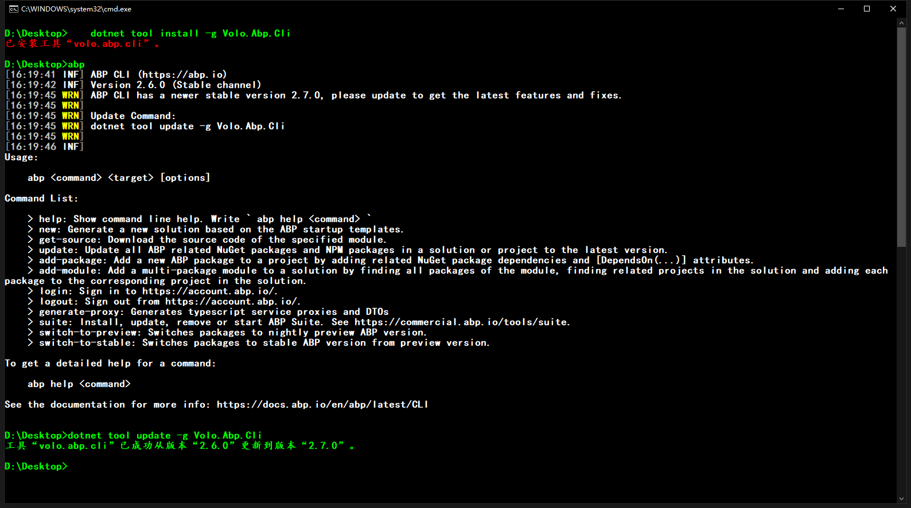
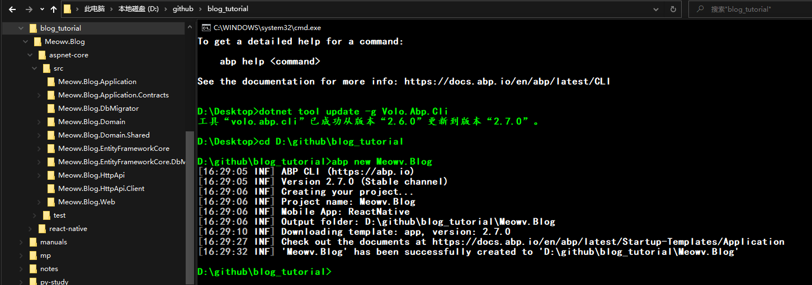
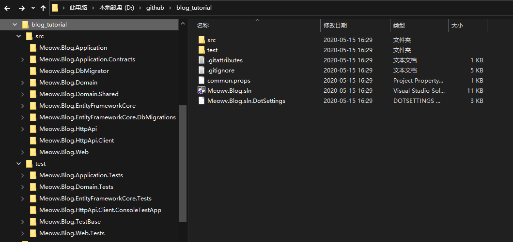

# 使用 abp cli 搭建项目

首先，默认咱们已经有了.net core 3.1的开发环境，如果你没有，快去下载... <https://dotnet.microsoft.com/download>

由于项目是基于abp vNext开发的，所以开发之前建议去撸一遍abp官方文档，<https://docs.abp.io/en/abp/latest/>

创建项目有很多种方式：

- 第一种，纯手撸，使用vs手动创建新项目
- 第二种，借助abp模板直接傻瓜式下载，地址：<http://abp.io/get-started>
- 第三种，abp cli(推荐)

## abp cli

abp cli是使用ABP框架启动新解决方案的最快方法，那么前提是你要安装啊。

`dotnet tool install -g Volo.Abp.Cli`

如果你的版本比较低，使用下面命令进行更新

`dotnet tool update -g Volo.Abp.Cli`



更多使用方法，请参考 <https://docs.abp.io/en/abp/latest/CLI>

## abp new

终于进入主题了，使用命令

`abp new <solution-name>` 创建博客项目



默认会生成两个项目，一个aspnet-core，一个react-native。暂时干掉不需要项目吧，虽然react-native也很香，但是现在先忽略它。

然后将aspnet-core文件夹下所有文件剪切至我们的根目录，于是就变成下面这个样子。



至此，基于abp cli创建项目完成，用VS2019打开看看吧。

此时整个目录结构是这样婶的~

```csharp
blog_tutorial
 ├── common.props
 ├── Meowv.Blog.sln
 ├── Meowv.Blog.sln.DotSettings
 ├── src
 │   ├── Meowv.Blog.Application
 │   ├── Meowv.Blog.Application.Contracts
 │   ├── Meowv.Blog.DbMigrator
 │   ├── Meowv.Blog.Domain
 │   ├── Meowv.Blog.Domain.Shared
 │   ├── Meowv.Blog.EntityFrameworkCore
 │   ├── Meowv.Blog.EntityFrameworkCore.DbMigrations
 │   ├── Meowv.Blog.HttpApi
 │   ├── Meowv.Blog.HttpApi.Client
 │   └── Meowv.Blog.Web
 └── test
     ├── Meowv.Blog.Application.Tests
     ├── Meowv.Blog.Domain.Tests
     ├── Meowv.Blog.EntityFrameworkCore.Tests
     ├── Meowv.Blog.HttpApi.Client.ConsoleTestApp
     ├── Meowv.Blog.TestBase
     └── Meowv.Blog.Web.Tests
```

由于是基于abp开发，所有默认的项目帮我们引用了一些非常强大但是我们用不到或者不想用的功能，进一步优化项目结构，删掉不要的引用，美化美化。

- 先干掉test文件夹吧，项目刚搭建测试个毛毛啊？**干掉不代表测试不重要**
- 干掉Meowv.Blog.sln.DotSettings，目前来说没啥乱用
- 添加了一个LICENSE
- 再添加一个README.md文件
- 再添加一个.github文件夹，请暂时忽略它，这个是GitHub Action所需
- 干掉src\Meowv.Blog.DbMigrator，有Meowv.Blog.EntityFrameworkCore.DbMigrations就够了
- 干掉src\Meowv.Blog.HttpApi.Client
- 在src目录下新增项目Meowv.Blog.Application.Caching，用来处理应用服务缓存
- 在src目录下新增项目Meowv.Blog.BackgroundJobs，用来处理后台定时任务
- 在src目录下新增项目Meowv.Blog.Swagger，这里用来编写Swagger扩展、Filter等
- 在src目录下新增项目Meowv.Blog.ToolKits，这里放公共的工具类、扩展方法
- 修改项目名称Meowv.Blog.Web为Meowv.Blog.HttpApi.Hosting，为了完美同时也可以去修改一下文件夹的名称哦
- 在解决方案中新建解决方案文件夹solution-items，然后编辑Meowv.Blog.sln文件，修改Meowv.Blog.Web为Meowv.Blog.HttpApi.Hosting，再新增以下代码

```csharp
Project("{2150E333-8FDC-42A3-9474-1A3956D46DE8}") = "solution-items", "solution-items", "{731730B9-645C-430A-AB05-3FC2BED63614}"
      ProjectSection(SolutionItems) = preProject
            .gitattributes = .gitattributes
            .gitignore = .gitignore
            common.props = common.props
            LICENSE = LICENSE
            README.md = README.md
      EndProjectSection
EndProject
```

现在整个项目变成了下面这个样子

```csharp
blog_tutorial
 ├── common.props
 ├── LICENSE
 ├── Meowv.Blog.sln
 ├── README.md
 └── src
     ├── Meowv.Blog.Application
     ├── Meowv.Blog.Application.Caching
     ├── Meowv.Blog.Application.Contracts
     ├── Meowv.Blog.BackgroundJobs
     ├── Meowv.Blog.Domain
     ├── Meowv.Blog.Domain.Shared
     ├── Meowv.Blog.EntityFrameworkCore
     ├── Meowv.Blog.EntityFrameworkCore.DbMigrations
     ├── Meowv.Blog.HttpApi
     ├── Meowv.Blog.HttpApi.Hosting
     ├── Meowv.Blog.Swagger
     └── Meowv.Blog.ToolKits
```

编译一下，全部生成成功，到这里算是用abp cli成功搭建一个属于自己的项目，并且还做了响应的调整。


本章只是搭建了项目，后面将逐一分解，期待吗，骚年？
