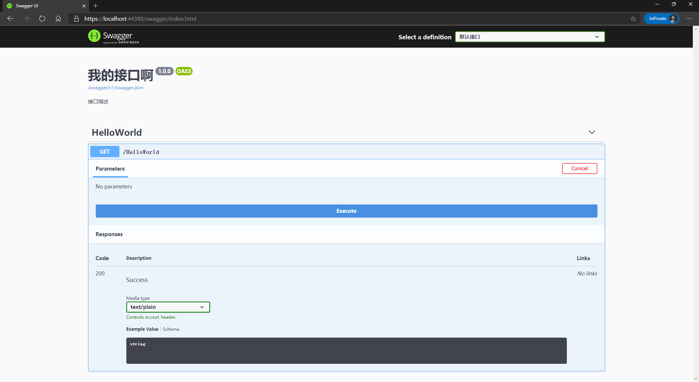
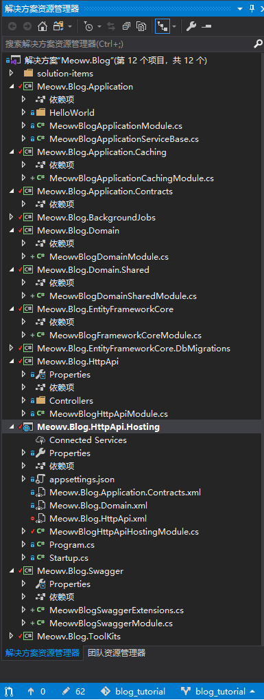

# 完善与美化，Swagger登场

上一篇文章已经成功将博客项目跑起来了，那么本篇主要是将之前遗留的问题解决，现在的代码看起来可能还是比较混乱，有大量与之无关的代码存在里面，对于强迫症患者来说真的是零容忍。

在程序员界，总有一批强迫症患者，他们希望自己写的代码看起来尽量的完美无瑕疵。

## 完善与美化

直奔主题，首先将各项目层的项目文件(`.csproj`)打开，格式化一下，没有引用`<Import Project="..\..\common.props" />`这句代码的也加一下，这里其实就是将公共属性拿出来，没什么特殊的。

`common.props`中的代码也非常简单，主要是禁用当开启输出XML的时候没有给代码进行summary注释产生的警告，其实这些大可不必为之折腾，不影响项目的成功运行。如果您觉得没啥必要，完全可以跳过此小节看最后。

### .Application

`.Application`层现在只引用`Volo.Abp.Identity.Application`包，和依赖`.Application.Caching`、`.Application.Contracts`、`.Domain`三个项目。

```xml
//Meowv.Blog.Application.csproj
<Project Sdk="Microsoft.NET.Sdk">

  <Import Project="..\..\common.props" />

  <PropertyGroup>
    <TargetFramework>netcoreapp3.1</TargetFramework>
  </PropertyGroup>

  <ItemGroup>
    <PackageReference Include="Volo.Abp.Identity.Application" Version="2.7.0" />

    <ProjectReference Include="..\Meowv.Blog.Application.Caching\Meowv.Blog.Application.Caching.csproj" />
    <ProjectReference Include="..\Meowv.Blog.Application.Contracts\Meowv.Blog.Application.Contracts.csproj" />
    <ProjectReference Include="..\Meowv.Blog.Domain.Shared\Meowv.Blog.Domain.Shared.csproj" />
  </ItemGroup>

</Project>
```

### .Application.Caching

`.Application.Caching`层看名字就知道，我准备用它来处理缓存，这里会用到两个包，`Volo.Abp.Caching`、`Microsoft.Extensions.Caching.Redis`。

不管三七二十一，新建一个模块类`MeowvBlogApplicationCachingModule.cs`，依赖于`AbpCachingModule`和我们的`MeowvBlogDomainModule`模块(此时还没添加)

```csharp
using Volo.Abp.Caching;
using Volo.Abp.Modularity;

namespace Meowv.Blog.Application.Caching
{
    [DependsOn(
        typeof(AbpCachingModule)
        // ...
    )]
    public class MeowvBlogApplicationCachingModule : AbpModule
    {
        public override void ConfigureServices(ServiceConfigurationContext context)
        {
            base.ConfigureServices(context);
        }
    }
}
```

```xml
//Meowv.Blog.Application.Caching.csproj
<Project Sdk="Microsoft.NET.Sdk">

  <Import Project="..\..\common.props" />

  <PropertyGroup>
    <TargetFramework>netcoreapp3.1</TargetFramework>
  </PropertyGroup>
  
  <ItemGroup>
    <PackageReference Include="Microsoft.Extensions.Caching.Redis" Version="2.2.0" />
    <PackageReference Include="Volo.Abp.Caching" Version="2.7.0" />

    <ProjectReference Include="..\Meowv.Blog.Application.Contracts\Meowv.Blog.Application.Contracts.csproj" />
    <ProjectReference Include="..\Meowv.Blog.Domain.Shared\Meowv.Blog.Domain.Shared.csproj" />
    <ProjectReference Include="..\Meowv.Blog.ToolKits\Meowv.Blog.ToolKits.csproj" />
  </ItemGroup>

</Project>
```

### .Application.Contracts

删掉里面所有文件，`.Application.Contracts`层我不准备按照abp那样来做，此层我只想用来放我们的传输对象(DTO)，添加项目引用`Domain.Shared`，同时开启输出XML文件到我们`.HttpApi.Hosting`

输出XML很简单，在 Visual Studio 中对着项目 右键=>属性=>生成=>输出，然后选择XML文档文件，默认为一个物理路径，我们将其改为相对路径`..\Meowv.Blog.HttpApi.Hosting\Meowv.Blog.Application.Contracts.xml`，XML输出到`.HttpApi.Hosting`层。

也可以直接修改项目文件实现，如下

```xml
//Meowv.Blog.Application.Contracts.csproj
<Project Sdk="Microsoft.NET.Sdk">

  <Import Project="..\..\common.props" />

  <PropertyGroup>
    <TargetFramework>netcoreapp3.1</TargetFramework>
  </PropertyGroup>

  <PropertyGroup Condition="'$(Configuration)|$(Platform)'=='Debug|AnyCPU'">
    <DocumentationFile>..\Meowv.Blog.HttpApi.Hosting\Meowv.Blog.Application.Contracts.xml</DocumentationFile>
  </PropertyGroup>

  <ItemGroup>
    <ProjectReference Include="..\Meowv.Blog.Domain.Shared\Meowv.Blog.Domain.Shared.csproj" />
  </ItemGroup>

</Project>
```

### .Domain

`.Domain`层为我们的实体领域模型，不需要引用其它层，只添加包`Volo.Abp.Identity.Domain`，同时也输出一下XML文件，XML文件的作用后续Swagger会用的。

```xml
//Meowv.Blog.Domain.csproj
<Project Sdk="Microsoft.NET.Sdk">

  <Import Project="..\..\common.props" />

  <PropertyGroup>
    <TargetFramework>netcoreapp3.1</TargetFramework>
  </PropertyGroup>

  <PropertyGroup Condition="'$(Configuration)|$(Platform)'=='Debug|AnyCPU'">
    <DocumentationFile>..\Meowv.Blog.HttpApi.Hosting\Meowv.Blog.Domain.xml</DocumentationFile>
  </PropertyGroup>

  <ItemGroup>
    <PackageReference Include="Volo.Abp.Identity.Domain" Version="2.7.0" />

    <ProjectReference Include="..\Meowv.Blog.Domain.Shared\Meowv.Blog.Domain.Shared.csproj" />
  </ItemGroup>

</Project>
```

删掉此层所有文件，不要忘了添加模块类，`MeowvBlogDomainModule.cs`，它依赖`AbpIdentityDomainModule`模块

```csharp
using Volo.Abp.Identity;
using Volo.Abp.Modularity;

namespace Meowv.Blog.Domain
{
    [DependsOn(typeof(AbpIdentityDomainModule))]
    public class MeowvBlogDomainModule : AbpModule
    {

    }
}
```

此时上面`.Application.Caching`中可以将`MeowvBlogDomainModule`加上了。

```csharp
//MeowvBlogApplicationCachingModule.cs
...
    [DependsOn(
        typeof(AbpCachingModule),
        typeof(MeowvBlogDomainModule)
    )]
    public class MeowvBlogApplicationCachingModule : AbpModule
    {
        ...
    }
...
```

### .Domain.Shared

`.Domain.Shared`层相当于`.Domain`的一个扩展一样，这里放一下项目用到的枚举、公共常量等内容，需要引用我们的`.Domain`项目

```xml
<Project Sdk="Microsoft.NET.Sdk">

  <Import Project="..\..\common.props" />

  <PropertyGroup>
    <TargetFramework>netcoreapp3.1</TargetFramework>
  </PropertyGroup>

  <ItemGroup>
    <ProjectReference Include="..\Meowv.Blog.Domain\Meowv.Blog.Domain.csproj" />
  </ItemGroup>

</Project>
```

还是要新增一个模块类`MeowvBlogDomainSharedModule.cs`，它依赖`AbpIdentityDomainSharedModule`模块

```csharp
//MeowvBlogDomainSharedModule.cs
using Volo.Abp.Identity;
using Volo.Abp.Modularity;

namespace Meowv.Blog.Domain
{
    [DependsOn(typeof(AbpIdentityDomainModule))]
    public class MeowvBlogDomainModule : AbpModule
    {
    }
}
```

### .EntityFrameworkCore

`.EntityFrameworkCore`层同样的，先删掉默认生成的文件。它主要是集成了EF Core，自定义仓储。详细可以看看abp文档：<https://docs.abp.io/zh-Hans/abp/latest/Repositories>

它支持多种数据库 MySQL、SqlServer、PostgreSql、Sqlite等，如果你有用到MongoDB，则需要新建一个项目，单独实现。可以看官方文档，有时间可以分享具体方法，本项目用不到。<https://docs.abp.io/zh-Hans/abp/latest/MongoDB>

为了方便大家，我把以上4种主流数据库都集成到项目中，添加包`Volo.Abp.EntityFrameworkCore.MySQL`，`.PostgreSql`、`.Sqlite`、`.SqlServer`，同时引用`.Domain.Shared`项目

```xml
//Meowv.Blog.EntityFrameworkCore.csproj
<Project Sdk="Microsoft.NET.Sdk">

  <Import Project="..\..\common.props" />

  <PropertyGroup>
    <TargetFramework>netcoreapp3.1</TargetFramework>
  </PropertyGroup>
  
  <ItemGroup>
    <PackageReference Include="Volo.Abp.EntityFrameworkCore.MySQL" Version="2.7.0" />
    <PackageReference Include="Volo.Abp.EntityFrameworkCore.PostgreSql" Version="2.7.0" />
    <PackageReference Include="Volo.Abp.EntityFrameworkCore.Sqlite" Version="2.7.0" />
    <PackageReference Include="Volo.Abp.EntityFrameworkCore.SqlServer" Version="2.7.0" />

    <ProjectReference Include="..\Meowv.Blog.Domain.Shared\Meowv.Blog.Domain.Shared.csproj" />
  </ItemGroup>

</Project>
```

新建一个模块类`MeowvBlogFrameworkCoreModule.cs`，依赖`MeowvBlogDomainModule`和数据库模块

```csharp
//MeowvBlogFrameworkCoreModule.cs
using Meowv.Blog.Domain;
using Volo.Abp.EntityFrameworkCore;
using Volo.Abp.EntityFrameworkCore.MySQL;
using Volo.Abp.EntityFrameworkCore.PostgreSql;
using Volo.Abp.EntityFrameworkCore.Sqlite;
using Volo.Abp.EntityFrameworkCore.SqlServer;
using Volo.Abp.Modularity;

namespace Meowv.Blog.EntityFrameworkCore
{
    [DependsOn(
        typeof(MeowvBlogDomainModule),
        typeof(AbpEntityFrameworkCoreModule),
        typeof(AbpEntityFrameworkCoreMySQLModule),
        typeof(AbpEntityFrameworkCoreSqlServerModule),
        typeof(AbpEntityFrameworkCorePostgreSqlModule),
        typeof(AbpEntityFrameworkCoreSqliteModule)
    )]
    public class MeowvBlogFrameworkCoreModule : AbpModule
    {
        public override void ConfigureServices(ServiceConfigurationContext context)
        {

        }
    }
}
```

### .EntityFrameworkCore.DbMigrations

`.EntityFrameworkCore.DbMigrations`层主要做数据库迁移，用code-first方式创建数据库表，先删掉默认生成的文件，目前还用不上，后面讲。

### .ToolKits

`.ToolKits`层是我们手动创建的项目，我主要用它来包装一些扩展方法，公共的工具类。

## Swagger登场

做.net core开发的，相信Swagger的使用大家应该都很熟悉了，不做过多的介绍，今天只先将其用上看看效果。

我单独为Swagger新建了一个项目`Meowv.Blog.Swagger`，其实大可不必，直接写在`.HttpApi.Hosting`中也是一样的。

添加`Volo.Abp.AspNetCore`和`Swashbuckle.AspNetCore`包，引用实体层`.Domain`。

```xml
//Meowv.Blog.Swagger.csproj
<Project Sdk="Microsoft.NET.Sdk">

  <Import Project="..\..\common.props" />

  <PropertyGroup>
    <TargetFramework>netcoreapp3.1</TargetFramework>
  </PropertyGroup>

  <ItemGroup>
    <PackageReference Include="Volo.Abp.AspNetCore" Version="2.7.0" />
    <PackageReference Include="Swashbuckle.AspNetCore" Version="5.4.1" />

    <ProjectReference Include="..\Meowv.Blog.Domain\Meowv.Blog.Domain.csproj" />
  </ItemGroup>

</Project>
```

添加模块类`MeowvBlogSwaggerModule.cs`，依赖`MeowvBlogDomainModule`模块，并且重写`ConfigureServices`和`OnApplicationInitialization`方法，不知道这是什么的，可以看文档：<https://docs.abp.io/zh-Hans/abp/latest/Module-Development-Basics>

然后新建一个扩展类`MeowvBlogSwaggerExtensions.cs`，编写两个扩展方法`AddSwagger`和`UseSwaggerUI`。

在`AddSwagger`方法中引用我们的XML文件，配置接口的名称版本以及描述信息，在`UseSwaggerUI`方法中使用SwaggerUI，代码如下：

```csharp
//MeowvBlogSwaggerExtensions.cs
using Microsoft.AspNetCore.Builder;
using Microsoft.Extensions.DependencyInjection;
using Microsoft.OpenApi.Models;
using System;
using System.IO;

namespace Meowv.Blog.Swagger
{
    public static class MeowvBlogSwaggerExtensions
    {
        public static IServiceCollection AddSwagger(this IServiceCollection services)
        {
            return services.AddSwaggerGen(options =>
            {
                options.SwaggerDoc("v1", new OpenApiInfo
                {
                    Version = "1.0.0",
                    Title = "我的接口啊",
                    Description = "接口描述"
                });

                options.IncludeXmlComments(Path.Combine(AppContext.BaseDirectory, "Meowv.Blog.HttpApi.xml"));
                options.IncludeXmlComments(Path.Combine(AppContext.BaseDirectory, "Meowv.Blog.Domain.xml"));
                options.IncludeXmlComments(Path.Combine(AppContext.BaseDirectory, "Meowv.Blog.Application.Contracts.xml"));
            });
        }

        public static void UseSwaggerUI(this IApplicationBuilder app)
        {
            app.UseSwaggerUI(options =>
            {
                options.SwaggerEndpoint($"/swagger/v1/swagger.json", "默认接口");
            });
        }
    }
}
```

随后便可以在模块`MeowvBlogDomainModule`中引用了

```csharp
//MeowvBlogSwaggerModule.cs
using Meowv.Blog.Domain;
using Microsoft.AspNetCore.Builder;
using Volo.Abp;
using Volo.Abp.Modularity;

namespace Meowv.Blog.Swagger
{
    [DependsOn(typeof(MeowvBlogDomainModule))]
    public class MeowvBlogSwaggerModule : AbpModule
    {
        public override void ConfigureServices(ServiceConfigurationContext context)
        {
            context.Services.AddSwagger();
        }

        public override void OnApplicationInitialization(ApplicationInitializationContext context)
        {
            context.GetApplicationBuilder().UseSwagger().UseSwaggerUI();
        }
    }
}
```

最后在`.HttpApi.Hosting`层的的启动模块中引用一下。

```csharp
//MeowvBlogHttpApiHostingModule.cs
...
    [DependsOn(
       typeof(AbpAspNetCoreMvcModule),
       typeof(AbpAutofacModule),
       typeof(MeowvBlogHttpApiModule),
       typeof(MeowvBlogSwaggerModule),
       typeof(MeowvBlogFrameworkCoreModule)
    )]
    public class MeowvBlogHttpApiHostingModule : AbpModule
    {
        ...
    }
...
```

`Ctrl + Shift + B`生成解决方案，`Ctrl+F5`打开 .../swagger/index.html 看看效果，上面有一个坑没有填，不知道大家发现了没有，`Meowv.Blog.HttpApi.xml`没有生成，启动是是会报错的，大家按照之前的方法自行生成XML即可。



棒！预期已经达到了。Swagger之所以想单独创建一个项目是因为还涉及到很多内容，如接口分组、JWT授权、还有Swagger文档描述信息的Filter等。

项目中还剩下`.BackgroundJobs`层没有处理，此层准备集成`Hangfire`做一个定时任务处理的，后面会慢慢用起来的。

现在再回头看看，项目是不是很清爽? 没有乱七八糟的东西，有的只是我们需要的。

此时的层级目录，以供参考。



项目中可能有许多不是很合理的地方，请酌情参考。
