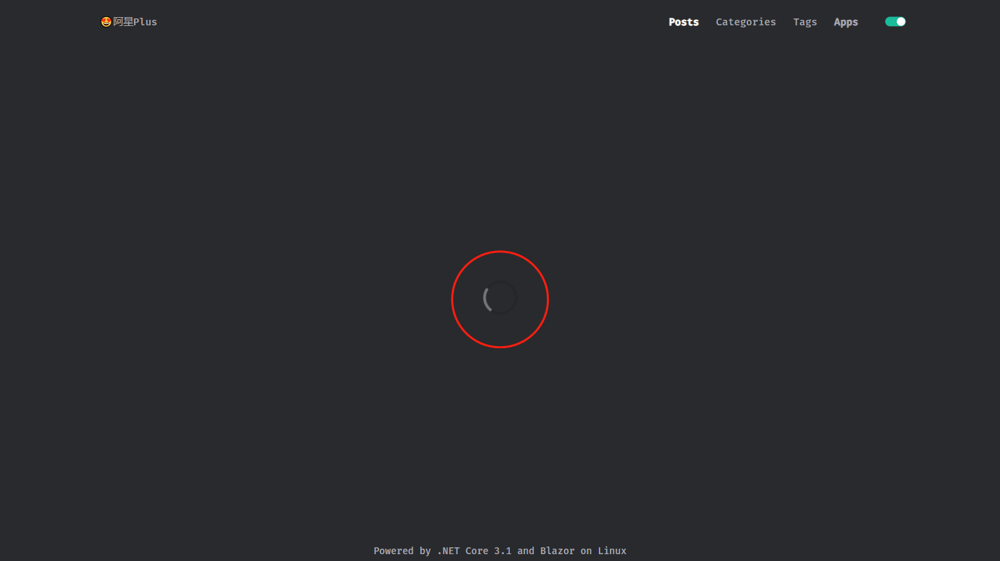
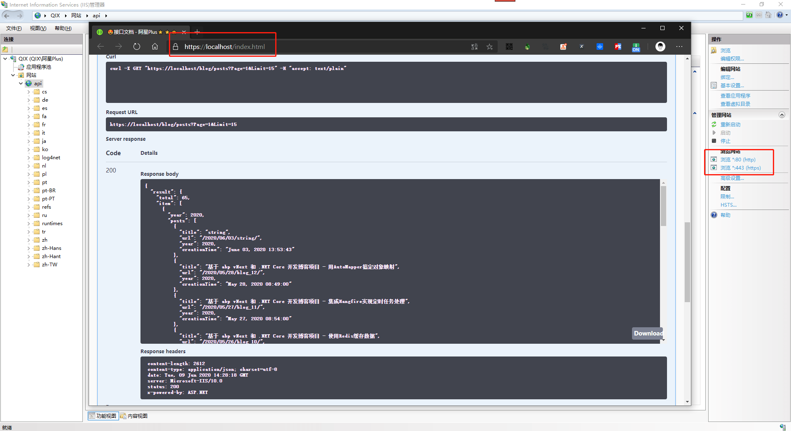

# Blazor 实战系列（三）

上一篇完成了博客的主题切换，菜单和二维码的显示与隐藏功能，本篇继续完成分页查询文章列表的数据展示。

## 添加页面

现在点击页面上的链接，都会提示错误消息，因为没有找到对应的路由地址。先在Pages下创建五个文件夹：Posts、Categories、Tags、Apps、FriendLinks。

然后在对应的文件夹下添加Razor组件。

- Posts文件夹：文章列表页面`Posts.razor`、根据分类查询文章列表页面`Posts.Category.razor`、根据标签查询文章列表页面`Posts.Tag.razor`、文章详情页`Post.razor`
- Categories文件夹：分类列表页面`Categories.razor`
- Tags文件夹：标签列表页面`Tags.razor`
- Apps文件夹：`Apps.razor`准备将友情链接入口放在里面
- FriendLinks文件夹：友情链接列表页面`FriendLinks.razor`

先分别创建上面这些Razor组件，差不多除了后台CURD的页面就这些了，现在来逐个突破。

不管三七二十一，先把所有页面的路由给确定了，指定页面路由使用 `@page` 指令，官方文档说不支持可选参数，但是可以支持多个路由规则。

默认先什么都不显示，可以将之前的加载中圈圈写成一个组件，供每个页面使用。

在Shared文件夹添加组件`Loading.razor`。

```html
<!--Loading.razor-->
<div class="loader"></div>
```

```csharp
//Posts.razor
@page "/posts/"
@page "/posts/page/{page:int}"
@page "/posts/{page:int}"

<Loading />

@code {
    /// <summary>
    /// 当前页码
    /// </summary>
    [Parameter]
    public int? page { get; set; }
}
```

这里我加了三条，可以匹配没有page参数，带page参数的，`/posts/page/{page:int}`这个大家可以不用加，我是用来兼容目前线上的博客路由的。总的来说可以匹配到：`/posts`、`/posts/1`、`/posts/page/1`这样的路由。

```csharp
//Posts.Category.razor
@page "/category/{name}"

<Loading />

@code {
    /// <summary>
    /// 分类名称参数
    /// </summary>
    [Parameter]
    public string name { get; set; }
}
```

根据分类名称查询文章列表页面，name当作分类名称参数，可以匹配到类似于：`/category/aaa`、`/category/bbb`这样的路由。

```csharp
//Posts.Tag.razor
@page "/tag/{name}"

<Loading />

@code {
    /// <summary>
    /// 标签名称参数
    /// </summary>
    [Parameter]
    public string name { get; set; }
}
```

这个根据标签名称查询文章列表页面和上面差不多一样，可以匹配到：`/tag/aaa`、`/tag/bbb`这样的路由。

```csharp
//Post.razor
@page "/post/{year:int}/{month:int}/{day:int}/{name}"

<Loading />

@code {
    [Parameter]
    public int year { get; set; }

    [Parameter]
    public int month { get; set; }

    [Parameter]
    public int day { get; set; }

    [Parameter]
    public string name { get; set; }
}
```

文章详情页面的路由有点点复杂，以/post/开头，加上年月日和当前文章的语义化名称组成。分别添加了四个参数年月日和名称，用来接收URL的规则，使用int来设置路由的约束，最终可以匹配到路由：`/post/2020/06/09/aaa`、`/post/2020/06/9/bbb`这样的。

```csharp
//Categories.razor
@page "/categories"

<Loading />

//Tags.razor
@page "/tags"

<Loading />

//FriendLinks.razor
@page "/friendlinks"

<Loading />
```

分类、标签、友情链接都是固定的路由，像上面这样就不多说了，然后还剩一个`Apps.razor`。

```html
//Apps.razor
@page "/apps"

<div class="container">
    <div class="post-wrap">
        <h2 class="post-title">-&nbsp;Apps&nbsp;-</h2>
        <ul>
            <li>
                <a target="_blank" href="https://support.qq.com/products/75616"><h3>吐个槽_留言板</h3></a>
            </li>
            <li>
                <NavLink href="/friendlinks"><h3>友情链接</h3></NavLink>
            </li>
        </ul>
    </div>
</div>
```

在里面添加了一个友情链接的入口，和一个 [腾讯兔小巢](https://support.qq.com/products/75616) 的链接，欢迎大家吐槽留言噢。



现在可以运行一下看看，点击所有的链接都不会提示错误，只要路由匹配正确就会出现加载中的圈圈了。

## 文章列表

在做文章列表的数据绑定的时候遇到了大坑，有前端开发经验的都知道，JavaScript弱类型语言中接收json数据随便玩，但是在Blazor中我试了下动态接受传递过来的JSON数据，一直报错压根运行不起来。所以在请求api接收数据的时候需要指定接收对象，那就好办了我就直接引用API中的`.Application.Contracts`就行了啊，但是紧接着坑又来了，目标框架对不上，引用之后也运行不起来，这里应该是之前没有设计好。

于是，我就想了一个折中的办法吧，将API中的返回对象可以用到的DTO先手动拷贝一份到Blazor项目中，后续可以考虑将公共的返回模型做成Nuget包，方便使用。

那么，最终就是在Blazor中添加一个Response文件夹，用来放接收对象，里面的内容看图：


有点傻，先这样解决，后面在做进一步的优化吧。

将我们复制进来的东东，在`_Imports.razor`中添加引用。

```csharp
//_Imports.razor
@using System.Net.Http
@using System.Net.Http.Json
@using Microsoft.AspNetCore.Components.Forms
@using Microsoft.AspNetCore.Components.Routing
@using Microsoft.AspNetCore.Components.Web
@using Microsoft.AspNetCore.Components.WebAssembly.Http
@using Meowv.Blog.BlazorApp.Shared
@using Response.Base
@using Response.Blog

@inject HttpClient Http
@inject Commons.Common Common
```

`@inject HttpClient Http`：注入`HttpClient`，用它来请求API数据。

现在有了接收对象，接下来就好办了，来实现分页查询文章列表吧。

先添加三个私有变量，限制条数，就是一次加载文章的数量，总页码用来计算分页，还有就是API的返回数据的接收类型参数。

```csharp
/// <summary>
/// 限制条数
/// </summary>
private int Limit = 15;

/// <summary>
/// 总页码
/// </summary>
private int TotalPage;

/// <summary>
/// 文章列表数据
/// </summary>
private ServiceResult<PagedList<QueryPostDto>> posts;
```

然后当页面初始化的时候，去加载数据，渲染页面，因为page参数可能存在为空的情况，所以要考虑进去，当为空的时候给他一个默认值1。

```csharp
/// <summary>
/// 初始化
/// </summary>
protected override async Task OnInitializedAsync()
{
    // 设置默认值
    page = page.HasValue ? page : 1;

    await RenderPage(page);
}

/// <summary>
/// 点击页码重新渲染数据
/// </summary>
/// <param name="page"></param>
/// <returns></returns>
private async Task RenderPage(int? page)
{
    // 获取数据
    posts = await Http.GetFromJsonAsync<ServiceResult<PagedList<QueryPostDto>>>($"/blog/posts?page={page}&limit={Limit}");

    // 计算总页码
    TotalPage = (int)Math.Ceiling((posts.Result.Total / (double)Limit));
}
```

在初始化方法中设置默认值，调用`RenderPage(...)`获取到API返回来的数据，并根据返回数据计算出页码，这样就可以绑定数据了。

```html
@if (posts == null)
{
    <Loading />
}
else
{
    <div class="post-wrap archive">
        @if (posts.Success && posts.Result.Item.Any())
        {
            @foreach (var item in posts.Result.Item)
            {
                <h3>@item.Year</h3>
                @foreach (var post in item.Posts)
                {
                    <article class="archive-item">
                        <NavLink href="@("/post" + post.Url)">@post.Title</NavLink>
                        <span class="archive-item-date">@post.CreationTime</span>
                    </article>
                }
            }
            <nav class="pagination">
                @for (int i = 1; i <= TotalPage; i++)
                {
                    var _page = i;

                    if (page == _page)
                    {
                        <span class="page-number current">@_page</span>
                    }
                    else
                    {
                        <a class="page-number" @onclick="@(() => RenderPage(_page))" href="/posts/@_page">@_page</a>
                    }
                }
            </nav>
        }
        else
        {
            <ErrorTip />
        }
    </div>
}
```

在加载数据的时候肯定是需要一个等待时间的，因为不可抗拒的原因数据还没加载出来的时候，可以让它先转一会圈圈，当`posts`不为空的时候，再去绑定数据。

在绑定数据，for循环页码的时候我又遇到了一个坑😂，这里不能直接去使用变量i，必须新建一个变量去接受它，不然我传递给`RenderPage(...)`的参数就会是错的，始终会取到最后一次循环的i值。

当判断数据出错或者没有数据的时候，在把错误提示`<ErrorTip />`扔出来显示。

做到这里，可以去运行看看了，肯定会报错，因为还有一个重要的东西没有改，就是我们接口的`BaseAddress`，在`Program.cs`中，默认是当前Blazor项目的运行地址。

我们需要先将API项目运行起来，拿到地址配置在`Program.cs`中，因为现在还是本地开发，有多种办法可以解决，可以将`.HttpApi.Hosting`设为启动项目直接运行起来，也可以使用命令直接`dotnet run`。

我这里为了方便，直接发布在IIS中，后续只要电脑打开就可以访问了，你甚至选择其它任何你能想到的方式。

关于如何发布这里先不做展开，有机会的话写一篇将.net core开发的项目发布到 Windows、Linux、Docker 的教程吧。



所以我的`Program.cs`中配置如下：

```csharp
//Program.cs
using Meowv.Blog.BlazorApp.Commons;
using Microsoft.AspNetCore.Components.WebAssembly.Hosting;
using Microsoft.Extensions.DependencyInjection;
using System;
using System.Net.Http;
using System.Threading.Tasks;

namespace Meowv.Blog.BlazorApp
{
    public class Program
    {
        public static async Task Main(string[] args)
        {
            var builder = WebAssemblyHostBuilder.CreateDefault(args);
            builder.RootComponents.Add<App>("app");

            var baseAddress = "https://localhost";

            if (builder.HostEnvironment.IsProduction())
                baseAddress = "https://api.meowv.com";

            builder.Services.AddTransient(sp => new HttpClient
            {
                BaseAddress = new Uri(baseAddress)
            });

            builder.Services.AddSingleton(typeof(Common));

            await builder.Build().RunAsync();
        }
    }
}
```

`baseAddress`默认为本地开发地址，使用`builder.HostEnvironment.IsProduction()`判断是否为线上正式生产环境，改变`baseAddress`地址。


现在可以看到已经可以正常获取数据，并且翻页也是OK的，然后又出现了一个新的BUG😂。

## 解决BUG

细心的可以发现，当我点击头部组件的`Posts`a 标签菜单时候，页面没有发生变化，只是路由改变了。

思来想去，我决定使用`NavigationManager`这个URI和导航状态帮助程序来解决，当点击头部的`Posts`a 标签菜单直接刷新页面得了。

在`Common.cs`中使用构造函数注入`NavigationManager`，然后添加一个跳转指定URL的方法。

```csharp
/// <summary>
/// 跳转指定URL
/// </summary>
/// <param name="uri"></param>
/// <param name="forceLoad">true，绕过路由刷新页面</param>
/// <returns></returns>
public async Task RenderPage(string url, bool forceLoad = true)
{
    _navigationManager.NavigateTo(url, forceLoad);

    await Task.CompletedTask;
}
```

当`forceLoad = true`的时候，将会绕过路由直接强制刷新页面，如果`forceLoad = false`，则不会刷新页面。

紧接着在`Header.razor`中修改代码，添加点击事件。

```html
@*<NavLink class="menu-item" href="posts">Posts</NavLink>*@

<NavLink class="menu-item" href="posts" @onclick="@(async () => await Common.RenderPage("posts"))">Posts</NavLink>
```

总算是搞定，完成了分页查询文章列表的数据绑定，今天就到这里吧，未完待续...
