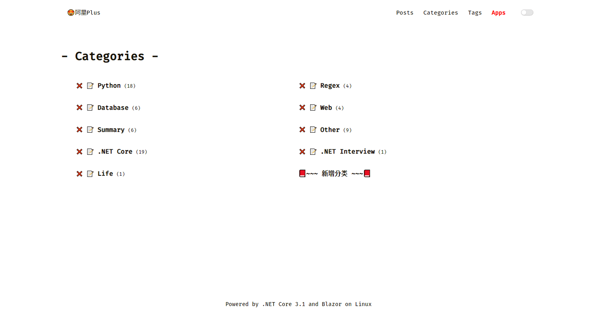
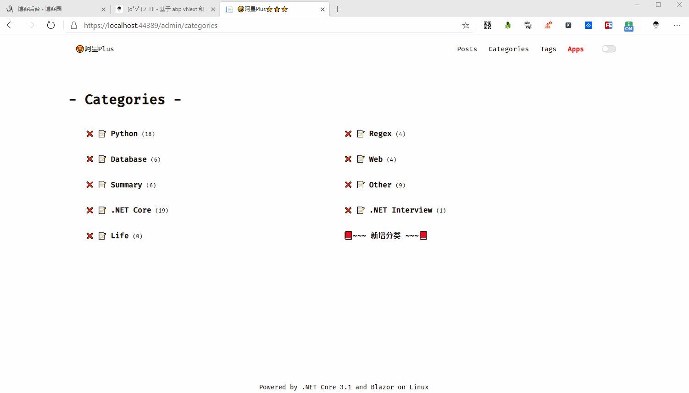

# Blazor 实战系列（六）

上一篇完成了博客文章详情页面的数据展示和基于JWT方式的简单身份验证，本篇继续推进，完成后台分类管理的所有增删改查等功能。

## 分类管理



在 Admin 文件夹下新建Razor组件，`Categories.razor`，设置路由，`@page "/admin/categories"`。将具体的展示内容放在组件`AdminLayout`中。

```html
@page "/admin/categories"

<AdminLayout>
      <Loading />
</AdminLayout>
```

在这里我会将所有分类展示出来，新增、更新、删除都会放在一个页面上去完成。

先将列表查出来，添加API的返回参数，`private ServiceResult<IEnumerable<QueryCategoryForAdminDto>> categories;`，然后再初始化中去获取数据。

```csharp
//QueryCategoryForAdminDto.cs
namespace Meowv.Blog.BlazorApp.Response.Blog
{
    public class QueryCategoryForAdminDto : QueryCategoryDto
    {
        /// <summary>
        /// 主键
        /// </summary>
        public int Id { get; set; }
    }
}
```

```csharp
/// <summary>
/// API返回的分类列表数据
/// </summary>
private ServiceResult<IEnumerable<QueryCategoryForAdminDto>> categories;

/// <summary>
/// 初始化
/// </summary>
/// <returns></returns>
protected override async Task OnInitializedAsync()
{
    var token = await Common.GetStorageAsync("token");
    Http.DefaultRequestHeaders.Add("Authorization", $"Bearer {token}");

    categories = await FetchData();
}

/// <summary>
/// 获取数据
/// </summary>
/// <returns></returns>
private async Task<ServiceResult<IEnumerable<QueryCategoryForAdminDto>>> FetchData()
{
    return await Http.GetFromJsonAsync<ServiceResult<IEnumerable<QueryCategoryForAdminDto>>>("/blog/admin/categories");
}
```

初始化的时候，需要将我们存在`localStorage`中的token读取出来，因为我们后台的API都需要添加 `Authorization` Header 请求头才能成功返回数据。

在Blazor添加请求头也是比较方便的，直接`Http.DefaultRequestHeaders.Add(...)`即可，要注意的是 token值前面需要加 `Bearer`，跟了一个空格不可以省略。

获取数据单独提成了一个方法`FetchData()`，因为会频繁用到，现在在页面上将数据绑定进行展示。

```html
@if (categories == null)
{
    <Loading />
}
else
{
    <div class="post-wrap categories">
        <h2 class="post-title">-&nbsp;Categories&nbsp;-</h2>
        @if (categories.Success && categories.Result.Any())
        {
            <div class="categories-card">
                @foreach (var item in categories.Result)
                {
                    <div class="card-item">
                        <div class="categories">
                            <NavLink title="❌删除" @onclick="@(async () => await DeleteAsync(item.Id))">❌</NavLink>
                            <NavLink title="📝编辑" @onclick="@(() => ShowBox(item))">📝</NavLink>
                            <NavLink target="_blank" href="@($"/category/{item.DisplayName}")">
                                <h3>@item.CategoryName</h3>
                                <small>(@item.Count)</small>
                            </NavLink>
                        </div>
                    </div>
                }
                <div class="card-item">
                    <div class="categories">
                        <NavLink><h3 @onclick="@(() => ShowBox())">📕~~~ 新增分类 ~~~📕</h3></NavLink>
                    </div>
                </div>
            </div>
        }
        else
        {
            <ErrorTip />
        }
    </div>
}
```

同样的当categories还没成功获取到数据的时候，我们直接在展示 `<Loading />`组件。然后就是循环列表数据在`foreach`中进行绑定数据。

在每条数据最前面，加了删除和编辑两个按钮，删除的时候调用`DeleteAsync`方法，将当前分类的Id传给他即可。新增和编辑的时候调用`ShowBox`方法，他接受一个参数，当前循环到的分类对象item，即`QueryCategoryForAdminDto`。

同时这里考虑到复用性，我写了一个弹窗组件，`Box.Razor`，放在Shared文件夹下面，可以先看一下标题为弹窗组件的内容再回来继续往下看。

### 删除分类

接下来看看删除方法。

```csharp
/// <summary>
/// 删除分类
/// </summary>
/// <param name="id"></param>
/// <returns></returns>
private async Task DeleteAsync(int id)
{
    // 弹窗确认
    bool confirmed = await Common.InvokeAsync<bool>("confirm", "\n💥💢真的要干掉这个该死的分类吗💢💥");

    if (confirmed)
    {
        var response = await Http.DeleteAsync($"/blog/category?id={id}");

        var result = await response.Content.ReadFromJsonAsync<ServiceResult>();

        if (result.Success)
        {
            categories = await FetchData();
        }
    }
}
```

删除之前搞个原生的`confirm`进行提示，避免手残误删。因为API那边使用的是`HttpDelete`，所有我们调用API时候要用`Http.DeleteAsync`，返回的是`HttpResponseMessage`对象，需要我们手动处理接收返回数据，将其转换为`ServiceResult`对象，如果判断删除成功后重新调用`FetchData()`刷新分类数据。


### 新增/更新分类

新增和更新数据选择使用弹窗的方式来进行(弹窗组件在下方)，首先是需要一个参数判断弹窗是否打开，因为是将新增和更新放在一起，所以如何判断是新增还是更新呢？这里使用Id来进行判断，当编辑的时候肯定会有Id参数。新增的时候是没有参数传递的。

当我们打开弹窗后里面需要展示两个input框，用来供输入要保存的数据，同样是添加两个变量。

添加所需的这几个参数。

```csharp
/// <summary>
/// 默认隐藏Box
/// </summary>
private bool Open { get; set; } = false;

/// <summary>
/// 新增或者更新时候的分类字段值
/// </summary>
private string categoryName, displayName;

/// <summary>
/// 更新分类的Id值
/// </summary>
private int id;
```

现在可以将Box组件添加到页面上。

```html
<div class="post-wrap categories">
    ...
</div>

<Box OnClickCallback="@SubmitAsync" Open="@Open">
    <div class="box-item">
        <b>DisplayName：</b><input type="text" @bind="@displayName" @bind:event="oninput" />
    </div>
    <div class="box-item">
        <b>CategoryName：</b><input type="text" @bind="@categoryName" @bind:event="oninput" />
    </div>
</Box>
```

确定按钮回调事件执行`SubmitAsync()`方法，打开状态参数为上面添加的`Open`，按钮文字`ButtonText`为默认值不填。

添加了两个input，将两个分类字段分别绑定上去，使用`@bind`和`@bind:event`。前者等价于设置其value值，后者等价于一个change事件当值改变后会重新赋给绑定的字段参数。

现在可以来看看点击了新增或者编辑按钮的方法`ShowBox(...)`，接收一个参数`QueryCategoryForAdminDto`让其默认值为null。

```csharp
/// <summary>
/// 显示box，绑定字段
/// </summary>
/// <param name="dto"></param>
private void ShowBox(QueryCategoryForAdminDto dto = null)
{
    Open = true;
    id = 0;

    // 新增
    if (dto == null)
    {
        displayName = null;
        categoryName = null;
    }
    else // 更新
    {
        id = dto.Id;
        displayName = dto.DisplayName;
        categoryName = dto.CategoryName;
    }
}
```

执行`ShowBox()`方法，将弹窗打开，设置`Open = true;`和初始化id的值`id = 0;`。

通过参数是否null进行判断是新增还是更新，这样打开弹窗就搞定了，剩下的就交给弹窗来处理了。

因为新增和更新API需要还对应的输入参数`EditCategoryInput`，去添加它不要忘了。

那么现在就只差按钮回调事件`SubmitAsync()`了，主要是给输入参数进行赋值调用API，执行新增或者更新即可。

```csharp
/// <summary>
/// 确认按钮点击事件
/// </summary>
/// <returns></returns>
private async Task SubmitAsync()
{
    var input = new EditCategoryInput()
    {
        DisplayName = displayName.Trim(),
        CategoryName = categoryName.Trim()
    };

    if (string.IsNullOrEmpty(input.DisplayName) || string.IsNullOrEmpty(input.CategoryName))
    {
        return;
    }

    var responseMessage = new HttpResponseMessage();

    if (id > 0)
        responseMessage = await Http.PutAsJsonAsync($"/blog/category?id={id}", input);
    else
        responseMessage = await Http.PostAsJsonAsync("/blog/category", input);

    var result = await responseMessage.Content.ReadFromJsonAsync<ServiceResult>();
    if (result.Success)
    {
        categories = await FetchData();
        Open = false;
    }
}
```

当参数为空时，直接`return`什么都不执行。通过当前Id判断是新增还是更新操作，调用不同的方法`PutAsJsonAsync`和`PostAsJsonAsync`去请求API，同样返回到是`HttpResponseMessage`对象，最后如果操作成功，重新请求一个数据，刷新分类列表，将弹窗关闭掉。

分类管理页面的全部代码如下：

::: details 点击查看代码

```csharp
@page "/admin/categories"

<AdminLayout>
    @if (categories == null)
    {
        <Loading />
    }
    else
    {
        <div class="post-wrap categories">
            <h2 class="post-title">-&nbsp;Categories&nbsp;-</h2>
            @if (categories.Success && categories.Result.Any())
            {
                <div class="categories-card">
                    @foreach (var item in categories.Result)
                    {
                        <div class="card-item">
                            <div class="categories">
                                <NavLink title="❌删除" @onclick="@(async () => await DeleteAsync(item.Id))">❌</NavLink>
                                <NavLink title="📝编辑" @onclick="@(() => ShowBox(item))">📝</NavLink>
                                <NavLink target="_blank" href="@($"/category/{item.DisplayName}")">
                                    <h3>@item.CategoryName</h3>
                                    <small>(@item.Count)</small>
                                </NavLink>
                            </div>
                        </div>
                    }
                    <div class="card-item">
                        <div class="categories">
                            <NavLink><h3 @onclick="@(() => ShowBox())">📕~~~ 新增分类 ~~~📕</h3></NavLink>
                        </div>
                    </div>
                </div>
            }
            else
            {
                <ErrorTip />
            }
        </div>

        <Box OnClickCallback="@SubmitAsync" Open="@Open">
            <div class="box-item">
                <b>DisplayName：</b><input type="text" @bind="@displayName" @bind:event="oninput" />
            </div>
            <div class="box-item">
                <b>CategoryName：</b><input type="text" @bind="@categoryName" @bind:event="oninput" />
            </div>
        </Box>
    }
</AdminLayout>

@code {
    /// <summary>
    /// 默认隐藏Box
    /// </summary>
    private bool Open { get; set; } = false;

    /// <summary>
    /// 新增或者更新时候的分类字段值
    /// </summary>
    private string categoryName, displayName;

    /// <summary>
    /// 更新分类的Id值
    /// </summary>
    private int id;

    /// <summary>
    /// API返回的分类列表数据
    /// </summary>
    private ServiceResult<IEnumerable<QueryCategoryForAdminDto>> categories;

    /// <summary>
    /// 初始化
    /// </summary>
    /// <returns></returns>
    protected override async Task OnInitializedAsync()
    {
        var token = await Common.GetStorageAsync("token");
        Http.DefaultRequestHeaders.Add("Authorization", $"Bearer {token}");

        categories = await FetchData();
    }

    /// <summary>
    /// 获取数据
    /// </summary>
    /// <returns></returns>
    private async Task<ServiceResult<IEnumerable<QueryCategoryForAdminDto>>> FetchData()
    {
        return await Http.GetFromJsonAsync<ServiceResult<IEnumerable<QueryCategoryForAdminDto>>>("/blog/admin/categories");
    }

    /// <summary>
    /// 删除分类
    /// </summary>
    /// <param name="id"></param>
    /// <returns></returns>
    private async Task DeleteAsync(int id)
    {
        Open = false;

        // 弹窗确认
        bool confirmed = await Common.InvokeAsync<bool>("confirm", "\n💥💢真的要干掉这个该死的分类吗💢💥");

        if (confirmed)
        {
            var response = await Http.DeleteAsync($"/blog/category?id={id}");

            var result = await response.Content.ReadFromJsonAsync<ServiceResult>();

            if (result.Success)
            {
                categories = await FetchData();
            }
        }
    }

    /// <summary>
    /// 显示box，绑定字段
    /// </summary>
    /// <param name="dto"></param>
    private void ShowBox(QueryCategoryForAdminDto dto = null)
    {
        Open = true;
        id = 0;

        // 新增
        if (dto == null)
        {
            displayName = null;
            categoryName = null;
        }
        else // 更新
        {
            id = dto.Id;
            displayName = dto.DisplayName;
            categoryName = dto.CategoryName;
        }
    }

    /// <summary>
    /// 确认按钮点击事件
    /// </summary>
    /// <returns></returns>
    private async Task SubmitAsync()
    {
        var input = new EditCategoryInput()
        {
            DisplayName = displayName.Trim(),
            CategoryName = categoryName.Trim()
        };

        if (string.IsNullOrEmpty(input.DisplayName) || string.IsNullOrEmpty(input.CategoryName))
        {
            return;
        }

        var responseMessage = new HttpResponseMessage();

        if (id > 0)
            responseMessage = await Http.PutAsJsonAsync($"/blog/category?id={id}", input);
        else
            responseMessage = await Http.PostAsJsonAsync("/blog/category", input);

        var result = await responseMessage.Content.ReadFromJsonAsync<ServiceResult>();
        if (result.Success)
        {
            categories = await FetchData();
            Open = false;
        }
    }
}
```

:::



## 弹窗组件

考虑到新增和更新数据的时候需要弹窗，这里就简单演示一下写一个小组件。

在 Shared 文件夹下新建一个`Box.razor`。

在开始之前分析一下弹窗组件所需的元素，弹窗肯定有一个确认和取消按钮，右上角需要有一个关闭按钮，关闭按钮和取消按钮一个意思。他还需要一个打开或者关闭的状态，判断是否打开弹窗，还有就是弹窗内需要自定义展示内容。

确定按钮的文字可以自定义，所以差不多就需要3个参数，组件内容`RenderFragment ChildContent`，是否打开弹窗`bool Open`默认隐藏，按钮文字`string ButtonText`默认值给"确定"。然后最重要的是确定按钮需要一个回调事件，`EventCallback<MouseEventArgs> OnClickCallback` 用于执行不同的事件。

```csharp
/// <summary>
/// 组件内容
/// </summary>
[Parameter]
public RenderFragment ChildContent { get; set; }

/// <summary>
/// 是否隐藏
/// </summary>
[Parameter]
public bool Open { get; set; } = true;

/// <summary>
/// 按钮文字
/// </summary>
[Parameter]
public string ButtonText { get; set; } = "确定";

/// <summary>
/// 确认按钮点击事件回调
/// </summary>
[Parameter]
public EventCallback<MouseEventArgs> OnClickCallback { get; set; }

/// <summary>
/// 关闭Box
/// </summary>
private void Close() => Open = false;
```

右上角关闭和取消按钮直接在内部进行处理，执行`Close()`方法，将参数`Open`值设置为false即可。

对应的html如下。

```html
@if (Open)
{
    <div class="shadow"></div>
    <div class="box">
        <div class="close" @onclick="Close">❌</div>
        <div class="box-content">
            @ChildContent
            <div class="box-item box-item-btn">
                <button class="box-btn" @onclick="OnClickCallback">@ButtonText</button>
                <button class="box-btn btn-primary" @onclick="Close">取消</button>
            </div>
        </div>
    </div>
}
```

## 关于样式

下面是弹窗组件所需的样式代码，大家需要的自取，也可以直接去GitHub实时获取最新的样式文件。

```css
.box {
    width: 600px;
    height: 300px;
    border-radius: 5px;
    background-color: #fff;
    position: fixed;
    top: 50%;
    left: 50%;
    margin-top: -150px;
    margin-left: -300px;
    z-index: 997;
}
.close {
    position: absolute;
    right: 3px;
    top: 2px;
    cursor: pointer;
}
.shadow {
    width: 100%;
    height: 100%;
    position: fixed;
    left: 0;
    top: 0;
    z-index: 996;
    background-color: #000;
    opacity: 0.3;
}
.box-content {
    width: 90%;
    margin: 20px auto;
}
.box-item {
    margin-top: 10px;
    height: 30px;
}
.box-item b {
    width: 130px;
    display: inline-block;
}
.box-item input[type=text] {
    padding-left: 5px;
    width: 300px;
    height: 30px;
}
.box-item label {
    width: 100px;
    white-space: nowrap;
}
.box-item input[type=radio] {
    width: auto;
    height: auto;
    visibility: initial;
    display: initial;
    margin-right: 2px;
}
.box-item button {
    height: 30px;
    width: 100px;
}
.box-item-btn {
    position: absolute;
    right: 20px;
    bottom: 20px;
}
.box-btn {
    display: inline-block;
    height: 30px;
    line-height: 30px;
    padding: 0 18px;
    background-color: #5A9600;
    color: #fff;
    white-space: nowrap;
    text-align: center;
    font-size: 14px;
    border: none;
    border-radius: 2px;
    cursor: pointer;
}
button:focus {
    outline: 0;
}
.box-btn:hover {
    opacity: .8;
    filter: alpha(opacity=80);
    color: #fff;
}
.btn-primary {
    border: 1px solid #C9C9C9;
    background-color: #fff;
    color: #555;
}
.btn-primary:hover {
    border-color: #5A9600;
    color: #333;
}
.post-box {
    width: 98%;
    margin: 27px auto 0;
}
.post-box-item {
    width: 100%;
    height: 30px;
    margin-bottom: 5px;
}
.post-box-item input {
    width: 49.5%;
    height: 30px;
    padding-left: 5px;
    border: 1px solid #ddd;
}
.post-box-item input:nth-child(1) {
    float: left;
    margin-right: 1px;
}
.post-box-item input:nth-child(2) {
    float: right;
    margin-left: 1px;
}
.post-box .box-item b {
    width: auto;
}
.post-box .box-item input[type=text] {
    width: 90%;
}

```

好了，分类模块的功能都完成了，标签和友情链接的管理界面还会远吗？这两个模块的做法和分类是一样的，有兴趣的可以自己动手完成，今天到这吧，未完待续...
