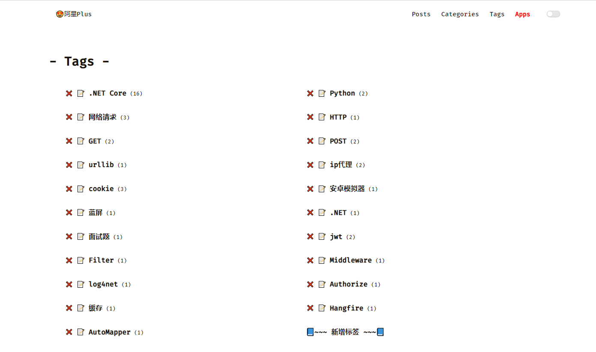
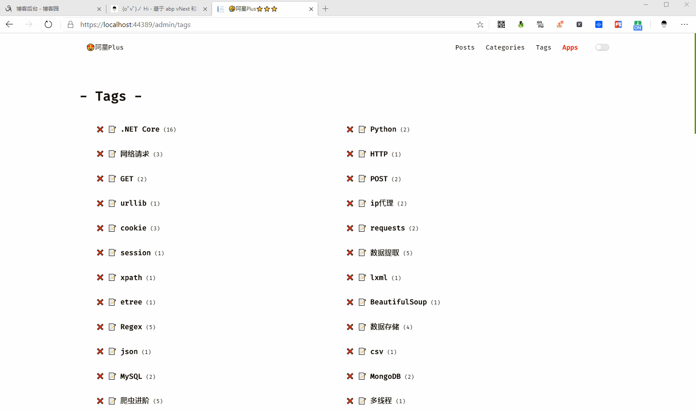
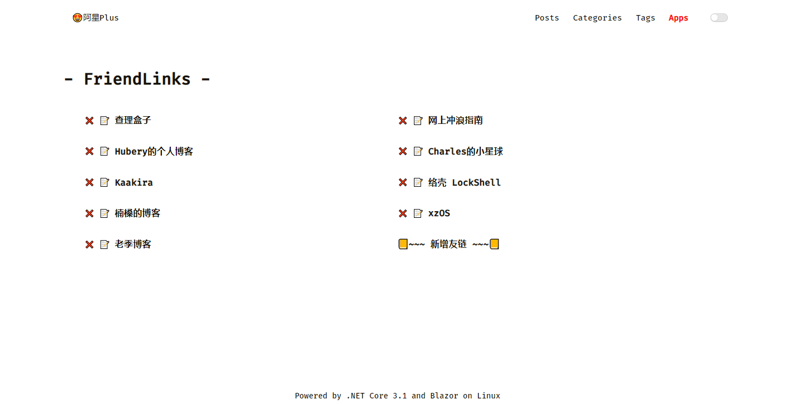

# Blazor 实战系列（七）

上一篇完成了后台分类模块的所有功能，本篇继续将标签模块和友情链接模块的增删改查完成。

## 标签管理



实现方式和之前的分类管理是一样的，在Admin文件夹下面添加`Tags.razor`组件，设置路由`@page "/admin/tags"`。

同样的内容也需要放在`AdminLayout`组件下面，添加几个参数：弹窗状态`bool Open`、新增或更新时标签字段`string tagName, displayName`、更新时的标签Id`int id`、API返回的标签列表接收参数`ServiceResult<IEnumerable<QueryTagForAdminDto>> tags`。

```csharp
/// <summary>
/// 默认隐藏Box
/// </summary>
private bool Open { get; set; } = false;

/// <summary>
/// 新增或者更新时候的标签字段值
/// </summary>
private string tagName, displayName;

/// <summary>
/// 更新标签的Id值
/// </summary>
private int id;

/// <summary>
/// API返回的标签列表数据
/// </summary>
private ServiceResult<IEnumerable<QueryTagForAdminDto>> tags;
```

```csharp
//QueryTagForAdminDto.cs
namespace Meowv.Blog.BlazorApp.Response.Blog
{
    public class QueryTagForAdminDto : QueryTagDto
    {
        /// <summary>
        /// 主键
        /// </summary>
        public int Id { get; set; }
    }
}
```

在初始化方法`OnInitializedAsync()`中获取数据。

```csharp
/// <summary>
/// 初始化
/// </summary>
/// <returns></returns>
protected override async Task OnInitializedAsync()
{
    var token = await Common.GetStorageAsync("token");
    Http.DefaultRequestHeaders.Add("Authorization", $"Bearer {token}");

    tags = await FetchData();
}

/// <summary>
/// 获取数据
/// </summary>
/// <returns></returns>
private async Task<ServiceResult<IEnumerable<QueryTagForAdminDto>>> FetchData()
{
    return await Http.GetFromJsonAsync<ServiceResult<IEnumerable<QueryTagForAdminDto>>>("/blog/admin/tags");
}
```

注意需要设置请求头，进行授权访问，然后页面上绑定数据。

```html
<AdminLayout>
    @if (tags == null)
    {
        <Loading />
    }
    else
    {
        <div class="post-wrap tags">
            <h2 class="post-title">-&nbsp;Tags&nbsp;-</h2>
            @if (tags.Success && tags.Result.Any())
            {
                <div class="categories-card">
                    @foreach (var item in tags.Result)
                    {
                        <div class="card-item">
                            <div class="categories">
                                <NavLink title="❌删除" @onclick="@(async () => await DeleteAsync(item.Id))">❌</NavLink>
                                <NavLink title="📝编辑" @onclick="@(() => ShowBox(item))">📝</NavLink>
                                <NavLink target="_blank" href="@($"/tag/{item.DisplayName}")">
                                    <h3>@item.TagName</h3>
                                    <small>(@item.Count)</small>
                                </NavLink>
                            </div>
                        </div>
                    }
                    <div class="card-item">
                        <div class="categories">
                            <NavLink><h3 @onclick="@(() => ShowBox())">📘~~~ 新增标签 ~~~📘</h3></NavLink>
                        </div>
                    </div>
                </div>
            }
            else
            {
                <ErrorTip />
            }
        </div>

        <Box OnClickCallback="@SubmitAsync" Open="@Open">
            <div class="box-item">
                <b>DisplayName：</b><input type="text" @bind="@displayName" @bind:event="oninput" />
            </div>
            <div class="box-item">
                <b>TagName：</b><input type="text" @bind="@tagName" @bind:event="oninput" />
            </div>
        </Box>
    }
</AdminLayout>
```

`tags`没获取到数据的时候显示`<Loading />`组件内容，循环遍历数据进行绑定，删除按钮绑定点击事件调用`DeleteAsync()`方法。新增和编辑按钮点击事件调用`ShowBox()`方法显示弹窗。新增的时候不需要传递参数，编辑的时候需要将当前item即`QueryTagForAdminDto`传递进去。

`<Box>`组件中绑定了标签的两个参数，是否打开参数`Opne`和确认按钮回调事件方法`SubmitAsync()`。

删除标签的方法`DeleteAsync(...)`如下：

```csharp
// 弹窗确认
bool confirmed = await Common.InvokeAsync<bool>("confirm", "\n💥💢真的要干掉这个该死的标签吗💢💥");

if (confirmed)
{
    var response = await Http.DeleteAsync($"/blog/tag?id={id}");

    var result = await response.Content.ReadFromJsonAsync<ServiceResult>();

    if (result.Success)
    {
        tags = await FetchData();
    }
}
```

删除之前进行二次确认，避免误伤，删除成功重新加载一遍数据。

弹窗的方法`ShowBox(...)`如下：

```csharp
/// <summary>
/// 显示box，绑定字段
/// </summary>
/// <param name="dto"></param>
private void ShowBox(QueryTagForAdminDto dto = null)
{
    Open = true;
    id = 0;

    // 新增
    if (dto == null)
    {
        displayName = null;
        tagName = null;
    }
    else // 更新
    {
        id = dto.Id;
        displayName = dto.DisplayName;
        tagName = dto.TagName;
    }
}
```

最后在弹窗中确认按钮的回调事件方法`SubmitAsync()`如下：

```csharp
/// <summary>
/// 确认按钮点击事件
/// </summary>
/// <returns></returns>
private async Task SubmitAsync()
{
    var input = new EditTagInput()
    {
        DisplayName = displayName.Trim(),
        TagName = tagName.Trim()
    };

    if (string.IsNullOrEmpty(input.DisplayName) || string.IsNullOrEmpty(input.TagName))
    {
        return;
    }

    var responseMessage = new HttpResponseMessage();

    if (id > 0)
        responseMessage = await Http.PutAsJsonAsync($"/blog/tag?id={id}", input);
    else
        responseMessage = await Http.PostAsJsonAsync("/blog/tag", input);

    var result = await responseMessage.Content.ReadFromJsonAsync<ServiceResult>();
    if (result.Success)
    {
        tags = await FetchData();
        Open = false;
    }
}
```

输入参数`EditTagInput`。

```csharp
namespace Meowv.Blog.BlazorApp.Response.Blog
{
    public class EditTagInput : TagDto
    {
    }
}
```

最终执行新增或者更新数据都在点击事件中进行，将变量的值赋值给`EditTagInput`，根据id判断走新增还是更新，成功后重新加载数据，关掉弹窗。

标签管理页面全部代码如下：

::: details 点击查看代码

```csharp
@page "/admin/categories"

<AdminLayout>
    @if (categories == null)
    {
        <Loading />
    }
    else
    {
        <div class="post-wrap categories">
            <h2 class="post-title">-&nbsp;Categories&nbsp;-</h2>
            @if (categories.Success && categories.Result.Any())
            {
                <div class="categories-card">
                    @foreach (var item in categories.Result)
                    {
                        <div class="card-item">
                            <div class="categories">
                                <NavLink title="❌删除" @onclick="@(async () => await DeleteAsync(item.Id))">❌</NavLink>
                                <NavLink title="📝编辑" @onclick="@(() => ShowBox(item))">📝</NavLink>
                                <NavLink target="_blank" href="@($"/category/{item.DisplayName}")">
                                    <h3>@item.CategoryName</h3>
                                    <small>(@item.Count)</small>
                                </NavLink>
                            </div>
                        </div>
                    }
                    <div class="card-item">
                        <div class="categories">
                            <NavLink><h3 @onclick="@(() => ShowBox())">📕~~~ 新增分类 ~~~📕</h3></NavLink>
                        </div>
                    </div>
                </div>
            }
            else
            {
                <ErrorTip />
            }
        </div>

        <Box OnClickCallback="@SubmitAsync" Open="@Open">
            <div class="box-item">
                <b>DisplayName：</b><input type="text" @bind="@displayName" @bind:event="oninput" />
            </div>
            <div class="box-item">
                <b>CategoryName：</b><input type="text" @bind="@categoryName" @bind:event="oninput" />
            </div>
        </Box>
    }
</AdminLayout>

@code {
    /// <summary>
    /// 默认隐藏Box
    /// </summary>
    private bool Open { get; set; } = false;

    /// <summary>
    /// 新增或者更新时候的分类字段值
    /// </summary>
    private string categoryName, displayName;

    /// <summary>
    /// 更新分类的Id值
    /// </summary>
    private int id;

    /// <summary>
    /// API返回的分类列表数据
    /// </summary>
    private ServiceResult<IEnumerable<QueryCategoryForAdminDto>> categories;

    /// <summary>
    /// 初始化
    /// </summary>
    /// <returns></returns>
    protected override async Task OnInitializedAsync()
    {
        var token = await Common.GetStorageAsync("token");
        Http.DefaultRequestHeaders.Add("Authorization", $"Bearer {token}");

        categories = await FetchData();
    }

    /// <summary>
    /// 获取数据
    /// </summary>
    /// <returns></returns>
    private async Task<ServiceResult<IEnumerable<QueryCategoryForAdminDto>>> FetchData()
    {
        return await Http.GetFromJsonAsync<ServiceResult<IEnumerable<QueryCategoryForAdminDto>>>("/blog/admin/categories");
    }

    /// <summary>
    /// 删除分类
    /// </summary>
    /// <param name="id"></param>
    /// <returns></returns>
    private async Task DeleteAsync(int id)
    {
        Open = false;

        // 弹窗确认
        bool confirmed = await Common.InvokeAsync<bool>("confirm", "\n💥💢真的要干掉这个该死的分类吗💢💥");

        if (confirmed)
        {
            var response = await Http.DeleteAsync($"/blog/category?id={id}");

            var result = await response.Content.ReadFromJsonAsync<ServiceResult>();

            if (result.Success)
            {
                categories = await FetchData();
            }
        }
    }

    /// <summary>
    /// 显示box，绑定字段
    /// </summary>
    /// <param name="dto"></param>
    private void ShowBox(QueryCategoryForAdminDto dto = null)
    {
        Open = true;
        id = 0;

        // 新增
        if (dto == null)
        {
            displayName = null;
            categoryName = null;
        }
        else // 更新
        {
            id = dto.Id;
            displayName = dto.DisplayName;
            categoryName = dto.CategoryName;
        }
    }

    /// <summary>
    /// 确认按钮点击事件
    /// </summary>
    /// <returns></returns>
    private async Task SubmitAsync()
    {
        var input = new EditCategoryInput()
        {
            DisplayName = displayName.Trim(),
            CategoryName = categoryName.Trim()
        };

        if (string.IsNullOrEmpty(input.DisplayName) || string.IsNullOrEmpty(input.CategoryName))
        {
            return;
        }

        var responseMessage = new HttpResponseMessage();

        if (id > 0)
            responseMessage = await Http.PutAsJsonAsync($"/blog/category?id={id}", input);
        else
            responseMessage = await Http.PostAsJsonAsync("/blog/category", input);

        var result = await responseMessage.Content.ReadFromJsonAsync<ServiceResult>();
        if (result.Success)
        {
            categories = await FetchData();
            Open = false;
        }
    }
}
```

:::



## 友链管理



实现方式都是一样的，这个就不多说了，直接上代码。

先将API返回的接收参数和新增编辑的输入参数添加一下。

```csharp
//QueryFriendLinkForAdminDto.cs
namespace Meowv.Blog.BlazorApp.Response.Blog
{
    public class QueryFriendLinkForAdminDto : FriendLinkDto
    {
        /// <summary>
        /// 主键
        /// </summary>
        public int Id { get; set; }
    }
}

//EditFriendLinkInput.cs
namespace Meowv.Blog.BlazorApp.Response.Blog
{
    public class EditFriendLinkInput : FriendLinkDto
    {
    }
}
```

```csharp
@page "/admin/friendlinks"

<AdminLayout>
    @if (friendlinks == null)
    {
        <Loading />
    }
    else
    {
        <div class="post-wrap categories">
            <h2 class="post-title">-&nbsp;FriendLinks&nbsp;-</h2>
            @if (friendlinks.Success && friendlinks.Result.Any())
            {
                <div class="categories-card">
                    @foreach (var item in friendlinks.Result)
                    {
                        <div class="card-item">
                            <div class="categories">
                                <NavLink title="❌删除" @onclick="@(async () => await DeleteAsync(item.Id))">❌</NavLink>
                                <NavLink title="📝编辑" @onclick="@(() => ShowBox(item))">📝</NavLink>
                                <NavLink target="_blank" href="@item.LinkUrl">
                                    <h3>@item.Title</h3>
                                </NavLink>
                            </div>
                        </div>
                    }
                    <div class="card-item">
                        <div class="categories">
                            <NavLink><h3 @onclick="@(() => ShowBox())">📒~~~ 新增友链 ~~~📒</h3></NavLink>
                        </div>
                    </div>
                </div>
            }
            else
            {
                <ErrorTip />
            }
        </div>

        <Box OnClickCallback="@SubmitAsync" Open="@Open">
            <div class="box-item">
                <b>Title：</b><input type="text" @bind="@title" @bind:event="oninput" />
            </div>
            <div class="box-item">
                <b>LinkUrl：</b><input type="text" @bind="@linkUrl" @bind:event="oninput" />
            </div>
        </Box>
    }
</AdminLayout>

@code {
    /// <summary>
    /// 默认隐藏Box
    /// </summary>
    private bool Open { get; set; } = false;

    /// <summary>
    /// 新增或者更新时候的友链字段值
    /// </summary>
    private string title, linkUrl;

    /// <summary>
    /// 更新友链的Id值
    /// </summary>
    private int id;

    /// <summary>
    /// API返回的友链列表数据
    /// </summary>
    private ServiceResult<IEnumerable<QueryFriendLinkForAdminDto>> friendlinks;

    /// <summary>
    /// 初始化
    /// </summary>
    /// <returns></returns>
    protected override async Task OnInitializedAsync()
    {
        var token = await Common.GetStorageAsync("token");
        Http.DefaultRequestHeaders.Add("Authorization", $"Bearer {token}");

        friendlinks = await FetchData();
    }

    /// <summary>
    /// 获取数据
    /// </summary>
    /// <returns></returns>
    private async Task<ServiceResult<IEnumerable<QueryFriendLinkForAdminDto>>> FetchData()
    {
        return await Http.GetFromJsonAsync<ServiceResult<IEnumerable<QueryFriendLinkForAdminDto>>>("/blog/admin/friendlinks");
    }

    /// <summary>
    /// 删除分类
    /// </summary>
    /// <param name="id"></param>
    /// <returns></returns>
    private async Task DeleteAsync(int id)
    {
        Open = false;

        // 弹窗确认
        bool confirmed = await Common.InvokeAsync<bool>("confirm", "\n💥💢真的要干掉这个该死的分类吗💢💥");

        if (confirmed)
        {
            var response = await Http.DeleteAsync($"/blog/friendlink?id={id}");

            var result = await response.Content.ReadFromJsonAsync<ServiceResult>();

            if (result.Success)
            {
                friendlinks = await FetchData();
            }
        }
    }

    /// <summary>
    /// 显示box，绑定字段
    /// </summary>
    /// <param name="dto"></param>
    private void ShowBox(QueryFriendLinkForAdminDto dto = null)
    {
        Open = true;
        id = 0;

        // 新增
        if (dto == null)
        {
            title = null;
            linkUrl = null;
        }
        else // 更新
        {
            id = dto.Id;
            title = dto.Title;
            linkUrl = dto.LinkUrl;
        }
    }

    /// <summary>
    /// 确认按钮点击事件
    /// </summary>
    /// <returns></returns>
    private async Task SubmitAsync()
    {
        var input = new EditFriendLinkInput()
        {
            Title = title.Trim(),
            LinkUrl = linkUrl.Trim()
        };

        if (string.IsNullOrEmpty(input.Title) || string.IsNullOrEmpty(input.LinkUrl))
        {
            return;
        }

        var responseMessage = new HttpResponseMessage();

        if (id > 0)
            responseMessage = await Http.PutAsJsonAsync($"/blog/friendlink?id={id}", input);
        else
            responseMessage = await Http.PostAsJsonAsync("/blog/friendlink", input);

        var result = await responseMessage.Content.ReadFromJsonAsync<ServiceResult>();
        if (result.Success)
        {
            friendlinks = await FetchData();
            Open = false;
        }
    }
}
```


截至目前为止，还剩下文章模块的功能还没做了，今天到这里吧，明天继续刚，未完待续...
