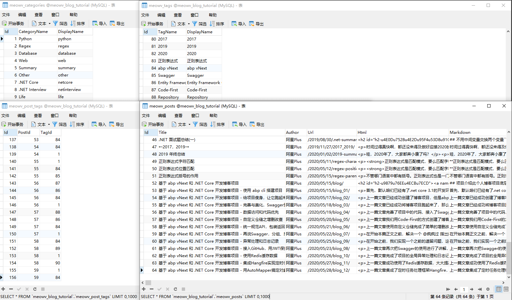
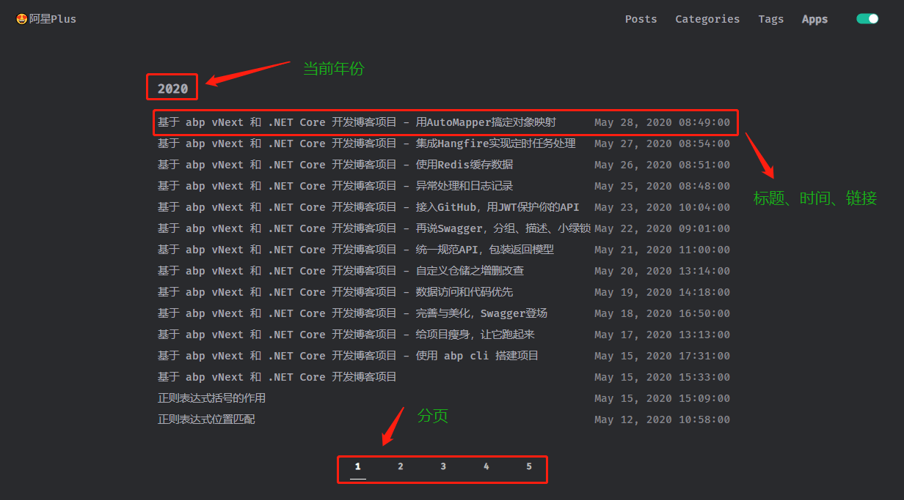
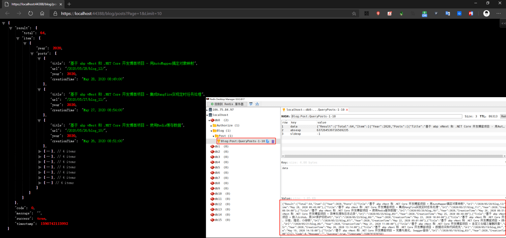
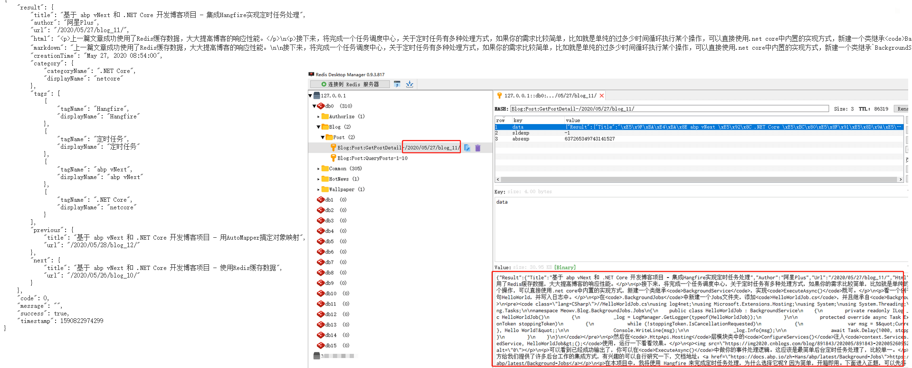

# 博客接口实战篇（一）

从本篇就开始博客页面的接口开发了，其实这些接口我是不想用文字来描述的，太枯燥太无趣了。全是CRUD，谁还不会啊，用得着我来讲吗？想想为了不半途而废，为了之前立的Flag，还是咬牙坚持吧。

## 准备工作

现在博客数据库中的数据是比较混乱的，为了看起来像那么回事，显得正式一点，我先手动搞点数据进去。



搞定了种子数据，就可以去愉快的写接口了，我这里将根据我现在的[博客](https://meowv.com)页面去分析所需要接口，感兴趣的去点点。

为了让接口看起来清晰，一目了然，删掉之前在`IBlogService`中添加的所有接口，将5个自定义仓储全部添加至`BlogService`中，然后用`partial`修饰。

```csharp
//IBlogService.cs
public partial interface IBlogService
{
}

//BlogService.cs
using Meowv.Blog.Application.Caching.Blog;
using Meowv.Blog.Domain.Blog.Repositories;

namespace Meowv.Blog.Application.Blog.Impl
{
    public partial class BlogService : ServiceBase, IBlogService
    {
        private readonly IBlogCacheService _blogCacheService;
        private readonly IPostRepository _postRepository;
        private readonly ICategoryRepository _categoryRepository;
        private readonly ITagRepository _tagRepository;
        private readonly IPostTagRepository _postTagRepository;
        private readonly IFriendLinkRepository _friendLinksRepository;

        public BlogService(IBlogCacheService blogCacheService,
                           IPostRepository postRepository,
                           ICategoryRepository categoryRepository,
                           ITagRepository tagRepository,
                           IPostTagRepository postTagRepository,
                           IFriendLinkRepository friendLinksRepository)
        {
            _blogCacheService = blogCacheService;
            _postRepository = postRepository;
            _categoryRepository = categoryRepository;
            _tagRepository = tagRepository;
            _postTagRepository = postTagRepository;
            _friendLinksRepository = friendLinksRepository;
        }
    }
}
```

在Blog文件夹下依次添加接口：`IBlogService.Post.cs`、`IBlogService.Category.cs`、`IBlogService.Tag.cs`、`IBlogService.FriendLink.cs`、`IBlogService.Admin.cs`。

在Blog/Impl文件夹下添加实现类：`IBlogService.Post.cs`、`BlogService.Category.cs`、`BlogService.Tag.cs`、`BlogService.FriendLink.cs`、`BlogService.Admin.cs`。

同上，`.Application.Caching`层也按照这个样子添加。

注意都需要添加partial修饰为局部的接口和实现类，所有文章相关的接口放在`IBlogService.Post.cs`中，分类放在`IBlogService.Category.cs`，标签放在`IBlogService.Tag.cs`，友链放在`IBlogService.FriendLink.cs`，后台增删改所有接口放在`IBlogService.Admin.cs`，最终效果图如下：


## 文章列表页



分析：列表带分页，以文章发表的年份分组，所需字段：标题、链接、时间、年份。

在`.Application.Contracts`层Blog文件夹下添加返回的模型：`QueryPostDto.cs`。

```csharp
//QueryPostDto.cs
using System.Collections.Generic;

namespace Meowv.Blog.Application.Contracts.Blog
{
    public class QueryPostDto
    {
        /// <summary>
        /// 年份
        /// </summary>
        public int Year { get; set; }

        /// <summary>
        /// Posts
        /// </summary>
        public IEnumerable<PostBriefDto> Posts { get; set; }
    }
}
```

模型为一个年份和一个文章列表，文章列表模型：`PostBriefDto.cs`。

```csharp
//PostBriefDto.cs
namespace Meowv.Blog.Application.Contracts.Blog
{
    public class PostBriefDto
    {
        /// <summary>
        /// 标题
        /// </summary>
        public string Title { get; set; }

        /// <summary>
        /// 链接
        /// </summary>
        public string Url { get; set; }

        /// <summary>
        /// 年份
        /// </summary>
        public int Year { get; set; }

        /// <summary>
        /// 创建时间
        /// </summary>
        public string CreationTime { get; set; }
    }
}
```

搞定，因为返回时间为英文格式，所以`CreationTime`给了字符串类型。

在`IBlogService.Post.cs`中添加接口分页查询文章列表`QueryPostsAsync`，肯定需要接受俩参数分页页码和分页数量。还是去添加一个公共模型`PagingInput`吧，在`.Application.Contracts`下面。

```csharp
//PagingInput.cs
using System.ComponentModel.DataAnnotations;

namespace Meowv.Blog.Application.Contracts
{
    /// <summary>
    /// 分页输入参数
    /// </summary>
    public class PagingInput
    {
        /// <summary>
        /// 页码
        /// </summary>
        [Range(1, int.MaxValue)]
        public int Page { get; set; } = 1;

        /// <summary>
        /// 限制条数
        /// </summary>
        [Range(10, 30)]
        public int Limit { get; set; } = 10;
    }
}
```

`Page`设置默认值为1，`Limit`设置默认值为10，`Range Attribute`设置参数可输入大小限制，于是这个分页查询文章列表的接口就是这个样子的。

```csharp
//IBlogService.Post.cs
public partial interface IBlogService
{
    /// <summary>
    /// 分页查询文章列表
    /// </summary>
    /// <param name="input"></param>
    /// <returns></returns>
    Task<ServiceResult<PagedList<QueryPostDto>>> QueryPostsAsync(PagingInput input);
}
```

`ServiceResult`和`PagedList`是之前添加的统一返回模型，紧接着就去添加一个分页查询文章列表缓存接口，和上面是对应的。

```csharp
//IBlogCacheService.Post.cs
using Meowv.Blog.Application.Contracts;
using Meowv.Blog.Application.Contracts.Blog;
using Meowv.Blog.ToolKits.Base;
using System;
using System.Threading.Tasks;

namespace Meowv.Blog.Application.Caching.Blog
{
    public partial interface IBlogCacheService
    {
        /// <summary>
        /// 分页查询文章列表
        /// </summary>
        /// <param name="input"></param>
        /// <param name="factory"></param>
        /// <returns></returns>
        Task<ServiceResult<PagedList<QueryPostDto>>> QueryPostsAsync(PagingInput input, Func<Task<ServiceResult<PagedList<QueryPostDto>>>> factory);
    }
}
```

分别实现这两个接口。

```csharp
//BlogCacheService.Post.cs
public partial class BlogCacheService
{
    private const string KEY_QueryPosts = "Blog:Post:QueryPosts-{0}-{1}";

    /// <summary>
    /// 分页查询文章列表
    /// </summary>
    /// <param name="input"></param>
    /// <param name="factory"></param>
    /// <returns></returns>
    public async Task<ServiceResult<PagedList<QueryPostDto>>> QueryPostsAsync(PagingInput input, Func<Task<ServiceResult<PagedList<QueryPostDto>>>> factory)
    {
        return await Cache.GetOrAddAsync(KEY_QueryPosts.FormatWith(input.Page, input.Limit), factory, CacheStrategy.ONE_DAY);
    }
}
```

```csharp
//BlogService.Post.cs
/// <summary>
/// 分页查询文章列表
/// </summary>
/// <param name="input"></param>
/// <returns></returns>
public async Task<ServiceResult<PagedList<QueryPostDto>>> QueryPostsAsync(PagingInput input)
{
    return await _blogCacheService.QueryPostsAsync(input, async () =>
    {
        var result = new ServiceResult<PagedList<QueryPostDto>>();

        var count = await _postRepository.GetCountAsync();

        var list = _postRepository.OrderByDescending(x => x.CreationTime)
                                  .PageByIndex(input.Page, input.Limit)
                                  .Select(x => new PostBriefDto
                                  {
                                      Title = x.Title,
                                      Url = x.Url,
                                      Year = x.CreationTime.Year,
                                      CreationTime = x.CreationTime.TryToDateTime()
                                  }).GroupBy(x => x.Year)
                                  .Select(x => new QueryPostDto
                                  {
                                      Year = x.Key,
                                      Posts = x.ToList()
                                  }).ToList();

        result.IsSuccess(new PagedList<QueryPostDto>(count.TryToInt(), list));
        return result;
    });
}
```

`PageByIndex(...)`、`TryToDateTime()`是`.ToolKits`层添加的扩展方法，先查询总数，然后根据时间倒序，分页，筛选出所需字段，根据年份分组，输出，结束。

在`BlogController`中添加API。

```csharp
/// <summary>
/// 分页查询文章列表
/// </summary>
/// <param name="input"></param>
/// <returns></returns>
[HttpGet]
[Route("posts")]
public async Task<ServiceResult<PagedList<QueryPostDto>>> QueryPostsAsync([FromQuery] PagingInput input)
{
    return await _blogService.QueryPostsAsync(input);
}
```

`[FromQuery]`设置input为从URL进行查询参数，编译运行看效果。



已经可以查询出数据，并且缓存至Redis中。

## 获取文章详情


分析：文章详情页，文章的标题、作者、发布时间、所属分类、标签列表、文章内容(HTML和MarkDown)、链接、上下篇的标题和链接。

创建返回模型：`PostDetailDto.cs`

```csharp
//PostDetailDto.cs
using System.Collections.Generic;

namespace Meowv.Blog.Application.Contracts.Blog
{
    public class PostDetailDto
    {
        /// <summary>
        /// 标题
        /// </summary>
        public string Title { get; set; }

        /// <summary>
        /// 作者
        /// </summary>
        public string Author { get; set; }

        /// <summary>
        /// 链接
        /// </summary>
        public string Url { get; set; }

        /// <summary>
        /// HTML
        /// </summary>
        public string Html { get; set; }

        /// <summary>
        /// Markdown
        /// </summary>
        public string Markdown { get; set; }

        /// <summary>
        /// 创建时间
        /// </summary>
        public string CreationTime { get; set; }

        /// <summary>
        /// 分类
        /// </summary>
        public CategoryDto Category { get; set; }

        /// <summary>
        /// 标签列表
        /// </summary>
        public IEnumerable<TagDto> Tags { get; set; }

        /// <summary>
        /// 上一篇
        /// </summary>
        public PostForPagedDto Previous { get; set; }

        /// <summary>
        /// 下一篇
        /// </summary>
        public PostForPagedDto Next { get; set; }
    }
}
```

同时添加`CategoryDto`、`TagDto`、`PostForPagedDto`。

```csharp
//CategoryDto.cs
namespace Meowv.Blog.Application.Contracts.Blog
{
    public class CategoryDto
    {
        /// <summary>
        /// 分类名称
        /// </summary>
        public string CategoryName { get; set; }

        /// <summary>
        /// 展示名称
        /// </summary>
        public string DisplayName { get; set; }
    }
}

//TagDto.cs
namespace Meowv.Blog.Application.Contracts.Blog
{
    public class TagDto
    {
        /// <summary>
        /// 标签名称
        /// </summary>
        public string TagName { get; set; }

        /// <summary>
        /// 展示名称
        /// </summary>
        public string DisplayName { get; set; }
    }
}

//PostForPagedDto.cs
namespace Meowv.Blog.Application.Contracts.Blog
{
    public class PostForPagedDto
    {
        /// <summary>
        /// 标题
        /// </summary>
        public string Title { get; set; }

        /// <summary>
        /// 链接
        /// </summary>
        public string Url { get; set; }
    }
}
```

添加获取文章详情接口和缓存的接口。

```csharp
//IBlogService.Post.cs
public partial interface IBlogService
{
    /// <summary>
    /// 根据URL获取文章详情
    /// </summary>
    /// <param name="url"></param>
    /// <returns></returns>
    Task<ServiceResult<PostDetailDto>> GetPostDetailAsync(string url);
}
```

```csharp
//IBlogCacheService.Post.cs
public partial interface IBlogCacheService
{
    /// <summary>
    /// 根据URL获取文章详情
    /// </summary>
    /// <param name="url"></param>
    /// <returns></returns>
    Task<ServiceResult<PostDetailDto>> GetPostDetailAsync(string url, Func<Task<ServiceResult<PostDetailDto>>> factory);
}
```

分别实现这两个接口。

```csharp
//BlogCacheService.Post.cs
public partial class BlogCacheService
{
    private const string KEY_GetPostDetail = "Blog:Post:GetPostDetail-{0}";

    /// <summary>
    /// 根据URL获取文章详情
    /// </summary>
    /// <param name="url"></param>
    /// <param name="factory"></param>
    /// <returns></returns>
    public async Task<ServiceResult<PostDetailDto>> GetPostDetailAsync(string url, Func<Task<ServiceResult<PostDetailDto>>> factory)
    {
        return await Cache.GetOrAddAsync(KEY_GetPostDetail.FormatWith(url), factory, CacheStrategy.ONE_DAY);
    }
}
```

```csharp
//BlogService.Post.cs
/// <summary>
/// 根据URL获取文章详情
/// </summary>
/// <param name="url"></param>
/// <returns></returns>
public async Task<ServiceResult<PostDetailDto>> GetPostDetailAsync(string url)
{
    return await _blogCacheService.GetPostDetailAsync(url, async () =>
    {
        var result = new ServiceResult<PostDetailDto>();

        var post = await _postRepository.FindAsync(x => x.Url.Equals(url));

        if (null == post)
        {
            result.IsFailed(ResponseText.WHAT_NOT_EXIST.FormatWith("URL", url));
            return result;
        }

        var category = await _categoryRepository.GetAsync(post.CategoryId);

        var tags = from post_tags in await _postTagRepository.GetListAsync()
                   join tag in await _tagRepository.GetListAsync()
                   on post_tags.TagId equals tag.Id
                   where post_tags.PostId.Equals(post.Id)
                   select new TagDto
                   {
                       TagName = tag.TagName,
                       DisplayName = tag.DisplayName
                   };

        var previous = _postRepository.Where(x => x.CreationTime > post.CreationTime).Take(1).FirstOrDefault();
        var next = _postRepository.Where(x => x.CreationTime < post.CreationTime).OrderByDescending(x => x.CreationTime).Take(1).FirstOrDefault();

        var postDetail = new PostDetailDto
        {
            Title = post.Title,
            Author = post.Author,
            Url = post.Url,
            Html = post.Html,
            Markdown = post.Markdown,
            CreationTime = post.CreationTime.TryToDateTime(),
            Category = new CategoryDto
            {
                CategoryName = category.CategoryName,
                DisplayName = category.DisplayName
            },
            Tags = tags,
            Previous = previous == null ? null : new PostForPagedDto
            {
                Title = previous.Title,
                Url = previous.Url
            },
            Next = next == null ? null : new PostForPagedDto
            {
                Title = next.Title,
                Url = next.Url
            }
        };

        result.IsSuccess(postDetail);
        return result;
    });
}
```

`ResponseText.WHAT_NOT_EXIST`是定义在`MeowvBlogConsts.cs`的常量。

`TryToDateTime()`和列表查询中的扩展方法一样，转换时间为想要的格式。

简单说一下查询逻辑，先根据参数url，查询是否存在数据，如果文章不存在则返回错误消息。

然后根据 `post.CategoryId` 就可以查询到当前文章的分类名称。

联合查询post_tags和tag两张表，指定查询条件post.Id，查询当前文章的所有标签。

最后上下篇的逻辑也很简单，上一篇取大于当前文章发布时间的第一篇，下一篇取时间倒序排序并且小于当前文章发布时间的第一篇文章。

最后将所有查询到的数据赋值给输出对象，返回，结束。

在`BlogController`中添加API。

```csharp
 /// <summary>
 /// 根据URL获取文章详情
 /// </summary>
 /// <param name="url"></param>
 /// <returns></returns>
 [HttpGet]
 [Route("post")]
 public async Task<ServiceResult<PostDetailDto>> GetPostDetailAsync(string url)
 {
     return await _blogService.GetPostDetailAsync(url);
 }
```

编译运行，然后输入URL查询一条文章详情数据。



成功输出预期内容，缓存同时也是ok的。
