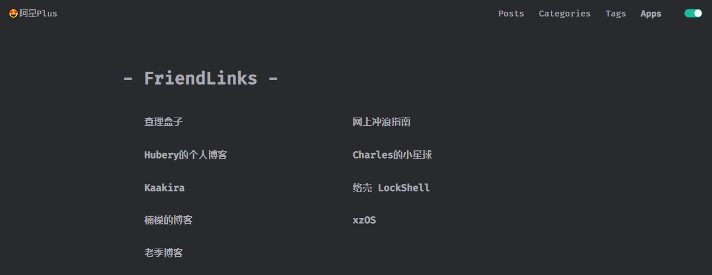
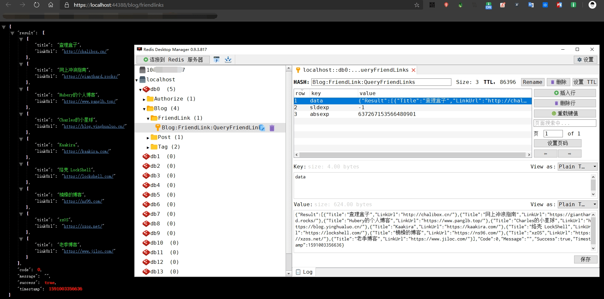
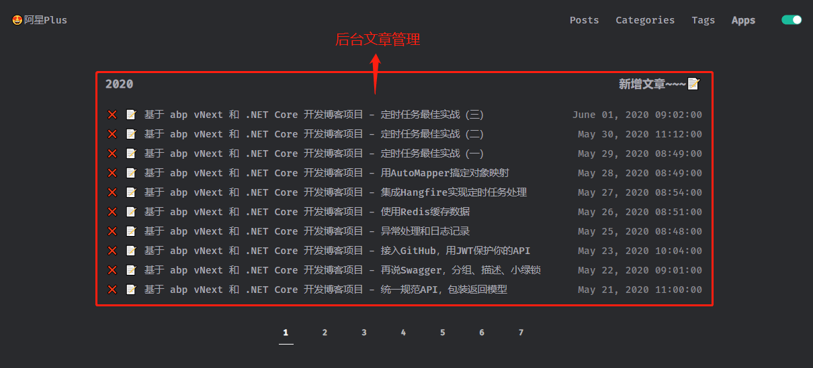
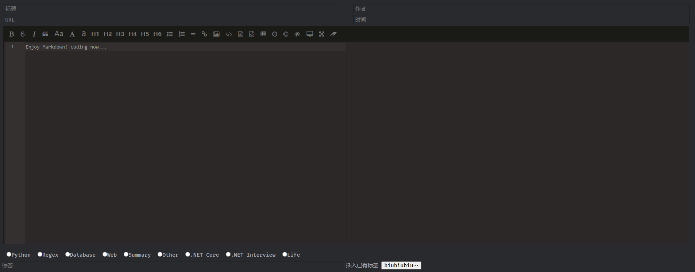
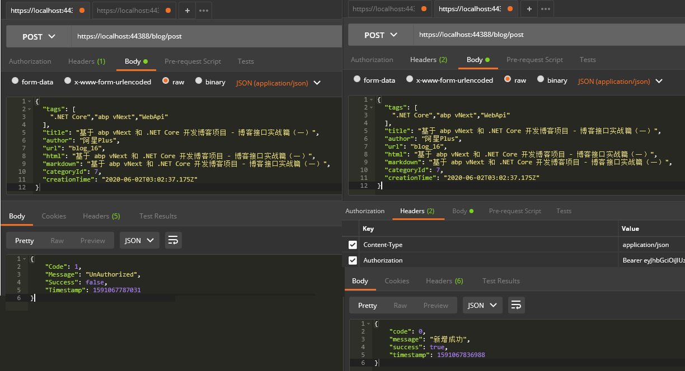

# 博客接口实战篇（三）

上篇文章完成了分类和标签页面相关的共6个接口，本篇继续来写博客增删改查API的业务。

供前端查询用的接口还剩下一个，这里先补上。

## 友链列表



分析：返回标题和对应的链接即可，传输对象`FriendLinkDto.cs`。

```csharp
//FriendLinkDto.cs
namespace Meowv.Blog.Application.Contracts.Blog
{
    public class FriendLinkDto
    {
        /// <summary>
        /// 标题
        /// </summary>
        public string Title { get; set; }

        /// <summary>
        /// 链接
        /// </summary>
        public string LinkUrl { get; set; }
    }
}
```

添加查询友链列表接口和缓存接口。

```csharp
//IBlogService.FriendLink.cs
using Meowv.Blog.Application.Contracts.Blog;
using Meowv.Blog.ToolKits.Base;
using System.Collections.Generic;
using System.Threading.Tasks;

namespace Meowv.Blog.Application.Blog
{
    public partial interface IBlogService
    {
        /// <summary>
        /// 查询友链列表
        /// </summary>
        /// <returns></returns>
        Task<ServiceResult<IEnumerable<FriendLinkDto>>> QueryFriendLinksAsync();
    }
}
```

```csharp
//IBlogCacheService.FriendLink.cs
using Meowv.Blog.Application.Contracts.Blog;
using Meowv.Blog.ToolKits.Base;
using System;
using System.Collections.Generic;
using System.Threading.Tasks;

namespace Meowv.Blog.Application.Caching.Blog
{
    public partial interface IBlogCacheService
    {
        /// <summary>
        /// 查询友链列表
        /// </summary>
        /// <param name="factory"></param>
        /// <returns></returns>
        Task<ServiceResult<IEnumerable<FriendLinkDto>>> QueryFriendLinksAsync(Func<Task<ServiceResult<IEnumerable<FriendLinkDto>>>> factory);
    }
}
```

接下来，实现他们。

```csharp
//BlogCacheService.FriendLink.cs
using Meowv.Blog.Application.Contracts.Blog;
using Meowv.Blog.ToolKits.Base;
using System;
using System.Collections.Generic;
using System.Threading.Tasks;
using static Meowv.Blog.Domain.Shared.MeowvBlogConsts;

namespace Meowv.Blog.Application.Caching.Blog.Impl
{
    public partial class BlogCacheService
    {
        private const string KEY_QueryFriendLinks = "Blog:FriendLink:QueryFriendLinks";

        /// <summary>
        /// 查询友链列表
        /// </summary>
        /// <param name="factory"></param>
        /// <returns></returns>
        public async Task<ServiceResult<IEnumerable<FriendLinkDto>>> QueryFriendLinksAsync(Func<Task<ServiceResult<IEnumerable<FriendLinkDto>>>> factory)
        {
            return await Cache.GetOrAddAsync(KEY_QueryFriendLinks, factory, CacheStrategy.ONE_DAY);
        }
    }
}
```

```csharp
//BlogService.FriendLink.cs
using Meowv.Blog.Application.Contracts.Blog;
using Meowv.Blog.Domain.Blog;
using Meowv.Blog.ToolKits.Base;
using System.Collections.Generic;
using System.Threading.Tasks;

namespace Meowv.Blog.Application.Blog.Impl
{
    public partial class BlogService
    {
        /// <summary>
        /// 查询友链列表
        /// </summary>
        /// <returns></returns>
        public async Task<ServiceResult<IEnumerable<FriendLinkDto>>> QueryFriendLinksAsync()
        {
            return await _blogCacheService.QueryFriendLinksAsync(async () =>
            {
                var result = new ServiceResult<IEnumerable<FriendLinkDto>>();

                var friendLinks = await _friendLinksRepository.GetListAsync();
                var list = ObjectMapper.Map<IEnumerable<FriendLink>, IEnumerable<FriendLinkDto>>(friendLinks);

                result.IsSuccess(list);
                return result;
            });
        }
    }
}
```

直接查询所有的友链数据，这里使用前面讲到的AutoMapper处理对象映射，将`IEnumerable<FriendLink>`转换为`IEnumerable<FriendLinkDto>`。

在`MeowvBlogAutoMapperProfile.cs`中添加一条配置：`CreateMap<FriendLink, FriendLinkDto>();`，在`BlogController`中添加API。

```csharp
/// <summary>
/// 查询友链列表
/// </summary>
/// <returns></returns>
[HttpGet]
[Route("friendlinks")]
public async Task<ServiceResult<IEnumerable<FriendLinkDto>>> QueryFriendLinksAsync()
{
    return await _blogService.QueryFriendLinksAsync();
}
```

编译运行，打开查询友链的API，此时没数据，手动添加几条数据进去再试试吧。



## 文章管理



后台文章管理包含：文章列表、新增、更新、删除文章，接下来依次完成这些接口。

### 文章列表

这里的文章列表和前台的文章列表差不多，就是多了一个Id，以供编辑和删除使用，所以可以新建一个模型类`QueryPostForAdminDto`继承`QueryPostDto`，添加`PostBriefForAdminDto`继承`PostBriefDto`同时新增一个字段主键Id。

在`QueryPostForAdminDto`中隐藏基类成员`Posts`，使用新的接收类型：`IEnumerable<PostBriefForAdminDto>`。

```csharp
//PostBriefForAdminDto.cs
namespace Meowv.Blog.Application.Contracts.Blog
{
    public class PostBriefForAdminDto : PostBriefDto
    {
        /// <summary>
        /// 主键
        /// </summary>
        public int Id { get; set; }
    }
}
```

```csharp
//QueryPostForAdminDto.cs
using System.Collections.Generic;

namespace Meowv.Blog.Application.Contracts.Blog
{
    public class QueryPostForAdminDto : QueryPostDto
    {
        /// <summary>
        /// Posts
        /// </summary>
        public new IEnumerable<PostBriefForAdminDto> Posts { get; set; }
    }
}
```

添加分页查询文章列表的接口：`QueryPostsForAdminAsync()`，关于后台的一些接口就不添加缓存了。

```csharp
//IBlogService.Admin.cs
using Meowv.Blog.Application.Contracts;
using Meowv.Blog.Application.Contracts.Blog;
using Meowv.Blog.ToolKits.Base;
using System.Threading.Tasks;

namespace Meowv.Blog.Application.Blog
{
    public partial interface IBlogService
    {
        /// <summary>
        /// 分页查询文章列表
        /// </summary>
        /// <param name="input"></param>
        /// <returns></returns>
        Task<ServiceResult<PagedList<QueryPostForAdminDto>>> QueryPostsForAdminAsync(PagingInput input);
    }
}
```

然后实现这个接口。

```csharp
//BlogService.Admin.cs
using Meowv.Blog.Application.Contracts;
using Meowv.Blog.Application.Contracts.Blog;
using Meowv.Blog.ToolKits.Base;
using Meowv.Blog.ToolKits.Extensions;
using System.Linq;
using System.Threading.Tasks;

namespace Meowv.Blog.Application.Blog.Impl
{
    public partial class BlogService
    {
        /// <summary>
        /// 分页查询文章列表
        /// </summary>
        /// <param name="input"></param>
        /// <returns></returns>
        public async Task<ServiceResult<PagedList<QueryPostForAdminDto>>> QueryPostsForAdminAsync(PagingInput input)
        {
            var result = new ServiceResult<PagedList<QueryPostForAdminDto>>();

            var count = await _postRepository.GetCountAsync();

            var list = _postRepository.OrderByDescending(x => x.CreationTime)
                                      .PageByIndex(input.Page, input.Limit)
                                      .Select(x => new PostBriefForAdminDto
                                      {
                                          Id = x.Id,
                                          Title = x.Title,
                                          Url = x.Url,
                                          Year = x.CreationTime.Year,
                                          CreationTime = x.CreationTime.TryToDateTime()
                                      })
                                      .GroupBy(x => x.Year)
                                      .Select(x => new QueryPostForAdminDto
                                      {
                                          Year = x.Key,
                                          Posts = x.ToList()
                                      }).ToList();

            result.IsSuccess(new PagedList<QueryPostForAdminDto>(count.TryToInt(), list));
            return result;
        }
    }
}
```

实现逻辑也非常简单和之前一样，就是在`Select`的时候多了一个`Id`，添加一个新的Controller：`BlogController.Admin.cs`，添加这个接口。

```csharp
//BlogController.Admin.cs
using Meowv.Blog.Application.Contracts;
using Meowv.Blog.Application.Contracts.Blog;
using Meowv.Blog.ToolKits.Base;
using Microsoft.AspNetCore.Authorization;
using Microsoft.AspNetCore.Mvc;
using System.Threading.Tasks;
using static Meowv.Blog.Domain.Shared.MeowvBlogConsts;

namespace Meowv.Blog.HttpApi.Controllers
{
    public partial class BlogController
    {
        /// <summary>
        /// 分页查询文章列表
        /// </summary>
        /// <param name="input"></param>
        /// <returns></returns>
        [HttpGet]
        [Authorize]
        [Route("admin/posts")]
        [ApiExplorerSettings(GroupName = Grouping.GroupName_v2)]
        public async Task<ServiceResult<PagedList<QueryPostForAdminDto>>> QueryPostsForAdminAsync([FromQuery] PagingInput input)
        {
            return await _blogService.QueryPostsForAdminAsync(input);
        }
    }
}
```

因为是后台的接口，所以加上`AuthorizeAttribute`，指定接口组为`GroupName_v2`，参数方式为`[FromQuery]`。

当没有进行授权的时候，是无法访问接口的。


### 新增文章



在做新增文章的时候要注意几点，不是单纯的添加文章数据就结束了，要指定文章分类，添加文章的标签。添加标签我这里是从标签库中去取得数据，只存标签Id，所以添加标签的时候就可能存在添加了标签库中已有的标签。

新建一个新增和更新文章的通用输出参数模型类，起名：`EditPostInput`，继承`PostDto`，然后添加标签Tags字段，返回类型`IEnumerable<string>`。

```csharp
//EditPostInput.cs
using System.Collections.Generic;

namespace Meowv.Blog.Application.Contracts.Blog.Params
{
    public class EditPostInput : PostDto
    {
        /// <summary>
        /// 标签列表
        /// </summary>
        public IEnumerable<string> Tags { get; set; }
    }
}
```

添加新增文章的接口：`InsertPostAsync`。

```csharp
/// <summary>
/// 新增文章
/// </summary>
/// <param name="input"></param>
/// <returns></returns>
Task<ServiceResult> InsertPostAsync(EditPostInput input);
```

然后去实现这个接口，实现之前，配置AutoMapper实体映射。

```csharp
CreateMap<EditPostInput, Post>().ForMember(x => x.Id, opt => opt.Ignore());
```

将`EditPostInput`转换为`Post`，并且忽略`Id`字段。

```csharp
/// <summary>
/// 新增文章
/// </summary>
/// <param name="input"></param>
/// <returns></returns>
public async Task<ServiceResult> InsertPostAsync(EditPostInput input)
{
    var result = new ServiceResult();

    var post = ObjectMapper.Map<EditPostInput, Post>(input);
    post.Url = $"{post.CreationTime.ToString(" yyyy MM dd ").Replace(" ", "/")}{post.Url}/";
    await _postRepository.InsertAsync(post);

    var tags = await _tagRepository.GetListAsync();

    var newTags = input.Tags
                       .Where(item => !tags.Any(x => x.TagName.Equals(item)))
                       .Select(item => new Tag
                       {
                           TagName = item,
                           DisplayName = item
                       });
    await _tagRepository.BulkInsertAsync(newTags);

    var postTags = input.Tags.Select(item => new PostTag
    {
        PostId = post.Id,
        TagId = _tagRepository.FirstOrDefault(x => x.TagName == item).Id
    });
    await _postTagRepository.BulkInsertAsync(postTags);

    result.IsSuccess(ResponseText.INSERT_SUCCESS);
    return result;
}
```

URL字段，根据创建时间按照`yyyy/MM/dd/name/`格式拼接。

然后找出是否有新标签，有的话批量添加至标签表。

再根据`input.Tags`构建`PostTag`列表，也进行批量保存，这样才算是新增好一篇文章，最后输出`ResponseText.INSERT_SUCCESS`常量，提示成功。

在`BlogController.Admin.cs`添加API。

```csharp
/// <summary>
/// 新增文章
/// </summary>
/// <param name="input"></param>
/// <returns></returns>
[HttpPost]
[Authorize]
[Route("post")]
[ApiExplorerSettings(GroupName = Grouping.GroupName_v2)]
public async Task<ServiceResult> InsertPostAsync([FromBody] EditPostInput input)
{
    return await _blogService.InsertPostAsync(input);
}
```



### 更新文章

更新操作和新增操作输入参数一样，只新增一个Id用来标识更新那篇文章，添加`UpdatePostAsync`更新文章接口。

```csharp
/// <summary>
/// 更新文章
/// </summary>
/// <param name="id"></param>
/// <param name="input"></param>
/// <returns></returns>
Task<ServiceResult> UpdatePostAsync(int id, EditPostInput input);
```

同样的实现这个接口。

```csharp
/// <summary>
/// 更新文章
/// </summary>
/// <param name="id"></param>
/// <param name="input"></param>
/// <returns></returns>
public async Task<ServiceResult> UpdatePostAsync(int id, EditPostInput input)
{
    var result = new ServiceResult();

    var post = await _postRepository.GetAsync(id);
    post.Title = input.Title;
    post.Author = input.Author;
    post.Url = $"{input.CreationTime.ToString(" yyyy MM dd ").Replace(" ", "/")}{input.Url}/";
    post.Html = input.Html;
    post.Markdown = input.Markdown;
    post.CreationTime = input.CreationTime;
    post.CategoryId = input.CategoryId;

    await _postRepository.UpdateAsync(post);

    var tags = await _tagRepository.GetListAsync();

    var oldPostTags = from post_tags in await _postTagRepository.GetListAsync()
                      join tag in await _tagRepository.GetListAsync()
                      on post_tags.TagId equals tag.Id
                      where post_tags.PostId.Equals(post.Id)
                      select new
                      {
                          post_tags.Id,
                          tag.TagName
                      };

    var removedIds = oldPostTags.Where(item => !input.Tags.Any(x => x == item.TagName) &&
                                               tags.Any(t => t.TagName == item.TagName))
                                .Select(item => item.Id);
    await _postTagRepository.DeleteAsync(x => removedIds.Contains(x.Id));

    var newTags = input.Tags
                       .Where(item => !tags.Any(x => x.TagName == item))
                       .Select(item => new Tag
                       {
                           TagName = item,
                           DisplayName = item
                       });
    await _tagRepository.BulkInsertAsync(newTags);

    var postTags = input.Tags
                        .Where(item => !oldPostTags.Any(x => x.TagName == item))
                        .Select(item => new PostTag
                        {
                            PostId = id,
                            TagId = _tagRepository.FirstOrDefault(x => x.TagName == item).Id
                        });
    await _postTagRepository.BulkInsertAsync(postTags);

    result.IsSuccess(ResponseText.UPDATE_SUCCESS);
    return result;
}
```

`ResponseText.UPDATE_SUCCESS`是常量更新成功。

先根据Id查询到数据库中的这篇文章数据，然后根据input参数，修改需要修改的数据，最后保存。

注意的是，如果修改的时候修改了标签，有可能新增也有可能删除，也许会又有新增又有删除。

这时候就需要注意，这里做了一个比较通用的方法，找到数据库中当前文章Id的所有Tags，然后根据参数`input.Tags`可以找出被删掉的标签的PostTags的Id，调用删除方法删掉即可，同时也可以获取到新增的标签，批量进行保存。

完成上面操作后，才保存新加标签与文章对应的数据，最后提示更新成功，在`BlogController.Admin`添加API。

```csharp
/// <summary>
/// 更新文章
/// </summary>
/// <param name="id"></param>
/// <param name="input"></param>
/// <returns></returns>
[HttpPut]
[Authorize]
[Route("post")]
[ApiExplorerSettings(GroupName = Grouping.GroupName_v2)]
public async Task<ServiceResult> UpdatePostAsync([Required] int id, [FromBody] EditPostInput input)
{
    return await _blogService.UpdatePostAsync(id, input);
}
```

`[HttpPut]`指定请求方式为`put`请求，一般需要修改用put，添加用post。

`[Required]`指定参数id必填且是FromQuery的方式，input为`[FromBody]`。

更新一下上面新增的数据试试。


### 删除文章

删除相对来说就非常简单了，一般删除都会做逻辑删除，就是避免某些手残删除了，有找回的余地，我们这里就直接Delete了，也没什么重要数据。

添加接口：`DeletePostAsync`。

```csharp
/// <summary>
/// 删除文章
/// </summary>
/// <param name="id"></param>
/// <returns></returns>
Task<ServiceResult> DeletePostAsync(int id);
```

实现接口。

```csharp
/// <summary>
/// 删除文章
/// </summary>
/// <param name="id"></param>
/// <returns></returns>
public async Task<ServiceResult> DeletePostAsync(int id)
{
    var result = new ServiceResult();

    var post = await _postRepository.GetAsync(id);
    if (null == post)
    {
        result.IsFailed(ResponseText.WHAT_NOT_EXIST.FormatWith("Id", id));
        return result;
    }

    await _postRepository.DeleteAsync(id);
    await _postTagRepository.DeleteAsync(x => x.PostId == id);

    result.IsSuccess(ResponseText.DELETE_SUCCESS);
    return result;
}
```

删除的时候同样去查询一下数据，来判断是否存在。

`ResponseText.DELETE_SUCCESS`是添加的常量删除成功，删除成功同时也要将post_tags表的标签对应关系也干掉才算完整，在BlogController.Admin添加API。

```csharp
/// <summary>
/// 删除文章
/// </summary>
/// <param name="id"></param>
/// <returns></returns>
[HttpDelete]
[Authorize]
[Route("post")]
[ApiExplorerSettings(GroupName = Grouping.GroupName_v2)]
public async Task<ServiceResult> DeletePostAsync([Required] int id)
{
    return await _blogService.DeletePostAsync(id);
}
```

`[HttpDelete]`指定请求方式是删除资源，`[Required]`指定参数Id必填。

删掉上面添加的文章看看效果。


至此，完成了博客文章的增删改接口，未完待续...
