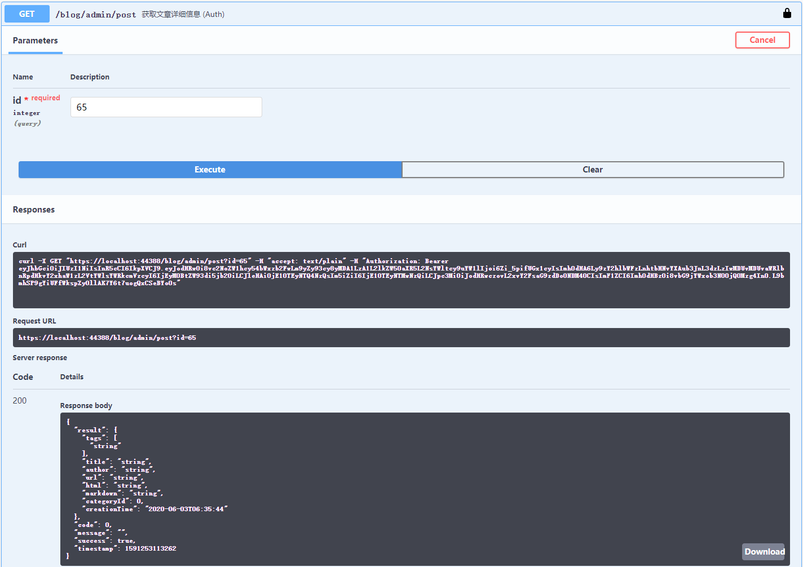

# 博客接口实战篇（四）

上篇文章完成了文章增删改的接口和友情链接列表的接口，本篇继续。

善于思考的同学肯定发现，在执行增删改操作后，Redis缓存中的数据还是存在的，也就意味着查询接口返回的数据还是旧的，所以在写接口之前，先完成一下清缓存的操作。

## 移除缓存

移除缓存我这里找了一个新的包：`Caching.CSRedis`，选他是因为微软的包`Microsoft.Extensions.Caching.StackExchangeRedis`没有给我们实现批量删除的功能。

`Caching.CSRedis`开源地址，<https://github.com/2881099/csredis> 在这不做过多介绍，感兴趣的自己去看。

在`.Application.Caching`层添加包`Caching.CSRedis`，`Install-Package Caching.CSRedis`，然后在模块类`MeowvBlogApplicationCachingModule`中进行配置。

```csharp
//MeowvBlogApplicationCachingModule.cs
...
public override void ConfigureServices(ServiceConfigurationContext context)
{
    ...

    var csredis = new CSRedis.CSRedisClient(AppSettings.Caching.RedisConnectionString);
    RedisHelper.Initialization(csredis);

    context.Services.AddSingleton<IDistributedCache>(new CSRedisCache(RedisHelper.Instance));
}
...
```

直接新建一个移除缓存的接口：`ICacheRemoveService`，添加移除缓存的方法`RemoveAsync()`。代码较少，可以直接写在缓存基类`CachingServiceBase`中。

```csharp
public interface ICacheRemoveService
{
    /// <summary>
    /// 移除缓存
    /// </summary>
    /// <param name="key"></param>
    /// <param name="cursor"></param>
    /// <returns></returns>
    Task RemoveAsync(string key, int cursor = 0);
}
```

然后可以在基类中实现这个接口。

```csharp
public async Task RemoveAsync(string key, int cursor = 0)
{
    var scan = await RedisHelper.ScanAsync(cursor);
    var keys = scan.Items;

    if (keys.Any() && key.IsNotNullOrEmpty())
    {
        keys = keys.Where(x => x.StartsWith(key)).ToArray();

        await RedisHelper.DelAsync(keys);
    }
}
```

简单说一下这个操作过程，使用`ScanAsync()`获取到所有的Redis key值，返回的是一个string数组，然后根据参数找到符合此前缀的所有key，最后调用`DelAsync(keys)`删除缓存。

在需要有移除缓存功能的接口上继承`ICacheRemoveService`，这里就是`IBlogCacheService`。

```csharp
//IBlogCacheService.cs
namespace Meowv.Blog.Application.Caching.Blog
{
    public partial interface IBlogCacheService : ICacheRemoveService
    {
    }
}
```

在基类中已经实现了这个接口，所以现在所有继承基类的缓存实现类都可以调用移除缓存方法了。

在`MeowvBlogConsts`中添加缓存前缀的常量。

```csharp
//MeowvBlogConsts.cs
/// <summary>
/// 缓存前缀
/// </summary>
public static class CachePrefix
{
    public const string Authorize = "Authorize";

    public const string Blog = "Blog";

    public const string Blog_Post = Blog + ":Post";

    public const string Blog_Tag = Blog + ":Tag";

    public const string Blog_Category = Blog + ":Category";

    public const string Blog_FriendLink = Blog + ":FriendLink";
}
```

然后在`BlogService.Admin.cs`服务执行增删改后调用移除缓存的方法。

```csharp
//BlogService.Admin.cs

// 执行清除缓存操作
await _blogCacheService.RemoveAsync(CachePrefix.Blog_Post);
```

因为是小项目，采用这种策略直接删除缓存，这样就搞定了当在执行增删改操作后，前台接口可以实时查询出最后的结果。

## 文章详情


当我们修改文章数据的时候，是需要把当前数据库中的数据带出来显示在界面上的，因为有可能只是个别地方需要修改，所以这还需要一个查询文章详情的接口，当然这里的详情和前端的是不一样的，这里是需要根据Id主键去查询。

添加模型类`PostForAdminDto.cs`，直接继承`PostDto`，然后添加一个Tags列表就行，==，好像和上一篇文章中的`EditPostInput`字段是一模一样的。顺手将`EditPostInput`改一下吧，具体代码如下：

```csharp
//PostForAdminDto.cs
using System.Collections.Generic;

namespace Meowv.Blog.Application.Contracts.Blog
{
    public class PostForAdminDto : PostDto
    {
        /// <summary>
        /// 标签列表
        /// </summary>
        public IEnumerable<string> Tags { get; set; }
    }
}

//EditPostInput.cs
namespace Meowv.Blog.Application.Contracts.Blog.Params
{
    public class EditPostInput : PostForAdminDto
    {
    }
}
```

在`IBlogService.Admin.cs`中添加接口。

```csharp
/// <summary>
/// 获取文章详情
/// </summary>
/// <param name="id"></param>
/// <returns></returns>
Task<ServiceResult<PostForAdminDto>> GetPostForAdminAsync(int id);
```

实现这个接口。

```csharp
/// <summary>
/// 获取文章详情
/// </summary>
/// <param name="id"></param>
/// <returns></returns>
public async Task<ServiceResult<PostForAdminDto>> GetPostForAdminAsync(int id)
{
    var result = new ServiceResult<PostForAdminDto>();

    var post = await _postRepository.GetAsync(id);

    var tags = from post_tags in await _postTagRepository.GetListAsync()
               join tag in await _tagRepository.GetListAsync()
               on post_tags.TagId equals tag.Id
               where post_tags.PostId.Equals(post.Id)
               select tag.TagName;

    var detail = ObjectMapper.Map<Post, PostForAdminDto>(post);
    detail.Tags = tags;
    detail.Url = post.Url.Split("/").Where(x => !string.IsNullOrEmpty(x)).Last();

    result.IsSuccess(detail);
    return result;
}
```

先根据Id查出文章数据，再通过联合查询找出标签数据。

```csharp
CreateMap<Post, PostForAdminDto>().ForMember(x => x.Tags, opt => opt.Ignore());
```

新建一条AutoMapper配置，将`Post`转换成`PostForAdminDto`，忽略Tags。

然后将查出来的标签、Url赋值给DTO，输出即可。在`BlogController.Admin`中添加API。

```csharp
/// <summary>
/// 获取文章详情
/// </summary>
/// <param name="id"></param>
/// <returns></returns>
[HttpGet]
[Authorize]
[Route("admin/post")]
[ApiExplorerSettings(GroupName = Grouping.GroupName_v2)]
public async Task<ServiceResult<PostForAdminDto>> GetPostForAdminAsync([Required] int id)
{
    return await _blogService.GetPostForAdminAsync(id);
}
```



至此，完成了关于文章的所有接口。

接下来按照以上方式依次完成分类、标签、友链的增删改查接口，我觉得如果你有跟着我一起做，剩下的可以自己完成。
