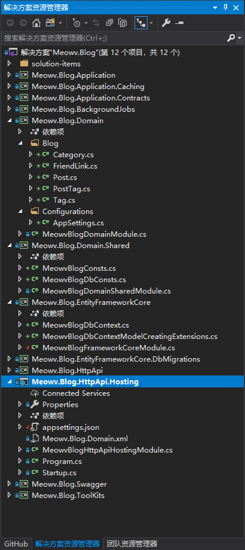
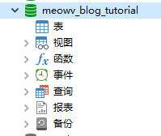
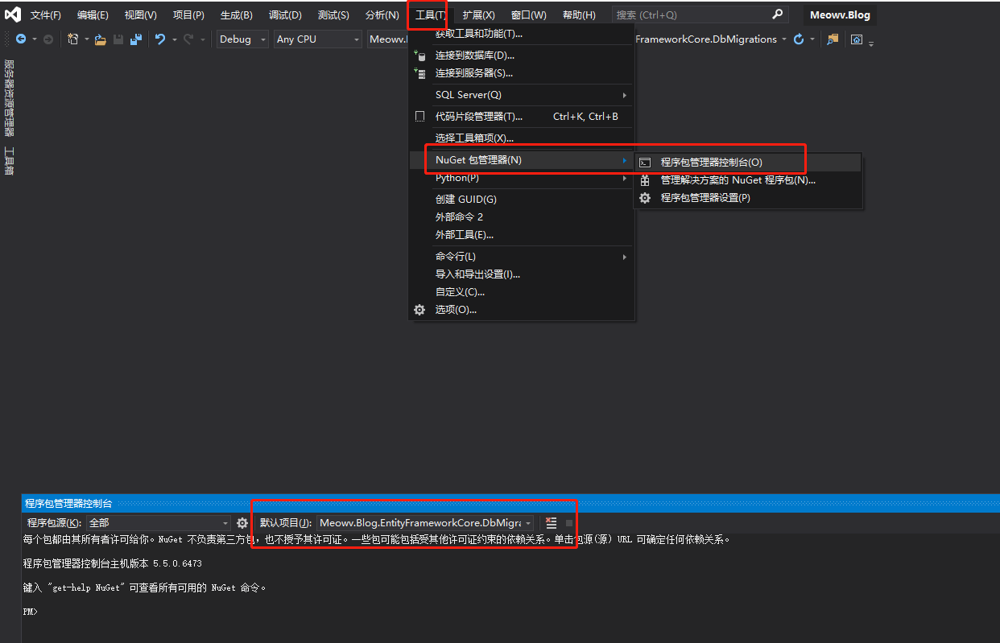
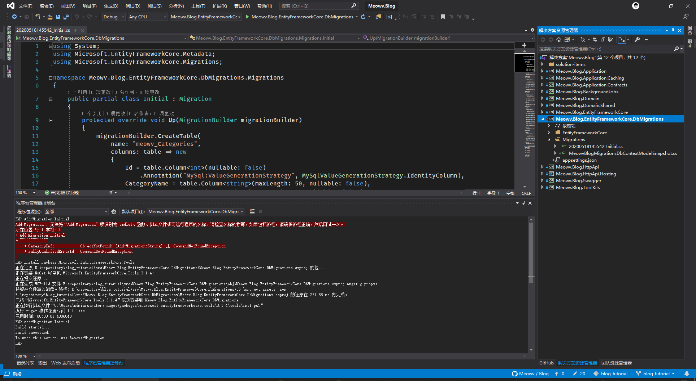
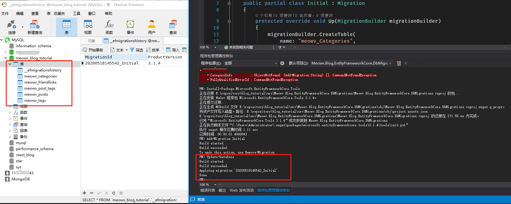
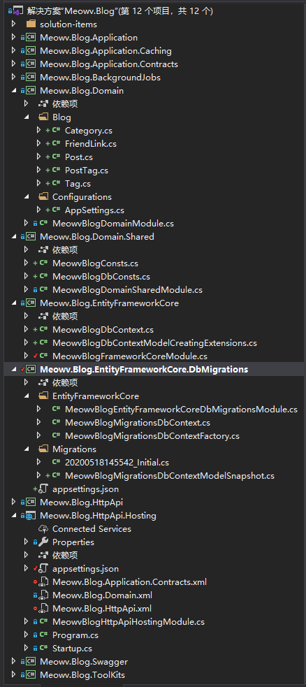

# 数据访问和代码优先

上一篇文章完善了项目中的代码，接入了Swagger。本篇主要使用Entity Framework Core完成对数据库的访问，以及使用Code-First的方式进行数据迁移，自动创建表结构。

## 数据访问

在`.EntityFrameworkCore`项目中添加我们的数据访问上下文对象`MeowvBlogDbContext`，继承自 `AbpDbContext<T>`。然后重写`OnModelCreating`方法。

`OnModelCreating`：定义EF Core 实体映射。先调用 `base.OnModelCreating` 让 abp 框架为我们实现基础映射，然后调用`builder.Configure()`扩展方法来配置应用程序的实体。当然也可以不用扩展，直接写在里面，这样一大坨显得不好看而已。

在abp框架中，可以使用 `[ConnectionStringName]` Attribute 为我们的DbContext配置连接字符串名称。先加上，然后再在`appsettings.json`中进行配置，因为之前集成了多个数据库，所以这里我们也配置多个连接字符串，与之对应。

本项目默认采用MySql，你可以选择任意你喜欢的。

```csharp
//MeowvBlogDbContext.cs
using Microsoft.EntityFrameworkCore;
using Volo.Abp.Data;
using Volo.Abp.EntityFrameworkCore;

namespace Meowv.Blog.EntityFrameworkCore
{
    [ConnectionStringName("MySql")]
    public class MeowvBlogDbContext : AbpDbContext<MeowvBlogDbContext>
    {
        public MeowvBlogDbContext(DbContextOptions<MeowvBlogDbContext> options) : base(options)
        {
        }

        protected override void OnModelCreating(ModelBuilder modelBuilder)
        {
            base.OnModelCreating(modelBuilder);

            modelBuilder.Configure();
        }
    }
}
```

```json
//appsettings.json
{
  "ConnectionStrings": {
    "Enable": "MySQL",
    "MySql": "Server=localhost;User Id=root;Password=123456;Database=meowv_blog_tutorial",
    "SqlServer": "",
    "PostgreSql": "",
    "Sqlite": ""
  }
}
```

然后新建我们的扩展类`MeowvBlogDbContextModelCreatingExtensions.cs`和扩展方法`Configure()`。注意，扩展方法是静态的，需加`static`

```csharp
//MeowvBlogDbContextModelCreatingExtensions.cs
using Microsoft.EntityFrameworkCore;
using Volo.Abp;

namespace Meowv.Blog.EntityFrameworkCore
{
    public static class MeowvBlogDbContextModelCreatingExtensions
    {
        public static void Configure(this ModelBuilder builder)
        {
            Check.NotNull(builder, nameof(builder));
            ...
        }
    }
}
```

完成上述操作后在我们的模块类`MeowvBlogFrameworkCoreModule`中将DbContext注册到依赖注入，根据你配置的值使用不同的数据库。在`.Domain`层创建配置文件访问类`AppSettings.cs`

```csharp
//AppSettings.cs
using Microsoft.Extensions.Configuration;
using System.IO;

namespace Meowv.Blog.Domain.Configurations
{
    /// <summary>
    /// appsettings.json配置文件数据读取类
    /// </summary>
    public class AppSettings
    {
        /// <summary>
        /// 配置文件的根节点
        /// </summary>
        private static readonly IConfigurationRoot _config;

        /// <summary>
        /// Constructor
        /// </summary>
        static AppSettings()
        {
            // 加载appsettings.json，并构建IConfigurationRoot
            var builder = new ConfigurationBuilder().SetBasePath(Directory.GetCurrentDirectory())
                                                    .AddJsonFile("appsettings.json", true, true);
            _config = builder.Build();
        }

        /// <summary>
        /// EnableDb
        /// </summary>
        public static string EnableDb => _config["ConnectionStrings:Enable"];

        /// <summary>
        /// ConnectionStrings
        /// </summary>
        public static string ConnectionStrings => _config.GetConnectionString(EnableDb);
    }
}
```

获取配置文件内容比较容易，代码中有注释也很容易理解。

值得一提的是，ABP会自动为DbContext中的实体创建默认仓储. 需要在注册的时使用options添加`AddDefaultRepositories()`。

默认情况下为每个实体创建一个仓储，如果想要为其他实体也创建仓储，可以将 `includeAllEntities` 设置为 true，然后就可以在服务中注入和使用 `IRepository<TEntity>` 或 `IQueryableRepository<TEntity>`

```csharp
//MeowvBlogFrameworkCoreModule.cs
using Meowv.Blog.Domain;
using Meowv.Blog.Domain.Configurations;
using Microsoft.Extensions.DependencyInjection;
using Volo.Abp.EntityFrameworkCore;
using Volo.Abp.EntityFrameworkCore.MySQL;
using Volo.Abp.EntityFrameworkCore.PostgreSql;
using Volo.Abp.EntityFrameworkCore.Sqlite;
using Volo.Abp.EntityFrameworkCore.SqlServer;
using Volo.Abp.Modularity;

namespace Meowv.Blog.EntityFrameworkCore
{
    [DependsOn(
        typeof(MeowvBlogDomainModule),
        typeof(AbpEntityFrameworkCoreModule),
        typeof(AbpEntityFrameworkCoreMySQLModule),
        typeof(AbpEntityFrameworkCoreSqlServerModule),
        typeof(AbpEntityFrameworkCorePostgreSqlModule),
        typeof(AbpEntityFrameworkCoreSqliteModule)
    )]
    public class MeowvBlogFrameworkCoreModule : AbpModule
    {
        public override void ConfigureServices(ServiceConfigurationContext context)
        {
            context.Services.AddAbpDbContext<MeowvBlogDbContext>(options =>
            {
                options.AddDefaultRepositories(includeAllEntities: true);
            });

            Configure<AbpDbContextOptions>(options =>
            {
                switch (AppSettings.EnableDb)
                {
                    case "MySQL":
                        options.UseMySQL();
                        break;
                    case "SqlServer":
                        options.UseSqlServer();
                        break;
                    case "PostgreSql":
                        options.UsePostgreSql();
                        break;
                    case "Sqlite":
                        options.UseSqlite();
                        break;
                    default:
                        options.UseMySQL();
                        break;
                }
            });
        }
    }
}
```

现在可以来初步设计博客所需表为：发表文章表(posts)、分类表(categories)、标签表(tags)、文章对应标签表(post_tags)、友情链接表(friendlinks)

在`.Domain`层编写实体类，Post.cs、Category.cs、Tag.cs、PostTag.cs、FriendLink.cs。把主键设置为int型，直接继承`Entity<int>`。关于这点可以参考ABP文档，<https://docs.abp.io/zh-Hans/abp/latest/Entities>

::: details 点击查看代码

```csharp
//Post.cs
using System;
using Volo.Abp.Domain.Entities;

namespace Meowv.Blog.Domain.Blog
{
    /// <summary>
    /// Post
    /// </summary>
    public class Post : Entity<int>
    {
        /// <summary>
        /// 标题
        /// </summary>
        public string Title { get; set; }

        /// <summary>
        /// 作者
        /// </summary>
        public string Author { get; set; }

        /// <summary>
        /// 链接
        /// </summary>
        public string Url { get; set; }

        /// <summary>
        /// HTML
        /// </summary>
        public string Html { get; set; }

        /// <summary>
        /// Markdown
        /// </summary>
        public string Markdown { get; set; }

        /// <summary>
        /// 分类Id
        /// </summary>
        public int CategoryId { get; set; }

        /// <summary>
        /// 创建时间
        /// </summary>
        public DateTime CreationTime { get; set; }
    }
}
```

```csharp
//Category.cs
using Volo.Abp.Domain.Entities;

namespace Meowv.Blog.Domain.Blog
{
    /// <summary>
    /// Category
    /// </summary>
    public class Category : Entity<int>
    {
        /// <summary>
        /// 分类名称
        /// </summary>
        public string CategoryName { get; set; }

        /// <summary>
        /// 展示名称
        /// </summary>
        public string DisplayName { get; set; }
    }
}
```

```csharp
//Tag.cs
using Volo.Abp.Domain.Entities;

namespace Meowv.Blog.Domain.Blog
{
    /// <summary>
    /// Tag
    /// </summary>
    public class Tag : Entity<int>
    {
        /// <summary>
        /// 标签名称
        /// </summary>
        public string TagName { get; set; }

        /// <summary>
        /// 展示名称
        /// </summary>
        public string DisplayName { get; set; }
    }
}
```

```csharp
//PostTag.cs
using Volo.Abp.Domain.Entities;

namespace Meowv.Blog.Domain.Blog
{
    /// <summary>
    /// PostTag
    /// </summary>
    public class PostTag : Entity<int>
    {
        /// <summary>
        /// 文章Id
        /// </summary>
        public int PostId { get; set; }

        /// <summary>
        /// 标签Id
        /// </summary>
        public int TagId { get; set; }
    }
}
```

```csharp
//FriendLink.cs
using Volo.Abp.Domain.Entities;

namespace Meowv.Blog.Domain.Blog
{
    /// <summary>
    /// FriendLink
    /// </summary>
    public class FriendLink : Entity<int>
    {
        /// <summary>
        /// 标题
        /// </summary>
        public string Title { get; set; }

        /// <summary>
        /// 链接
        /// </summary>
        public string LinkUrl { get; set; }
    }
}
```

:::

创建好实体类后，在`MeowvBlogDbContext`添加DbSet属性

```csharp
//MeowvBlogDbContext.cs
...
    [ConnectionStringName("MySql")]
    public class MeowvBlogDbContext : AbpDbContext<MeowvBlogDbContext>
    {
        public DbSet<Post> Posts { get; set; }

        public DbSet<Category> Categories { get; set; }

        public DbSet<Tag> Tags { get; set; }

        public DbSet<PostTag> PostTags { get; set; }

        public DbSet<FriendLink> FriendLinks { get; set; }

        ...
    }
...
```

在`.Domain.Shared`层添加全局常量类`MeowvBlogConsts.cs`和表名常量类`MeowvBlogDbConsts.cs`，搞一个表前缀的常量，我这里写的是`meowv_`，大家可以随意。代表我们的表名都将以`meowv_`开头。然后在`MeowvBlogDbConsts`中将表名称定义好。

```csharp
//MeowvBlogConsts.cs
namespace Meowv.Blog.Domain.Shared
{
    /// <summary>
    /// 全局常量
    /// </summary>
    public class MeowvBlogConsts
    {
        /// <summary>
        /// 数据库表前缀
        /// </summary>
        public const string DbTablePrefix = "meowv_";
    }
}
```

```csharp
//MeowvBlogDbConsts.cs
namespace Meowv.Blog.Domain.Shared
{
    public class MeowvBlogDbConsts
    {
        public static class DbTableName
        {
            public const string Posts = "Posts";

            public const string Categories = "Categories";

            public const string Tags = "Tags";

            public const string PostTags = "Post_Tags";

            public const string Friendlinks = "Friendlinks";
        }
    }
}
```

在`Configure()`方法中配置表模型，包括表名、字段类型和长度等信息。对于下面代码不是很明白的可以看看微软的自定义 Code First 约定：<https://docs.microsoft.com/zh-cn/ef/ef6/modeling/code-first/conventions/custom>

```csharp
//MeowvBlogDbContextModelCreatingExtensions.cs
using Meowv.Blog.Domain.Blog;
using Meowv.Blog.Domain.Shared;
using Microsoft.EntityFrameworkCore;
using Volo.Abp;
using static Meowv.Blog.Domain.Shared.MeowvBlogDbConsts;

namespace Meowv.Blog.EntityFrameworkCore
{
    public static class MeowvBlogDbContextModelCreatingExtensions
    {
        public static void Configure(this ModelBuilder builder)
        {
            Check.NotNull(builder, nameof(builder));

            builder.Entity<Post>(b =>
            {
                b.ToTable(MeowvBlogConsts.DbTablePrefix + DbTableName.Posts);
                b.HasKey(x => x.Id);
                b.Property(x => x.Title).HasMaxLength(200).IsRequired();
                b.Property(x => x.Author).HasMaxLength(10);
                b.Property(x => x.Url).HasMaxLength(100).IsRequired();
                b.Property(x => x.Html).HasColumnType("longtext").IsRequired();
                b.Property(x => x.Markdown).HasColumnType("longtext").IsRequired();
                b.Property(x => x.CategoryId).HasColumnType("int");
                b.Property(x => x.CreationTime).HasColumnType("datetime");
            });

            builder.Entity<Category>(b =>
            {
                b.ToTable(MeowvBlogConsts.DbTablePrefix + DbTableName.Categories);
                b.HasKey(x => x.Id);
                b.Property(x => x.CategoryName).HasMaxLength(50).IsRequired();
                b.Property(x => x.DisplayName).HasMaxLength(50).IsRequired();
            });

            builder.Entity<Tag>(b =>
            {
                b.ToTable(MeowvBlogConsts.DbTablePrefix + DbTableName.Tags);
                b.HasKey(x => x.Id);
                b.Property(x => x.TagName).HasMaxLength(50).IsRequired();
                b.Property(x => x.DisplayName).HasMaxLength(50).IsRequired();
            });

            builder.Entity<PostTag>(b =>
            {
                b.ToTable(MeowvBlogConsts.DbTablePrefix + DbTableName.PostTags);
                b.HasKey(x => x.Id);
                b.Property(x => x.PostId).HasColumnType("int").IsRequired();
                b.Property(x => x.TagId).HasColumnType("int").IsRequired();
            });

            builder.Entity<FriendLink>(b =>
            {
                b.ToTable(MeowvBlogConsts.DbTablePrefix + DbTableName.Friendlinks);
                b.HasKey(x => x.Id);
                b.Property(x => x.Title).HasMaxLength(20).IsRequired();
                b.Property(x => x.LinkUrl).HasMaxLength(100).IsRequired();
            });
        }
    }
}
```

此时项目层级目录如下



## 代码优先

在`.EntityFrameworkCore.DbMigrations`中新建模块类`MeowvBlogEntityFrameworkCoreDbMigrationsModule.cs`、数据迁移上下文访问对象`MeowvBlogMigrationsDbContext.cs`和一个Design Time Db Factory类`MeowvBlogMigrationsDbContextFactory.cs`

模块类依赖`MeowvBlogFrameworkCoreModule`模块和`AbpModule`。并在`ConfigureServices`方法中添加上下文的依赖注入。

```csharp
//MeowvBlogEntityFrameworkCoreDbMigrationsModule.cs
using Microsoft.Extensions.DependencyInjection;
using Volo.Abp.Modularity;

namespace Meowv.Blog.EntityFrameworkCore.DbMigrations.EntityFrameworkCore
{
    [DependsOn(
        typeof(MeowvBlogFrameworkCoreModule)
    )]
    public class MeowvBlogEntityFrameworkCoreDbMigrationsModule : AbpModule
    {
        public override void ConfigureServices(ServiceConfigurationContext context)
        {
            context.Services.AddAbpDbContext<MeowvBlogMigrationsDbContext>();
        }
    }
}
```

`MeowvBlogMigrationsDbContext`和`MeowvBlogDbContext`没什么大的区别

```csharp
//MeowvBlogMigrationsDbContext.cs
using Microsoft.EntityFrameworkCore;
using Volo.Abp.EntityFrameworkCore;

namespace Meowv.Blog.EntityFrameworkCore.DbMigrations.EntityFrameworkCore
{
    public class MeowvBlogMigrationsDbContext : AbpDbContext<MeowvBlogMigrationsDbContext>
    {
        public MeowvBlogMigrationsDbContext(DbContextOptions<MeowvBlogMigrationsDbContext> options) : base(options)
        {

        }

        protected override void OnModelCreating(ModelBuilder builder)
        {
            base.OnModelCreating(builder);

            builder.Configure();
        }
    }
}
```

`MeowvBlogMigrationsDbContextFactory`类主要是用来使用Code-First命令的(`Add-Migration` 和 `Update-Database` ...)

需要注意的地方，我们在这里要单独设置配置文件的连接字符串，将`.HttpApi.Hosting`层的`appsettings.json`复制一份到`.EntityFrameworkCore.DbMigrations`，你用了什么数据库就配置什么数据库的连接字符串。

```json
//appsettings.json
{
  "ConnectionStrings": {
    "Default": "Server=localhost;User Id=root;Password=123456;Database=meowv_blog"
  }
}
```

```csharp
//MeowvBlogMigrationsDbContextFactory.cs
using Microsoft.EntityFrameworkCore;
using Microsoft.EntityFrameworkCore.Design;
using Microsoft.Extensions.Configuration;
using System.IO;

namespace Meowv.Blog.EntityFrameworkCore.DbMigrations.EntityFrameworkCore
{
    public class MeowvBlogMigrationsDbContextFactory : IDesignTimeDbContextFactory<MeowvBlogMigrationsDbContext>
    {
        public MeowvBlogMigrationsDbContext CreateDbContext(string[] args)
        {
            var configuration = BuildConfiguration();

            var builder = new DbContextOptionsBuilder<MeowvBlogMigrationsDbContext>()
                .UseMySql(configuration.GetConnectionString("Default"));

            return new MeowvBlogMigrationsDbContext(builder.Options);
        }

        private static IConfigurationRoot BuildConfiguration()
        {
            var builder = new ConfigurationBuilder()
                .SetBasePath(Directory.GetCurrentDirectory())
                .AddJsonFile("appsettings.json", optional: true, reloadOnChange: true);

            return builder.Build();
        }
    }
}
```

到这里差不多就结束了，默认数据库`meowv_blog_tutorial`是不存在的，先去创建一个空的数据库。



然后在Visual Studio中打开程序包管理控制台，将`.EntityFrameworkCore.DbMigrations`设为启动项目。



键入命令：`Add-Migration Initial`,会发现报错啦，错误信息如下：

```csharp
Add-Migration : 无法将“Add-Migration”项识别为 cmdlet、函数、脚本文件或可运行程序的名称。请检查名称的拼写，如果包括路径，请确保路径正确，然后再试一次。
所在位置 行:1 字符: 1
+ Add-Migration Initial
+ ~~~~~~~~~~~~~
    + CategoryInfo          : ObjectNotFound: (Add-Migration:String) [], CommandNotFoundException
    + FullyQualifiedErrorId : CommandNotFoundException
```

这是因为我们少添加了一个包，要使用代码优先方式迁移数据，必须添加，`Microsoft.EntityFrameworkCore.Tools`。

紧接着直接用命令安装`Install-Package Microsoft.EntityFrameworkCore.Tools`包，再试一遍



可以看到已经成功，并且生成了一个Migrations文件夹和对应的数据迁移文件

最后输入更新命令：`Update-Database`，然后打开数据瞅瞅。



完美，成功创建了数据库表，而且命名也是我们想要的，字段类型也是ok的。`__efmigrationshistory`表是用来记录迁移历史的，这个可以不用管。当我们后续如果想要修改添加表字段，新增表的时候，都可以使用这种方式来完成。

解决方案层级目录图，供参考



本篇使用Entity Framework Core完成数据访问和代码优先的方式创建数据库表，你学会了吗？😁😁😁
