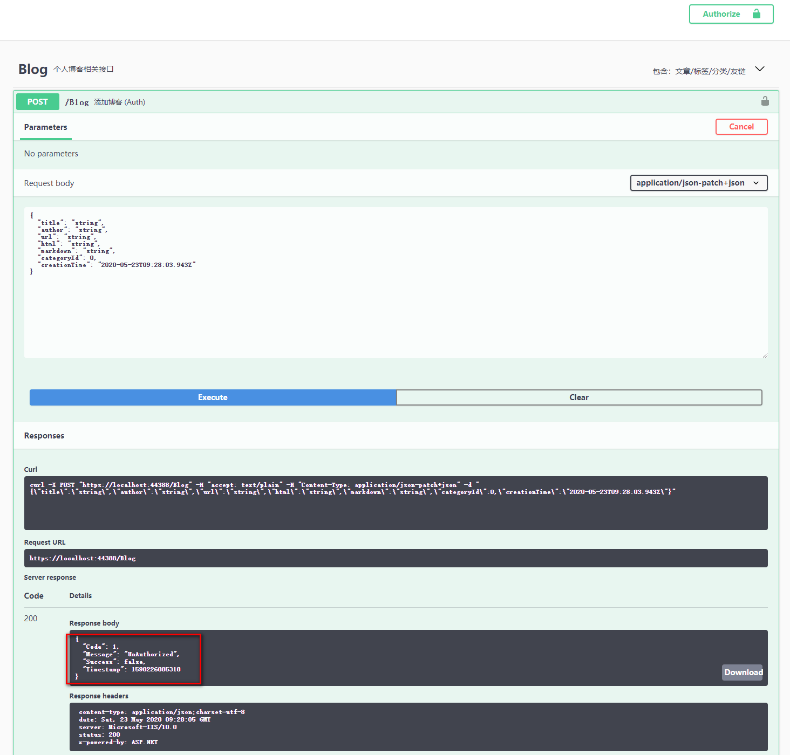
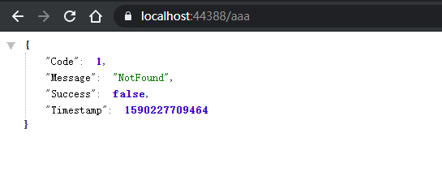
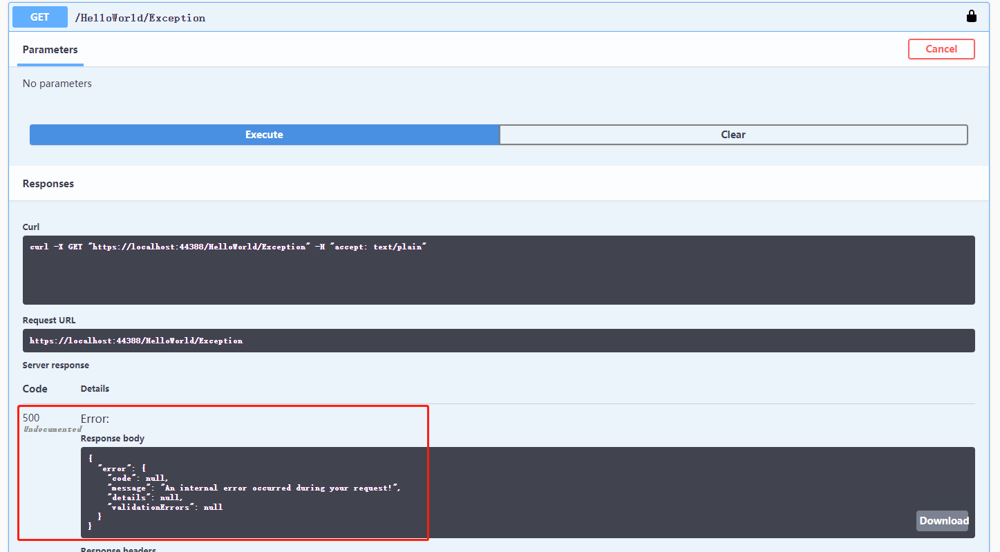
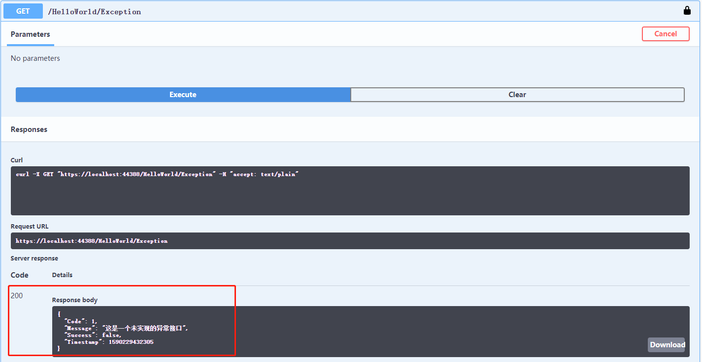
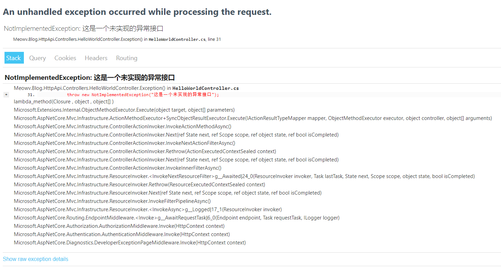

# 异常处理和日志记录

在开始之前，我们实现一个之前的遗留问题，这个问题是有人在GitHub Issues(<https://github.com/Meowv/Blog/issues/8)上提出来的，就是当我们对Swagger>进行分组，实现`IDocumentFilter`接口添加了文档描述信息后，切换分组时会显示不属于当前分组的Tag。

经过研究和分析发现，是可以解决的，我不知道大家有没有更好的办法，我的实现方法请看：


```csharp
//SwaggerDocumentFilter.cs
...
    public void Apply(OpenApiDocument swaggerDoc, DocumentFilterContext context)
    {
        var tags = new List<OpenApiTag>{...}

        #region 实现添加自定义描述时过滤不属于同一个分组的API

        var groupName = context.ApiDescriptions.FirstOrDefault().GroupName;

        var apis = context.ApiDescriptions.GetType().GetField("_source", BindingFlags.NonPublic | BindingFlags.Instance).GetValue(context.ApiDescriptions) as IEnumerable<ApiDescription>;

        var controllers = apis.Where(x => x.GroupName != groupName).Select(x => ((ControllerActionDescriptor)x.ActionDescriptor).ControllerName).Distinct();

        swaggerDoc.Tags = tags.Where(x => !controllers.Contains(x.Name)).OrderBy(x => x.Name).ToList();

        #endregion
    }
...
```

根据调试代码发现，我们可以从`context.ApiDescriptions`获取到当前显示的是哪一个分组下的API。

然后使用`GetType().GetField(string name, BindingFlags bindingAttr)`获取到`_source`，当前项目的所有API，里面同时也包含了ABP默认生成的一些接口。

再将API中不属于当前分组的API筛选掉，用Select查询出所有的Controller名称进行去重。

因为`OpenApiTag`中的Name名称与Controller的Name是一致的，所以最后将包含`controllers`名称的tag查询出来取反，即可满足需求。

---

上一篇文章集成了GitHub，使用JWT的方式完成了身份认证和授权，保护了我们写的API接口。

本篇主要实现对项目中出现的异常仅需处理，当出现不可避免的错误时，或者未授权用户调用接口时，可以进行有效的监控和日志记录。

目前调用未授权接口，会直接返回一个状态码为401的错误页面，这样显得太不友好，我们还是用之前写的统一返回模型来告诉调用者，你是未授权的，调不了我的接口，上篇也有提到过，我们将用两种方式来解决。

**方式一** ：使用`AddJwtBearer()`扩展方法下面的`options.Events`事件机制。

```csharp
//MeowvBlogHttpApiHostingModule.cs
...
//应用程序提供的对象，用于处理承载引发的事件，身份验证处理程序
options.Events = new JwtBearerEvents
{
    OnChallenge = async context =>
    {
        // 跳过默认的处理逻辑，返回下面的模型数据
        context.HandleResponse();

        context.Response.ContentType = "application/json;charset=utf-8";
        context.Response.StatusCode = StatusCodes.Status200OK;

        var result = new ServiceResult();
        result.IsFailed("UnAuthorized");

        await context.Response.WriteAsync(result.ToJson());
    }
};
...
```

在项目启动时，实例化了`OnChallenge`，如果用户调用未授权，将请求的状态码赋值为200，并返回模型数据。



如图所示，可以看到已经成功返回了一段比较友好的JSON数据。

```json
{
  "Code": 1,
  "Message": "UnAuthorized",
  "Success": false,
  "Timestamp": 1590226085318
}
```

**方式二** ：使用中间件的方式。

我们注释掉上面的代码，在`.HttpApi.Hosting`添加文件夹Middleware，新建一个中间件`ExceptionHandlerMiddleware.cs`

```csharp
using Meowv.Blog.ToolKits.Base;
using Meowv.Blog.ToolKits.Extensions;
using Microsoft.AspNetCore.Http;
using System;
using System.Net;
using System.Threading.Tasks;

namespace Meowv.Blog.HttpApi.Hosting.Middleware
{
    /// <summary>
    /// 异常处理中间件
    /// </summary>
    public class ExceptionHandlerMiddleware
    {
        private readonly RequestDelegate next;

        public ExceptionHandlerMiddleware(RequestDelegate next)
        {
            this.next = next;
        }

        /// <summary>
        /// Invoke
        /// </summary>
        /// <param name="context"></param>
        /// <returns></returns>
        public async Task Invoke(HttpContext context)
        {
            try
            {
                await next(context);
            }
            catch (Exception ex)
            {
                await ExceptionHandlerAsync(context, ex.Message);
            }
            finally
            {
                var statusCode = context.Response.StatusCode;
                if (statusCode != StatusCodes.Status200OK)
                {
                    Enum.TryParse(typeof(HttpStatusCode), statusCode.ToString(), out object message);
                    await ExceptionHandlerAsync(context, message.ToString());
                }
            }
        }

        /// <summary>
        /// 异常处理，返回JSON
        /// </summary>
        /// <param name="context"></param>
        /// <param name="message"></param>
        /// <returns></returns>
        private async Task ExceptionHandlerAsync(HttpContext context, string message)
        {
            context.Response.ContentType = "application/json;charset=utf-8";

            var result = new ServiceResult();
            result.IsFailed(message);

            await context.Response.WriteAsync(result.ToJson());
        }
    }
}
```

`RequestDelegate`是一种请求委托类型，用来处理HTTP请求的函数，返回的是`delegate`，实现异步的`Invoke`方法。

这里我写了一个比较通用的方法，当出现异常时直接执行`ExceptionHandlerAsync()`方法，当没有异常发生时，在`finally`中判断当前请求状态，可能是200？404？401？等等，不管它是什么，反正不是200，获取到状态码枚举的Key值用来当作错误信息返回，最后也执行`ExceptionHandlerAsync()`方法，返回我们自定义的模型。

写好了中间件，然后在`OnApplicationInitialization(...)`中使用它。

```csharp
        public override void OnApplicationInitialization(ApplicationInitializationContext context)
        {
            ...
            // 异常处理中间件
            app.UseMiddleware<ExceptionHandlerMiddleware>();
            ...
        }
```

同样可以达到效果，相比之下他还支持状态非401的错误返回，比如我们访问一个不存在的页面：<https://localhost:44388/aaa> ，也可以友好的进行处理。



当然这两种方式可以共存，互不影响。

还有一种处理异常的方式，就是我们的过滤器Filter，abp已经默认为我们实现了全局的异常模块，详情可以看其文档：<https://docs.abp.io/zh-Hans/abp/latest/Exception-Handling> ，在这里，我准备移除abp提供的异常处理模块，自己实现一个。

先看一下目前的异常显示情况，我们在`HelloWorldController`中写一个异常接口。

```csharp
//HelloWorldController.cs
...
        [HttpGet]
        [Route("Exception")]
        public string Exception()
        {
            throw new NotImplementedException("这是一个未实现的异常接口");
        }
...
```



按理说，他应该会执行到我们写的`ExceptionHandlerMiddleware`中间件中去，但是被我们的Filter进行拦截了，现在我们移除默认的拦截器`AbpExceptionFilter`

还是在模块类`MeowvBlogHttpApiHostingModule`，`ConfigureServices()`方法中。

```csharp
Configure<MvcOptions>(options =>
{
    var filterMetadata = options.Filters.FirstOrDefault(x => x is ServiceFilterAttribute attribute && attribute.ServiceType.Equals(typeof(AbpExceptionFilter)));

    // 移除 AbpExceptionFilter
    options.Filters.Remove(filterMetadata);
});
```

从`options.Filters`中找到`AbpExceptionFilter`，然后Remove掉，此时再看一下有异常的接口。



当我们注释掉我们的中间件时，他就会显示如下图这样。



这个页面有没有很熟悉的感觉？相信做过.net core开发的都遇到过吧。

ok，现在为止已经完美显示了。但到这里还远远不够，说好的自己实现Filter呢？我们现在实现Filter又有什么用呢？我们可以在Filter中可以做一些日志记录。

在`.HttpApi.Hosting`层添加文件夹Filters，新建一个`MeowvBlogExceptionFilter.cs`的Filter，他需要实现我们的`IExceptionFilter`接口的`OnExceptionAsync()`方法即可。

```csharp
//MeowvBlogExceptionFilter.cs
using Meowv.Blog.ToolKits.Helper;
using Microsoft.AspNetCore.Mvc.Filters;

namespace Meowv.Blog.HttpApi.Hosting.Filters
{
    public class MeowvBlogExceptionFilter : IExceptionFilter
    {
        /// <summary>
        /// 异常处理
        /// </summary>
        /// <param name="context"></param>
        /// <returns></returns>
        public void OnException(ExceptionContext context)
        {
            // 日志记录
            LoggerHelper.WriteToFile($"{context.HttpContext.Request.Path}|{context.Exception.Message}", context.Exception);
        }
    }
}
```

`OnException(...)`方法很简单，这里只做了记录日志的操作，剩下的交给我们中间件去处理吧。

注意，一定要在移除默认`AbpExceptionFilter`后，将我们自己实现的`MeowvBlogExceptionFilter`在模块类`ConfigureServices()`方法中注入到系统。

```csharp
...
Configure<MvcOptions>(options =>
{
    ...
    // 添加自己实现的 MeowvBlogExceptionFilter
    options.Filters.Add(typeof(MeowvBlogExceptionFilter));
});
...
```

说到日志，就有很多种处理方式，**请选择你熟悉的方式**，我这里将使用`log4net`进行处理，仅供参考。

在`.ToolKits`层添加`log4net`包，使用命令安装：`Install-Package log4net`，然后添加文件夹Helper，新建一个`LoggerHelper.cs`。

```csharp
//LoggerHelper.cs
using log4net;
using log4net.Config;
using log4net.Repository;
using System;
using System.IO;

namespace Meowv.Blog.ToolKits.Helper
{
    public static class LoggerHelper
    {
        private static readonly ILoggerRepository Repository = LogManager.CreateRepository("NETCoreRepository");
        private static readonly ILog Log = LogManager.GetLogger(Repository.Name, "NETCorelog4net");

        static LoggerHelper()
        {
            XmlConfigurator.Configure(Repository, new FileInfo("log4net.config"));
        }

        /// <summary>
        /// 写日志
        /// </summary>
        /// <param name="message"></param>
        /// <param name="ex"></param>
        public static void WriteToFile(string message)
        {
            Log.Info(message);
        }

        /// <summary>
        /// 写日志
        /// </summary>
        /// <param name="message"></param>
        /// <param name="ex"></param>
        public static void WriteToFile(string message, Exception ex)
        {
            if (string.IsNullOrEmpty(message))
                message = ex.Message;

            Log.Error(message, ex);
        }
    }
}
```

在`.HttpApi.Hosting`中添加log4net配置文件，`log4net.config`配置文件如下：

```xml
//log4net.config
<?xml version="1.0" encoding="utf-8" ?>
<configuration>
  <configSections>
    <section name="log4net" type="log4net.Config.Log4NetConfigurationSectionHandler, log4net"/>
  </configSections>
  <log4net debug="false">

    <appender name="info" type="log4net.Appender.RollingFileAppender,log4net">
      <param name="File" value="log4net/info/" />
      <param name="AppendToFile" value="true" />
      <param name="MaxSizeRollBackups" value="-1"/>
      <param name="MaximumFileSize" value="5MB"/>
      <param name="RollingStyle" value="Composite" />
      <param name="DatePattern" value="yyyyMMdd\\HH&quot;.log&quot;" />
      <param name="StaticLogFileName" value="false" />
      <layout type="log4net.Layout.PatternLayout,log4net">
        <param name="ConversionPattern" value="%n
{
    &quot;system&quot;: &quot;Meowv.Blog&quot;,
    &quot;datetime&quot;: &quot;%d&quot;,
    &quot;description&quot;: &quot;%m&quot;,
    &quot;level&quot;: &quot;%p&quot;,
    &quot;info&quot;: &quot;%exception&quot;
}" />
      </layout>
      <filter type="log4net.Filter.LevelRangeFilter">
        <levelMin value="INFO" />
        <levelMax value="INFO" />
      </filter>
    </appender>

    <appender name="error" type="log4net.Appender.RollingFileAppender,log4net">
      <param name="File" value="log4net/error/" />
      <param name="AppendToFile" value="true" />
      <param name="MaxSizeRollBackups" value="-1"/>
      <param name="MaximumFileSize" value="5MB"/>
      <param name="RollingStyle" value="Composite" />
      <param name="DatePattern" value="yyyyMMdd\\HH&quot;.log&quot;" />
      <param name="StaticLogFileName" value="false" />
      <layout type="log4net.Layout.PatternLayout,log4net">
        <param name="ConversionPattern" value="%n
{
    &quot;system&quot;: &quot;Meowv.Blog&quot;,
    &quot;datetime&quot;: &quot;%d&quot;,
    &quot;description&quot;: &quot;%m&quot;,
    &quot;level&quot;: &quot;%p&quot;,
    &quot;info&quot;: &quot;%exception&quot;
}" />
      </layout>
      <filter type="log4net.Filter.LevelRangeFilter">
        <levelMin value="ERROR" />
        <levelMax value="ERROR" />
      </filter>
    </appender>

    <root>
      <level value="ALL"></level>
      <appender-ref ref="info"/>
      <appender-ref ref="error"/>
    </root>

  </log4net>

</configuration>
```

此时再去调用 .../HelloWorld/Exception，将会得到日志文件，内容是以JSON格式进行存储的。


关于Filter的更多用法可以参考微软官方文档：<https://docs.microsoft.com/zh-cn/aspnet/core/mvc/controllers/filters>

到这里，系统的异常处理和日志记录便完成了，你学会了吗？😁😁😁
