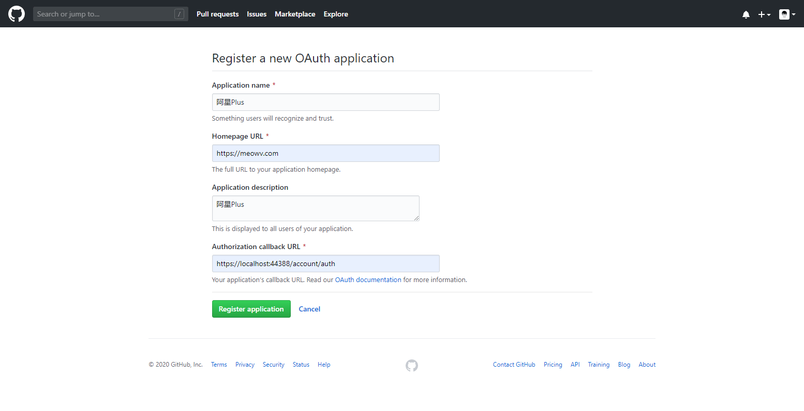
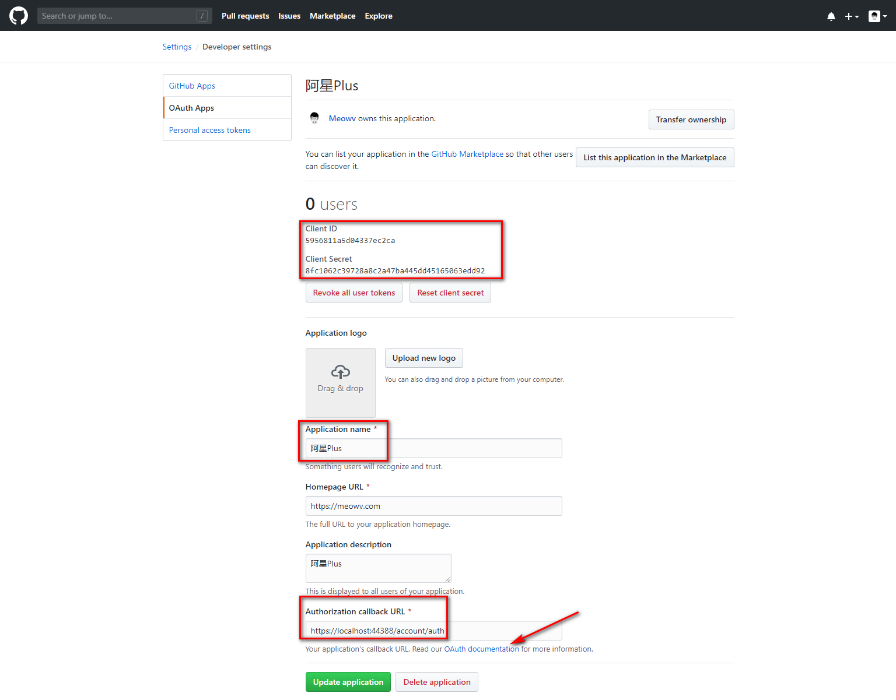
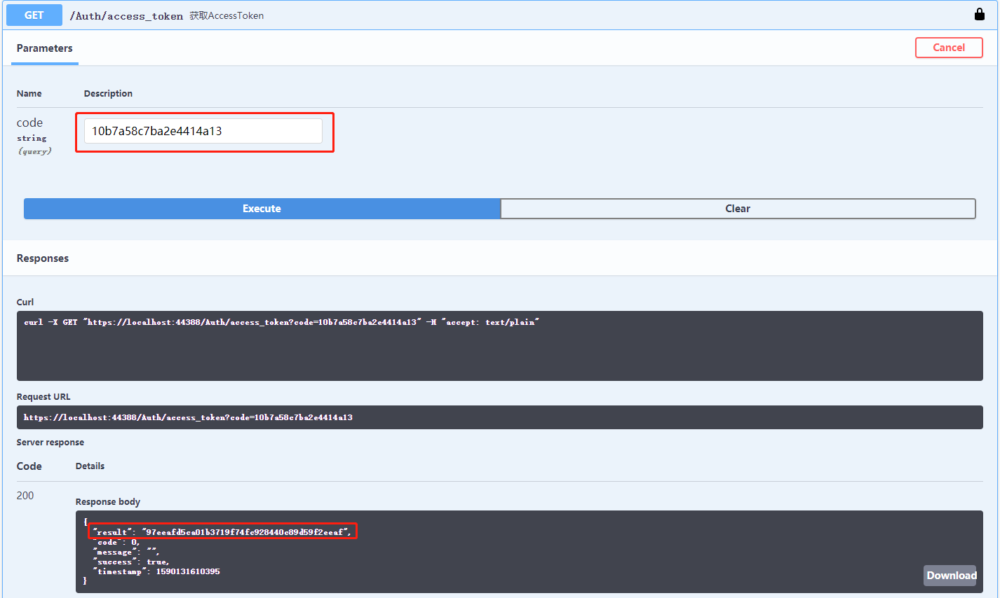
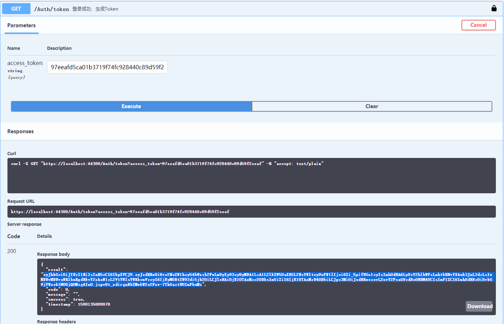
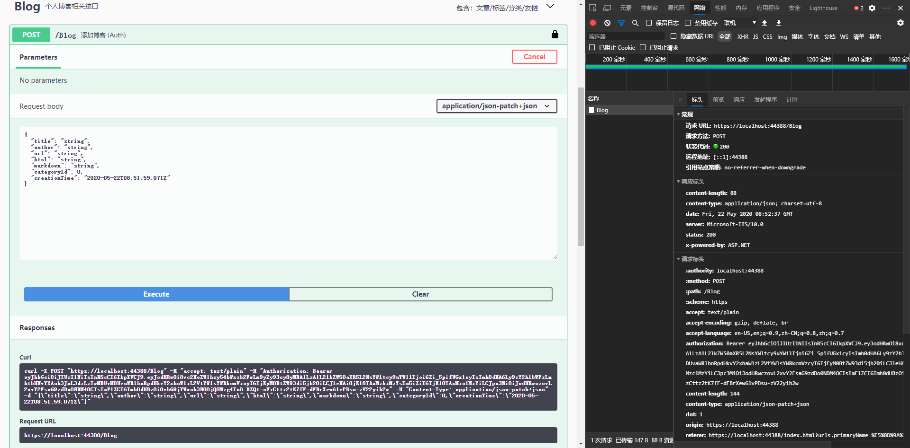
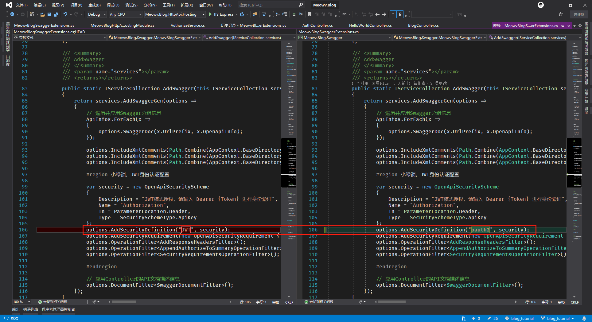

# 接入GitHub，用JWT保护你的API

上一篇文章再次把Swagger的使用进行了讲解，完成了对Swagger的分组、描述和开启小绿锁以进行身份的认证授权，那么本篇就来说说身份认证授权。

开始之前先搞清楚几个概念，请注意认证与授权是不同的意思，简单理解：认证，是证明你的身份，你有账号密码，你可以登录进我们的系统，说明你认证成功了；授权，即权限，分配给用户某一权限标识，用户得到什么什么权限，才能使用系统的某一功能，就是授权。

身份认证可以有很多种方式，可以创建一个用户表，使用账号密码，也可以接入第三方平台，在这里我接入GitHub进行身份认证。当然你可以选择其他方式(如：QQ、微信、微博等)，可以自己扩展。

打开GitHub，进入开发者设置界面(<https://github.com/settings/developers>)，我们新建一个 oAuth App。





如图所示，我们将要用到敏感数据放在`appsettings.json`中

```json
{
  ...
  "Github": {
    "UserId": 13010050,
    "ClientID": "5956811a5d04337ec2ca",
    "ClientSecret": "8fc1062c39728a8c2a47ba445dd45165063edd92",
    "RedirectUri": "https://localhost:44388/account/auth",
    "ApplicationName": "阿星Plus"
  }
}
```

`ClientID`和`ClientSecret`是GitHub为我们生成的，请注意保管好你的`ClientID`和`ClientSecret`。我这里直接给出了明文，我将在本篇结束后删掉此 oAuth App 😝。请自己创建噢！

`RedirectUri`是我们自己添加的回调地址。`ApplicationName`是我们应用的名称，全部都要和GitHub对应。

相应的在`AppSettings.cs`中读取

```csharp
...
        /// <summary>
        /// GitHub
        /// </summary>
        public static class GitHub
        {
            public static int UserId => Convert.ToInt32(_config["Github:UserId"]);

            public static string Client_ID => _config["Github:ClientID"];

            public static string Client_Secret => _config["Github:ClientSecret"];

            public static string Redirect_Uri => _config["Github:RedirectUri"];

            public static string ApplicationName => _config["Github:ApplicationName"];
        }
...
```

接下来，我们大家自行去GitHub的OAuth官方文档看看，<https://developer.github.com/apps/building-oauth-apps/authorizing-oauth-apps/>

分析一下，我们接入GitHub身份认证授权整个流程下来分以下几步

1. 根据参数生成GitHub重定向的地址，跳转到GitHub登录页，进行登录
2. 登录成功之后会跳转到我们的回调地址，回调地址会携带`code`参数
3. 拿到code参数，就可以换取到access_token
4. 有了access_token，可以调用GitHub获取用户信息的接口，得到当前登录成功的用户信息

开始之前，先将GitHub的API简单处理一下。

在`.Domain`层中Configurations文件夹下新建`GitHubConfig.cs`配置类，将所需要的API以及`appsettings.json`的内容读取出来。

```csharp
//GitHubConfig.cs
namespace Meowv.Blog.Domain.Configurations
{
    public class GitHubConfig
    {
        /// <summary>
        /// GET请求，跳转GitHub登录界面，获取用户授权，得到code
        /// </summary>
        public static string API_Authorize = "https://github.com/login/oauth/authorize";

        /// <summary>
        /// POST请求，根据code得到access_token
        /// </summary>
        public static string API_AccessToken = "https://github.com/login/oauth/access_token";

        /// <summary>
        /// GET请求，根据access_token得到用户信息
        /// </summary>
        public static string API_User = "https://api.github.com/user";

        /// <summary>
        /// Github UserId
        /// </summary>
        public static int UserId = AppSettings.GitHub.UserId;

        /// <summary>
        /// Client ID
        /// </summary>
        public static string Client_ID = AppSettings.GitHub.Client_ID;

        /// <summary>
        /// Client Secret
        /// </summary>
        public static string Client_Secret = AppSettings.GitHub.Client_Secret;

        /// <summary>
        /// Authorization callback URL
        /// </summary>
        public static string Redirect_Uri = AppSettings.GitHub.Redirect_Uri;

        /// <summary>
        /// Application name
        /// </summary>
        public static string ApplicationName = AppSettings.GitHub.ApplicationName;
    }
}
```

细心的同学可能以及看到了，我们在配置的时候多了一个`UserId`。在这里使用一个策略，因为我是博客系统，管理员用户就只有我一个人，GitHub的用户Id是唯一的，我将自己的`UserId`配置进去，当我们通过api获取到`UserId`和自己配置的`UserId`一致时，就为其授权，你就是我，我认可你，你可以进入后台随意玩耍了。

在开始写接口之前，还有一些工作要做，就是在 .net core 中开启使用我们的身份认证和授权，因为`.HttpApi.Hosting`层引用了项目`.Application`，`.Application`层本身也需要添加`Microsoft.AspNetCore.Authentication.JwtBearer`，所以在`.Application`添加包：`Microsoft.AspNetCore.Authentication.JwtBearer`，打开程序包管理器控制台用命令`Install-Package Microsoft.AspNetCore.Authentication.JwtBearer`安装，这样就不需要重复添加引用了。

在`.HttpApi.Hosting`模块类`MeowvBlogHttpApiHostingModule`，`ConfigureServices`中添加

```csharp
public override void ConfigureServices(ServiceConfigurationContext context)
{
    // 身份验证
    context.Services.AddAuthentication(JwtBearerDefaults.AuthenticationScheme)
           .AddJwtBearer(options =>
           {
               options.TokenValidationParameters = new TokenValidationParameters
               {
                   ValidateIssuer = true,
                   ValidateAudience = true,
                   ValidateLifetime = true,
                   ClockSkew = TimeSpan.FromSeconds(30),
                   ValidateIssuerSigningKey = true,
                   ValidAudience = AppSettings.JWT.Domain,
                   ValidIssuer = AppSettings.JWT.Domain,
                   IssuerSigningKey = new SymmetricSecurityKey(AppSettings.JWT.SecurityKey.GetBytes())
               };
           });

    // 认证授权
    context.Services.AddAuthorization();

    // Http请求
    context.Services.AddHttpClient();
}
```

因为待会我们要在代码中调用GitHub的api，所以这里提前将`System.Net.Http.IHttpClientFactory`和相关服务添加到IServiceCollection中。

解释一下`TokenValidationParameters`参数的含义：

`ValidateIssuer`：是否验证颁发者。`ValidateAudience`：是否验证访问群体。`ValidateLifetime`：是否验证生存期。`ClockSkew`：验证Token的时间偏移量。`ValidateIssuerSigningKey`：是否验证安全密钥。`ValidAudience`：访问群体。`ValidIssuer`：颁发者。`IssuerSigningKey`：安全密钥。
`GetBytes()`是abp的一个扩展方法，可以直接使用。

设置值全部为true，时间偏移量为30秒，然后将`ValidAudience`、`ValidIssuer`、`IssuerSigningKey`的值配置在`appsettings.json`中，这些值都是可以自定义的，不一定按照我填的来。

```csharp
//appsettings.json
{
  ...
  "JWT": {
    "Domain": "https://localhost:44388",
    "SecurityKey": "H4sIAAAAAAAAA3N0cnZxdXP38PTy9vH18w8I9AkOCQ0Lj4iMAgDB4fXPGgAAAA==",
    "Expires": 30
  }
}

//AppSettings.cs
...
        public static class JWT
        {
            public static string Domain => _config["JWT:Domain"];

            public static string SecurityKey => _config["JWT:SecurityKey"];

            public static int Expires => Convert.ToInt32(_config["JWT:Expires"]);
        }
...
```

`Expires`是我们的token过期时间，这里也给个30。至于它是30分钟还是30秒，由你自己决定。

`SecurityKey`是我随便用编码工具进行生成的。

同时在`OnApplicationInitialization(ApplicationInitializationContext context)`中使用它。

```csharp
...
        public override void OnApplicationInitialization(ApplicationInitializationContext context)
        {
            ...
            // 身份验证
            app.UseAuthentication();

            // 认证授权
            app.UseAuthorization();
            ...
        }
...
```

此时配置就完成了，接下来去写接口生成Token并在Swagger中运用起来。

在`.Application`层之前已经添加了包：`Microsoft.AspNetCore.Authentication.JwtBearer`，直接新建Authorize文件夹，添加接口`IAuthorizeService`以及实现类`AuthorizeService`。

```csharp
//IAuthorizeService.cs
using Meowv.Blog.ToolKits.Base;
using System.Threading.Tasks;

namespace Meowv.Blog.Application.Authorize
{
    public interface IAuthorizeService
    {
        /// <summary>
        /// 获取登录地址(GitHub)
        /// </summary>
        /// <returns></returns>
        Task<ServiceResult<string>> GetLoginAddressAsync();

        /// <summary>
        /// 获取AccessToken
        /// </summary>
        /// <param name="code"></param>
        /// <returns></returns>
        Task<ServiceResult<string>> GetAccessTokenAsync(string code);

        /// <summary>
        /// 登录成功，生成Token
        /// </summary>
        /// <param name="access_token"></param>
        /// <returns></returns>
        Task<ServiceResult<string>> GenerateTokenAsync(string access_token);
    }
}
```

添加三个接口成员方法，全部为异步的方式，同时注意我们是用之前编写的返回模型接收噢，然后一一去实现他们。

先实现`GetLoginAddressAsync()`，咱们构建一个`AuthorizeRequest`对象，用来填充生成GitHub登录地址，在`.ToolKits`层新建GitHub文件夹，引用`.Domain`项目，添加类：`AuthorizeRequest.cs`。

```csharp
//AuthorizeRequest.cs
using Meowv.Blog.Domain.Configurations;
using System;

namespace Meowv.Blog.ToolKits.GitHub
{
    public class AuthorizeRequest
    {
        /// <summary>
        /// Client ID
        /// </summary>
        public string Client_ID = GitHubConfig.Client_ID;

        /// <summary>
        /// Authorization callback URL
        /// </summary>
        public string Redirect_Uri = GitHubConfig.Redirect_Uri;

        /// <summary>
        /// State
        /// </summary>
        public string State { get; set; } = Guid.NewGuid().ToString("N");

        /// <summary>
        /// 该参数可选，需要调用Github哪些信息，可以填写多个，以逗号分割，比如：scope=user,public_repo。
        /// 如果不填写，那么你的应用程序将只能读取Github公开的信息，比如公开的用户信息，公开的库(repository)信息以及gists信息
        /// </summary>
        public string Scope { get; set; } = "user,public_repo";
    }
}
```

实现方法如下，拼接参数，输出GitHub重定向的地址。

```csharp
...
        /// <summary>
        /// 获取登录地址(GitHub)
        /// </summary>
        /// <returns></returns>
        public async Task<ServiceResult<string>> GetLoginAddressAsync()
        {
            var result = new ServiceResult<string>();

            var request = new AuthorizeRequest();
            var address = string.Concat(new string[]
            {
                    GitHubConfig.API_Authorize,
                    "?client_id=", request.Client_ID,
                    "&scope=", request.Scope,
                    "&state=", request.State,
                    "&redirect_uri=", request.Redirect_Uri
            });

            result.IsSuccess(address);
            return await Task.FromResult(result);
        }
...
```

同样的，实现`GetAccessTokenAsync(string code)`，构建`AccessTokenRequest`对象，在`.ToolKits`GitHub文件夹添加类：`AccessTokenRequest.cs`。

```csharp
//AccessTokenRequest.cs
using Meowv.Blog.Domain.Configurations;

namespace Meowv.Blog.ToolKits.GitHub
{
    public class AccessTokenRequest
    {
        /// <summary>
        /// Client ID
        /// </summary>
        public string Client_ID = GitHubConfig.Client_ID;

        /// <summary>
        /// Client Secret
        /// </summary>
        public string Client_Secret = GitHubConfig.Client_Secret;

        /// <summary>
        /// 调用API_Authorize获取到的Code值
        /// </summary>
        public string Code { get; set; }

        /// <summary>
        /// Authorization callback URL
        /// </summary>
        public string Redirect_Uri = GitHubConfig.Redirect_Uri;

        /// <summary>
        /// State
        /// </summary>
        public string State { get; set; }
    }
}
```

根据登录成功得到的code来获取AccessToken，因为涉及到HTTP请求，在这之前我们需要在构造函数中依赖注入`IHttpClientFactory`，使用`IHttpClientFactory`创建`HttpClient`。

```csharp
...
private readonly IHttpClientFactory _httpClient;

public AuthorizeService(IHttpClientFactory httpClient)
{
    _httpClient = httpClient;
}
...
```

```csharp
...
        /// <summary>
        /// 获取AccessToken
        /// </summary>
        /// <param name="code"></param>
        /// <returns></returns>
        public async Task<ServiceResult<string>> GetAccessTokenAsync(string code)
        {
            var result = new ServiceResult<string>();

            if (string.IsNullOrEmpty(code))
            {
                result.IsFailed("code为空");
                return result;
            }

            var request = new AccessTokenRequest();

            var content = new StringContent($"code={code}&client_id={request.Client_ID}&redirect_uri={request.Redirect_Uri}&client_secret={request.Client_Secret}");
            content.Headers.ContentType = new MediaTypeHeaderValue("application/x-www-form-urlencoded");

            using var client = _httpClient.CreateClient();
            var httpResponse = await client.PostAsync(GitHubConfig.API_AccessToken, content);

            var response = await httpResponse.Content.ReadAsStringAsync();

            if (response.StartsWith("access_token"))
                result.IsSuccess(response.Split("=")[1].Split("&").First());
            else
                result.IsFailed("code不正确");

            return result;
        }
...
```

使用`IHttpClientFactory`创建`HttpClient`可以自动释放对象，用`HttpClient`发送一个POST请求，如果GitHub服务器给我们返回了带access_token的字符串便表示成功了，将其处理一下输出access_token。如果没有，就代表参数code有误。

在`.HttpApi`层新建一个`AuthController`控制器，注入我们的`IAuthorizeService`Service，试试我们的接口。

```csharp
//AuthController.cs
using Meowv.Blog.Application.Authorize;
using Meowv.Blog.ToolKits.Base;
using Microsoft.AspNetCore.Authorization;
using Microsoft.AspNetCore.Mvc;
using System.Threading.Tasks;
using Volo.Abp.AspNetCore.Mvc;
using static Meowv.Blog.Domain.Shared.MeowvBlogConsts;

namespace Meowv.Blog.HttpApi.Controllers
{
    [ApiController]
    [AllowAnonymous]
    [Route("[controller]")]
    [ApiExplorerSettings(GroupName = Grouping.GroupName_v4)]
    public class AuthController : AbpController
    {
        private readonly IAuthorizeService _authorizeService;

        public AuthController(IAuthorizeService authorizeService)
        {
            _authorizeService = authorizeService;
        }

        /// <summary>
        /// 获取登录地址(GitHub)
        /// </summary>
        /// <returns></returns>
        [HttpGet]
        [Route("url")]
        public async Task<ServiceResult<string>> GetLoginAddressAsync()
        {
            return await _authorizeService.GetLoginAddressAsync();
        }

        /// <summary>
        /// 获取AccessToken
        /// </summary>
        /// <param name="code"></param>
        /// <returns></returns>
        [HttpGet]
        [Route("access_token")]
        public async Task<ServiceResult<string>> GetAccessTokenAsync(string code)
        {
            return await _authorizeService.GetAccessTokenAsync(code);
        }
    }
}
```

注意这里我们添加了两个Attribute：[AllowAnonymous]、[ApiExplorerSettings(GroupName = Grouping.GroupName_v4)]，在`.Swagger`层中为`AuthController`添加描述信息

```csharp
...
new OpenApiTag {
    Name = "Auth",
    Description = "JWT模式认证授权",
    ExternalDocs = new OpenApiExternalDocs { Description = "JSON Web Token" }
}
...
```

打开Swagger文档，调用一下我们两个接口看看效果。


然后打开我们生成的重定向地址，会跳转到登录页面，如下：


点击Authorize按钮，登录成功后会跳转至我们配置的回调页面，.../account/auth?code=10b7a58c7ba2e4414a14&state=a1ef05212c3b4a2cb2bbd87846dd4a8e

然后拿到code(10b7a58c7ba2e4414a14)，在去调用一下获取AccessToken接口，成功返回我们的access_token(97eeafd5ca01b3719f74fc928440c89d59f2eeag)。



拿到access_token，就可以去调用获取用户信息API了。在这之前我们先来写几个扩展方法，待会和以后都用得着，在`.ToolKits`层新建文件夹Extensions，添加几个比较常用的扩展类(...)。

扩展类的代码我就不贴出来了。大家可以去GitHub(<https://github.com/Meowv/Blog/tree/blog_tutorial/src/Meowv.Blog.ToolKits/Extensions>)自行下载，每个扩展方法都有具体的注释。

接下来实现`GenerateTokenAsync(string access_token)`，生成Token。

有了access_token，可以直接调用获取用户信息的接口：<https://api.github.com/user?access_token=97eeafd5ca01b3719f74fc928440c89d59f2eeag> ，会得到一个json，将这个json包装成一个模型类`UserResponse.cs`。

在这里教大家一个小技巧，如果你需要将json或者xml转换成模型类，可以使用Visual Studio的一个快捷功能，点击左上角菜单：编辑 => 选择性粘贴 => 将JSON粘贴为类/将XML粘贴为类，是不是很方便，快去试试吧。

```csharp
//UserResponse.cs
namespace Meowv.Blog.ToolKits.GitHub
{
    public class UserResponse
    {
        public string Login { get; set; }

        public int Id { get; set; }

        public string Avatar_url { get; set; }

        public string Html_url { get; set; }

        public string Repos_url { get; set; }

        public string Name { get; set; }

        public string Company { get; set; }

        public string Blog { get; set; }

        public string Location { get; set; }

        public string Email { get; set; }

        public string Bio { get; set; }

        public int Public_repos { get; set; }
    }
}
```

然后看一下具体生成token的方法吧。

```csharp
...
        /// <summary>
        /// 登录成功，生成Token
        /// </summary>
        /// <param name="access_token"></param>
        /// <returns></returns>
        public async Task<ServiceResult<string>> GenerateTokenAsync(string access_token)
        {
            var result = new ServiceResult<string>();

            if (string.IsNullOrEmpty(access_token))
            {
                result.IsFailed("access_token为空");
                return result;
            }

            var url = $"{GitHubConfig.API_User}?access_token={access_token}";
            using var client = _httpClient.CreateClient();
            client.DefaultRequestHeaders.Add("User-Agent", "Mozilla/5.0 (Windows NT 10.0; Win64; x64) AppleWebKit/537.36 (KHTML, like Gecko) Chrome/83.0.4103.14 Safari/537.36 Edg/83.0.478.13");
            var httpResponse = await client.GetAsync(url);
            if (httpResponse.StatusCode != HttpStatusCode.OK)
            {
                result.IsFailed("access_token不正确");
                return result;
            }

            var content = await httpResponse.Content.ReadAsStringAsync();

            var user = content.FromJson<UserResponse>();
            if (user.IsNull())
            {
                result.IsFailed("未获取到用户数据");
                return result;
            }

            if (user.Id != GitHubConfig.UserId)
            {
                result.IsFailed("当前账号未授权");
                return result;
            }

            var claims = new[] {
                    new Claim(ClaimTypes.Name, user.Name),
                    new Claim(ClaimTypes.Email, user.Email),
                    new Claim(JwtRegisteredClaimNames.Exp, $"{new DateTimeOffset(DateTime.Now.AddMinutes(AppSettings.JWT.Expires)).ToUnixTimeSeconds()}"),
                    new Claim(JwtRegisteredClaimNames.Nbf, $"{new DateTimeOffset(DateTime.Now).ToUnixTimeSeconds()}")
                };

            var key = new SymmetricSecurityKey(AppSettings.JWT.SecurityKey.SerializeUtf8());
            var creds = new SigningCredentials(key, SecurityAlgorithms.HmacSha256);

            var securityToken = new JwtSecurityToken(
                issuer: AppSettings.JWT.Domain,
                audience: AppSettings.JWT.Domain,
                claims: claims,
                expires: DateTime.Now.AddMinutes(AppSettings.JWT.Expires),
                signingCredentials: creds);

            var token = new JwtSecurityTokenHandler().WriteToken(securityToken);

            result.IsSuccess(token);
            return await Task.FromResult(result);
        }
...
```

GitHub的这个API做了相应的安全机制，有一点要注意一下，当我们用代码去模拟请求的时候，需要给他加上`User-Agent`，不然是不会成功返回结果的。

`FromJson<T>`是之前我们添加的扩展方法，将JSON字符串转为实体对象。

`SymmetricSecurityKey(byte[] key)`接收一个`byte[]`参数，这里也用到一个扩展方法`SerializeUtf8()`字符串序列化成字节序列。

我们判断返回的Id是否为我们配置的用户Id，如果是的话，就验证成功，进行授权，生成Token。

生成Token的代码也很简单，指定了 Name，Email，过期时间为30分钟。具体各项含义可以去这里看看：<https://tools.ietf.org/html/rfc7519>。

最后调用`new JwtSecurityTokenHandler().WriteToken(SecurityToken token)`便可成功生成Token，在Controller添加好，去试试吧。

```csharp
...
        /// <summary>
        /// 登录成功，生成Token
        /// </summary>
        /// <param name="access_token"></param>
        /// <returns></returns>
        [HttpGet]
        [Route("token")]
        public async Task<ServiceResult<string>> GenerateTokenAsync(string access_token)
        {
            return await _authorizeService.GenerateTokenAsync(access_token);
        }
...
```



将之前拿到的access_token传进去，调用接口可以看到已经成功生成了token。

前面为`AuthController`添加了一个Attribute：`[AllowAnonymous]`，代表这个Controller下的接口都不需要授权，就可以访问，当然你不添加的话默认也是开放的。可以为整个Controller指定，同时也可以为具体的接口指定。

当想要保护某个接口时，只需要加上Attribute：`[Authorize]`就可以了。现在来保护我们的`BlogController`下非查询接口，给增删改添加上`[Authorize]`，注意引用命名空间`Microsoft.AspNetCore.Authorization`。

```csharp
...
        ...
        /// <summary>
        /// 添加博客
        /// </summary>
        /// <param name="dto"></param>
        /// <returns></returns>
        [HttpPost]
        [Authorize]
        public async Task<ServiceResult<string>> InsertPostAsync([FromBody] PostDto dto)
        ...

        /// <summary>
        /// 删除博客
        /// </summary>
        /// <param name="id"></param>
        /// <returns></returns>
        [HttpDelete]
        [Authorize]
        public async Task<ServiceResult> DeletePostAsync([Required] int id)
        ...

        /// <summary>
        /// 更新博客
        /// </summary>
        /// <param name="id"></param>
        /// <param name="dto"></param>
        /// <returns></returns>
        [HttpPut]
        [Authorize]
        public async Task<ServiceResult<string>> UpdatePostAsync([Required] int id, [FromBody] PostDto dto)
        ...

        /// <summary>
        /// 查询博客
        /// </summary>
        /// <param name="id"></param>
        /// <returns></returns>
        [HttpGet]
        public async Task<ServiceResult<PostDto>> GetPostAsync([Required] int id)
        ...
...
```

现在编译运行一下，调用上面的增删改看看能不能成功？


这时接口就会直接给我们返回一个状态码为401的错误，为了避免这种不友好的错误，我们可以添加一个中间件来处理我们的管道请求或者在`AddJwtBearer()`中处理我们的身份验证事件机制，当遇到错误的状态码时，我们还是返回我们之前的创建的模型，定义友好的返回错误，将在后面篇章中给出具体方法。

可以看到公开的API和需要授权的API小绿锁是不一样的，公开的显示为黑色，需要授权的显示为灰色。

如果需要在Swagger中调用我们的非公开API，要怎么做呢？点击我们的小绿锁将生成的token按照`Bearer {Token}`的方式填进去即可。


注意不要点Logout，否则就退出了。



可以看到当我们请求的时候，请求头上多了一个`authorization: Bearer {token}`，此时便大功告成了。当我们在web中调用的时候，也遵循这个规则即可。

> 特别提示

在我做授权的时候，token也生成成功了，也在Swagger中正确填写Bearer {token}了。调用接口的时候始终还是返回401，最终发现导致这个问题的原因是在配置Swagger小绿锁时一个错误名称导致的。



看他的描述为：A unique name for the scheme, as per the Swagger spec.(根据Swagger规范，该方案的唯一名称)

如图，将其名称改为 "oauth2" ，便可以成功授权。本篇接入了GitHub，实现了认证和授权，用JWT的方式保护我们写的API，你学会了吗？😁😁😁
