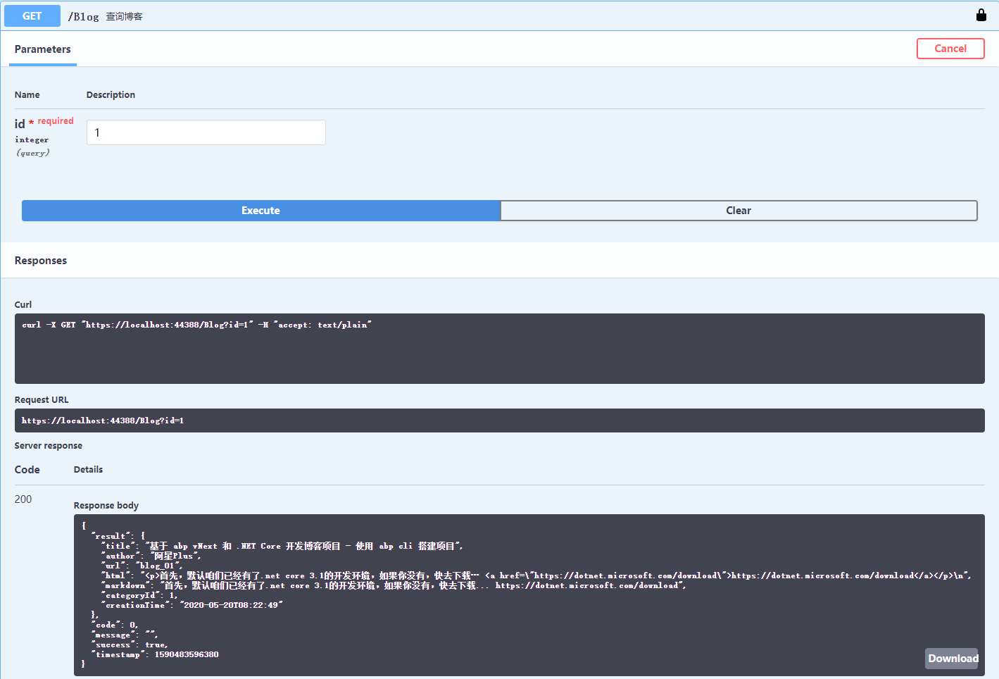

# 用AutoMapper搞定对象映射

上一篇文章集成了定时任务处理框架Hangfire，完成了一个简单的定时任务处理解决方案。

本篇紧接着来玩一下AutoMapper，AutoMapper可以很方便的搞定我们对象到对象之间的映射关系处理，同时abp也帮我们是现实了`IObjectMapper`接口，先根据官方文档：<https://docs.abp.io/zh-Hans/abp/latest/Object-To-Object-Mapping> ，将AutoMapper添加依赖到项目中。

在`.Application`层模块类中添加`AbpAutoMapperModule`模块依赖。

```csharp
//MeowvBlogApplicationModule.cs
using Meowv.Blog.Application.Caching;
using Volo.Abp.AutoMapper;
using Volo.Abp.Identity;
using Volo.Abp.Modularity;

namespace Meowv.Blog.Application
{
    [DependsOn(
        typeof(AbpIdentityApplicationModule),
        typeof(AbpAutoMapperModule),
        typeof(MeowvBlogApplicationCachingModule)
    )]
    public class MeowvBlogApplicationModule : AbpModule
    {
        public override void ConfigureServices(ServiceConfigurationContext context)
        {
            ...
        }
    }
}
```

在本项目中，主要处理的就是实体和DTO之前的映射关系，以之前写的`BlogService.cs`中的增删改查为例，将`Post.cs`和`PostDto.cs`互相映射。

先看`GetPostAsync(int id)`这个方法，之前的做法是手动创建对象，然后为其一个一个的赋值，可以想象当我们的字段超级多的时候，都得写一遍。现在有了AutoMapper，一句代码就可以搞定。

```csharp
public async Task<ServiceResult<PostDto>> GetPostAsync(int id)
{
    var result = new ServiceResult<PostDto>();

    var post = await _postRepository.GetAsync(id);
    if (post == null)
    {
        result.IsFailed("文章不存在");
        return result;
    }

    //var dto = new PostDto
    //{
    //    Title = post.Title,
    //    Author = post.Author,
    //    Url = post.Url,
    //    Html = post.Html,
    //    Markdown = post.Markdown,
    //    CategoryId = post.CategoryId,
    //    CreationTime = post.CreationTime
    //};

    var dto = ObjectMapper.Map<Post, PostDto>(post);

    result.IsSuccess(dto);
    return result;
}
```

`ObjectMapper`在`ApplicationService`中已经被注入，我们的继承了`ServiceBase`，可以直接使用。

到这里还没完，其中最重要的一步就是定义类与类之间的映射关系，AutoMapper提供了多种定义类之间映射的方法，有关详细信息请参阅AutoMapper的文档：<https://docs.automapper.org/>

其中定义一种映射的方法是创建一个Profile 类，在`.Application`层添加`MeowvBlogAutoMapperProfile.cs`，直接继承`Profile`在构造函数中定义即可。

```csharp
//MeowvBlogAutoMapperProfile.cs
using AutoMapper;
using Meowv.Blog.Application.Contracts.Blog;
using Meowv.Blog.Domain.Blog;

namespace Meowv.Blog.Application
{
    public class MeowvBlogAutoMapperProfile : Profile
    {
        public MeowvBlogAutoMapperProfile()
        {
            CreateMap<Post, PostDto>();

            CreateMap<PostDto, Post>().ForMember(x => x.Id, opt => opt.Ignore());
        }
    }
}
```

定义两个规则，第一个：从`Post`映射到`PostDto`，因为`PostDto`所有属性在`Post`中都是存在的，所以直接`CreateMap<>`即可；第二个：从`PostDto`映射到`Post`，因为`Post`中存在Id属性，而在`PostDto`中是没有的，所以可以使用`ForMember(...)`来忽略掉Id属性。

定义好映射规则后，在模块类中添加使用。

```csharp
//MeowvBlogApplicationModule.cs
...
    public override void ConfigureServices(ServiceConfigurationContext context)
    {
        Configure<AbpAutoMapperOptions>(options =>
        {
            options.AddMaps<MeowvBlogApplicationModule>(validate: true);
            options.AddProfile<MeowvBlogAutoMapperProfile>(validate: true);
        });
    }
...
```

使用同样的方式修改一下`InsertPostAsync(PostDto dto)`方法的代码。

```csharp
public async Task<ServiceResult<string>> InsertPostAsync(PostDto dto)
{
    var result = new ServiceResult<string>();

    //var entity = new Post
    //{
    //    Title = dto.Title,
    //    Author = dto.Author,
    //    Url = dto.Url,
    //    Html = dto.Html,
    //    Markdown = dto.Markdown,
    //    CategoryId = dto.CategoryId,
    //    CreationTime = dto.CreationTime
    //};

    var entity = ObjectMapper.Map<PostDto, Post>(dto);

    var post = await _postRepository.InsertAsync(entity);
    if (post == null)
    {
        result.IsFailed("添加失败");
        return result;
    }

    result.IsSuccess("添加成功");
    return result;
}
```

解放了双手，代码也变少了，真香，去测试一下用了对象映射后的接口是否好使。



可以看到，结果也是可以出来的，后续都将按照上面的方法大量用到对象映射。

顺便介绍`.HttpApi.Hosting`层几个配置属性。

路由规则配置，默认Swagger中的路由是大写的，如果我想转成小写可以使用以下配置代码，都写在模块类`MeowvBlogHttpApiHostingModule.cs`中。

```csharp
public override void ConfigureServices(ServiceConfigurationContext context)
{
...
    context.Services.AddRouting(options =>
    {
        // 设置URL为小写
        options.LowercaseUrls = true;
        // 在生成的URL后面添加斜杠
        options.AppendTrailingSlash = true;
    });
...
}
```

使用HSTS的中间件，该中间件添加了严格传输安全头。

```csharp
public override void OnApplicationInitialization(ApplicationInitializationContext context)
{
    ...
    app.UseHsts();
    ...
}
```

直接使用默认的跨域配置。

```csharp
public override void OnApplicationInitialization(ApplicationInitializationContext context)
{
    ...
    app.UseCors();
    ...
}
```

HTTP请求转HTTPS。

```csharp
public override void OnApplicationInitialization(ApplicationInitializationContext context)
{
    ...
    app.UseHttpsRedirection();
    ...
}
```

转发将标头代理到当前请求，配合 Nginx 使用，获取用户真实IP。

```csharp
public override void OnApplicationInitialization(ApplicationInitializationContext context)
{
    ...
    pp.UseForwardedHeaders(new ForwardedHeadersOptions
    {
        ForwardedHeaders = ForwardedHeaders.XForwardedFor | ForwardedHeaders.XForwardedProto
    });
    ...
}
```

本篇介绍了如何使用AutoMapper，搞定对象到对象间的映射，篇幅简短，内容比较简单，你学会了吗？😁😁😁
