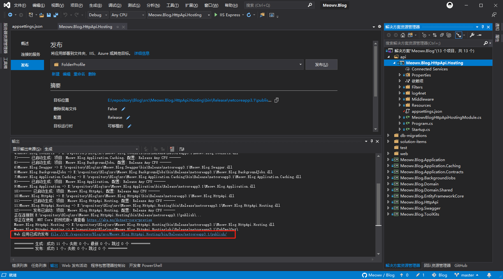
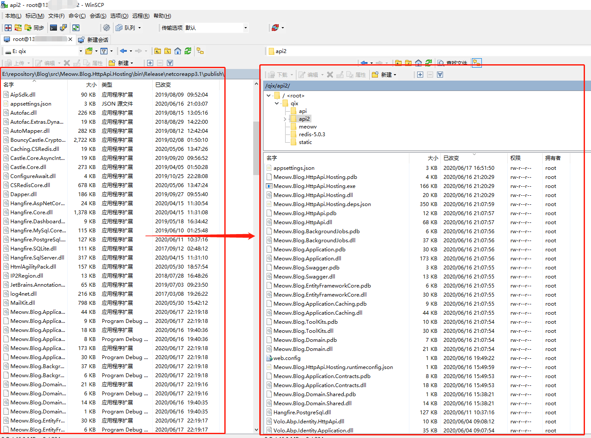
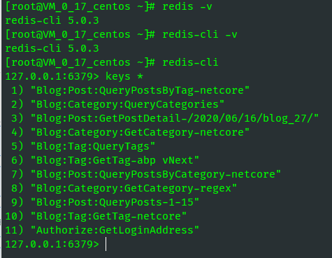
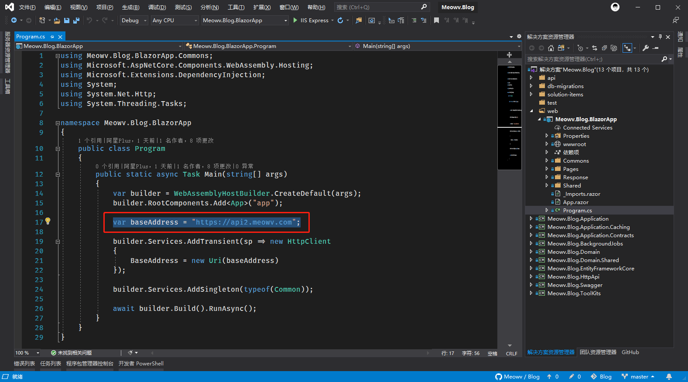
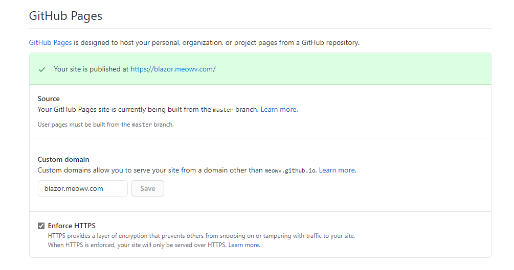
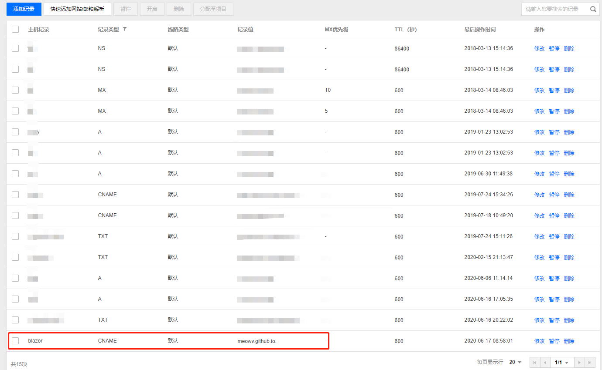

# 终结篇之发布项目

终于到了这一步了，开发了 API，紧接着又开发了 Blazor 版的博客项目，庆祝本系列文章完结撒花。🎉🎉🎉

既然开发完成了，还是拿出来溜溜比较好，本篇是本系列文章的最后一篇了，准备将 API 部署到 Linux，把前端 Blazor 开发的博客部署到 GitHub Pages。

- **blog**：<https://blazor.meowv.com/>
- **api**：<https://api2.meowv.com/>

先放地址，体验一下，要有点耐心，第一次访问会下载资源文件到本地浏览器，后面访问就贼快了。

也是第一次使用 Blazor 开发项目，不管怎么说，这个实验性的带教学和宣传目的博客总算是搞出来了，自己用的话，完全可以，同时在开发过程中自己也有不少收获。

## 发布API

发布自己写的后端API项目，必须要有属于自己的服务器，当然如果只是为了动动手玩玩就没啥必要了，因为 .NET Core 跨平台咱们可以任意选择，我这里演示将项目发布到 Linux 下。

在这之前可以看一下我去年的一篇文章，[基于.NET Core开发的个人博客发布至CentOS小记](../../articles/dotnetcore/publish-to-centos.md) ，简单了解下。

我的机器是很久之前撸羊毛的渣渣配置服务器，1G内存，1核CPU，1M带宽，不过对于我们这种小站来说没啥访问量，照样用。🤣🤣

首先肯定是需要安装 .NET Core 运行环境，直接安装最新的 .NET Core 3.1 即可。这一步大家根据微软官方文档来就可以了，<https://docs.microsoft.com/zh-cn/dotnet/core/install/linux> 。

安装完成后可以使用 `dotnet --list-runtimes` 查看运行时。


接着就可以去安装 Nginx ，高性能 Web 服务器，在这里使用它反向代理的功能，当然它的功能远不止于此。关于 Nginx 的安装我也不说了，如果你不懂，网上太多教程了。

安装完成后可以使用 `nginx -V` 查看安装版本等信息。


到这一步就可以把我们API项目部署上去了，直接利用 Visual Studio 将项目打包发布，`appsettings.json`配置文件信息填好，这一步不用多说吧，相信大家都会。



利用 WinSCP 工具将发布好的代码上传至服务器，我这里新建了文件夹 qix/api2 方便自己管理，顺便提一句，WinSCP 是一个 Windows 环境下使用的 SSH 的开源图形化 SFTP 客户端。



那么现在我们可以在终端中定位到API所在目录，`cd /qix/api2`，然后执行命令启动项目`dotnet run Meowv.Blog.HttpApi.Hosting.dll`这时候便会看到输出信息，我们就可以使用服务器IP+端口的方式访问到API了。

如果只是这样肯定不是我想要的，这时候就引入了 Linux 下的守护进程，就类似于 Windows 下面的服务一样，让守护进程帮助我们运行项目，当关机、重启或者其它异常问题出现时，可以自动帮我们重启应用，就是自动执行`dotnet run xxx.dll`这句命令。

关于守护进程用的比较多的，supervisor 与 pm2 ，前者基于Python开发的，后者是基于nodejs开发的。

咱这里就选用 supervisor 了，当然 pm2 也不错也可以用用。

在 centos 下安装 supervisor 也很简单，直接贴几行代码，照着执行即可。

```shell
yum install python-setuptools

easy_install supervisor

mkdir /etc/supervisor
echo_supervisord_conf > /etc/supervisor/supervisord.conf
```

安装成功后还需要花点时间去配置它，找到文件 /etc/supervisor/supervisord.conf 去掉文件最后的注释，可以改成向下面这样。

```ini
...
[include]
files = conf.d/*.ini
```

这时候就可以监听到 conf.d 文件夹下面的 ini 配置文件了，在 /etc/supervisor/ 下新建文件夹 conf.d，conf.d 文件夹下新建一个配置文件 api2_meowv.conf 文件，名字随便起，内容如下：

```ini
[program:api2_meowv] # api2_meowv程序名称
command=dotnet Meowv.Blog.HttpApi.Hosting.dll # 执行的命令
directory=/qix/api2  # 命令执行的目录
environment=ASPNETCORE__ENVIRONMENT=Production # 环境变量
user=root
stopsignal=INT
autostart=true # 是否自启动
autorestart=true # 是否自动重启
startsecs=3 # 自动重启时间间隔（s）
stderr_logfile=/var/log/api2.meowv.com.err.log #错误日志文件指向目录
stdout_logfile=/var/log/api2.meowv.com.out.log #输出日志文件指向目录
```

每行都带有注释，很清楚知道是干啥用的，顺便贴几条常用的命令：

```shell
supervisorctl start program_name   #启动某个进程(program_name=配置的进程名称)
supervisorctl stop program_name    #停止某一进程
supervisorctl reload               #重新启动配置中的所有程序
supervisorctl stop all             #停止全部进程
supervisorctl update               #更新新的配置到supervisord
supervisorctl restart program_name #重启某一进程
supervisorctl                      #查看正在守候的进程
```


使用上面命令成功启动项目，使用IP+端口的方式去访问API肯定是不友好的，这时候就需要一个域名了，我这里将新建一个二级域名 api2.meowv.com 执行新开发的API项目。

关于域名的解析啥的不说了，配置完域名我顺便去申请了一个SSL证书，使用HTTPS的方式访问。

这时可以去配置 Nginx 方向代理了。来到 nginx 安装目录，我这里是 /etc/nginx ，新建一个文件夹 ssl ，将申请的SSL证书放进去，然后再 conf.d 文件夹下新建一个 api2_meowv.conf 文件，写入下面的配置信息。

```nginx
server {
    listen 443 ssl;
    server_name api2.meowv.com;
    ssl_certificate ssl/1_api2.meowv.com_bundle.crt;
    ssl_certificate_key ssl/2_api2.meowv.com.key;
    ssl_session_timeout 5m;
    ssl_protocols TLSv1 TLSv1.1 TLSv1.2;
    ssl_ciphers AESGCM:ALL:!DH:!EXPORT:!RC4:+HIGH:!MEDIUM:!LOW:!aNULL:!eNULL;
    ssl_prefer_server_ciphers on;
    location / {
         if ($request_method = 'OPTIONS') {
            add_header Access-Control-Allow-Headers 'Authorization,Content-Type';
            add_header Access-Control-Allow-Origin *;
            add_header Access-Control-Allow-Credentials true;
            add_header Access-Control-Allow-Methods GET,POST,PUT,DELETE,OPTIONS;
            return 204;
         }
         proxy_pass http://localhost:5009;
         proxy_set_header   X-Real-IP        $remote_addr;
         proxy_set_header   Host             $host;
         proxy_set_header   X-Forwarded-For  $proxy_add_x_forwarded_for;
        client_max_body_size 20M;
    }
}

server {
    listen 80;
    server_name api2.meowv.com;
    rewrite ^(.*)$ https://api2.meowv.com;
}
```


关于配置信息大家可以自己去学习一下，我这里也是简单的使用，我这里监听的端口是 5009，这个端口在 API 项目中是可以自定义的，相信大家都知道。做好以上操作后，在终端执行 `nginx -s reloa`，刷新 nginx 配置使其生效，然后就大功告成了。

关于项目中的数据库和Redis缓存，大家可以自行安装。数据库可以选择使用Sqlite，项目中已经做了一键切换数据库。安装Redis也很简单，相信大家可以自己完成，Redis可用可不用，可以直接关闭。



现在API项目便发布成功，将其部署在Linux系统下面，有了线上正常运行的API，接下来把前端 Blazor 开发的博客也发一下。

## 发布Blog

为了节省服务器资源，现在里面已经容纳了超级多的东西了，我准备将 Blog 部署在 GitHub Pages 上。

使用 Blazor WebAssembly 发布后是纯静态的文件，所以啊，其实放在哪里都可以。无关乎环境，只要可以开启一个WEB服务即可。

在GitHub上创建一个仓库来放我们的发布后的代码，关于创建仓库不会的看这里，<https://pages.github.com> 。

接下来去发布 Blazor 项目，发布之前改一下API地址，当然这个也可以做成配置文件形式的。




然后将创建好的仓库克隆下来，把博客静态文件拷贝进去，这时候还不能直接push到仓库中，为了适配 GitHub Pages 我们还要做几点改动。

GitHub Pages 使用的是 Jekyll，以特殊字符开头的文件夹是不会被映射到路由中去的，我们发布的静态文件中刚好有以`_`开头的文件夹`_framework`，为了解决这个问题可以在仓库下面创建一个以`.nojekyll`命名的空文件即可。

根据实际操作和踩坑，现在如果发布还是会报一个无法加载资源的错误`The resource has been blocked.`，然后在GitHub找到了解决办法，详见：<https://github.com/dotnet/aspnetcore/issues/19907#issuecomment-600054113> 。

新建一个`.gitattributes`文件，写入内容：`* binary`，即可，现在将文件 push 到仓库。

然后在仓库的settings下面开启 GitHub Pages 功能选项。



我这里自定义了一个域名，如果你也想自定义域名可以在根目录添加一个名为`CNAME`的文件，里面的内容就是你的域名，我这里就是：blazor.meowv.com 。



最后在去配置一下域名的 CNAME 解析即可，等待 DNS 生效，便可以用自定义域名访问了。

## 结束语

本系列文章从零开始搭建了API，使用 Blazor 开发了一个简单的博客系统，功能不是很多。整体来说从无到有，自己也踩了一遍坑，也算有不少收获了。

在这里再次感谢那些在公众号给我赞赏的人。🌹🌹🌹

可能整体涉及到的东西不是很多，广度和深度都没有，只是很基础的用了用，在写之前我也已经说过，这些系列是用来记录自己的编码过程，因为大佬们都不愿意出来分享，所以我们渣渣只能做到这种程度。

如果对你没啥帮助，权当看过笑过😀😀或者右上角点一下小叉叉❌❌，因为不管你做的如何，总有人喜欢说三道四~~

如果对你有些许帮助，请多多推广哟。✨✨✨

最后大家可以关注一下我的微信公众号：『**阿星Plus**』🤞🤞🤞

因为疫情影响，今年高考推迟到7月份，每年高考便是我所在公司的业务高峰期，接下来实在太忙，估计也没时间创作了，正好准备休息一段时间，好好思考思考后面为大家带来更好的文章，有缘人下个系列见吧。😊😊😊

本系列文章代码开源地址：<https://github.com/meowv/blog>
