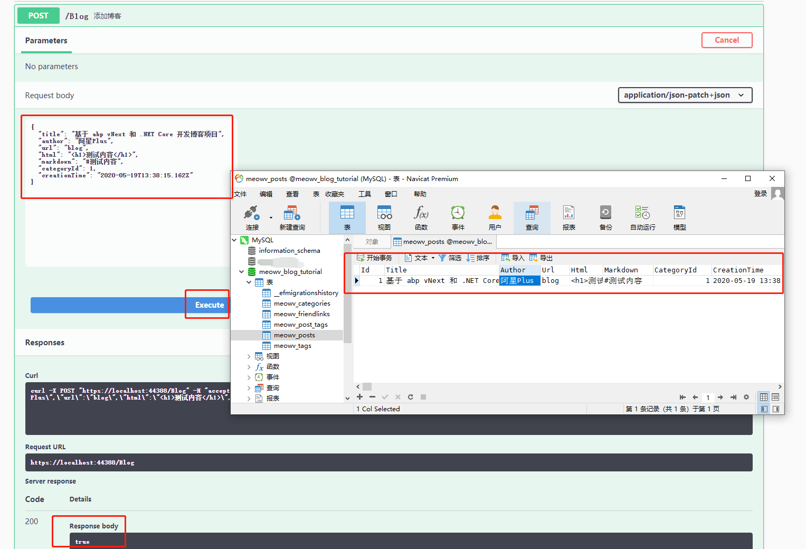
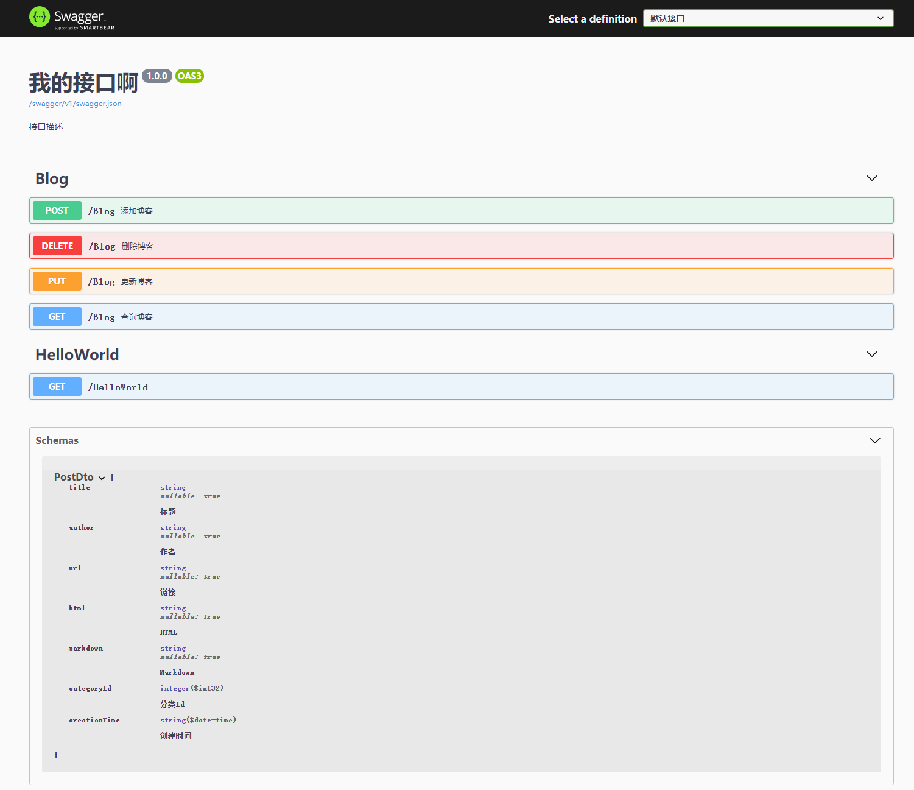

# 自定义仓储之增删改查

上一篇文章我们用Code-First的方式创建了博客所需的实体类，生成了数据库表，完成了对EF Core的封装。

本篇说一下自定义仓储的实现方式，其实在abp框架中已经默认给我们实现了默认的通用(泛型)仓储，`IRepository<TEntity, TKey>`，有着标准的CRUD操作，可以看：<https://docs.abp.io/zh-Hans/abp/latest/Repositories> 学习更多。

之所以实现自定义仓储，是因为abp没有给我们实现批量插入、更新的方法，这个是需要自己去扩展的。

既然是自定义仓储，那么就有了很高的自由度，我们可以任意发挥，可以接入第三方批量处理数据的库，可以接入Dapper操作等等，在这里贴一下微软官方推荐的一些EF Core的工具和扩展：<https://docs.microsoft.com/zh-cn/ef/core/extensions/> 。

## 自定义仓储

在`.Domain`领域层中创建仓储接口，`IPostRepository`、`ICategoryRepository`、`ITagRepository`、`IPostTagRepository`、`IFriendLinkRepository`，这里直接全部继承 `IRepository<TEntity, TKey>` 以使用已有的通用仓储功能。

可以转到`IRepository<TEntity, TKey>`接口定义看一下


看看abp对于仓储的介绍，如下：

`IRepository<TEntity, TKey>` 接口扩展了标准 `IQueryable<TEntity>` 你可以使用标准LINQ方法自由查询。但是，某些ORM提供程序或数据库系统可能不支持IQueryable接口。

ABP提供了 `IBasicRepository<TEntity, TPrimaryKey>` 和 `IBasicRepository<TEntity>` 接口来支持这样的场景。

你可以扩展这些接口（并可选择性地从BasicRepositoryBase派生）为你的实体创建自定义存储库。

依赖于 `IBasicRepository` 而不是依赖 `IRepository` 有一个优点, 即使它们不支持 `IQueryable` 也可以使用所有的数据源, 但主要的供应商, 像 Entity Framework, NHibernate 或 MongoDb 已经支持了 `IQueryable`。

因此, 使用 `IRepository` 是典型应用程序的 建议方法。但是可重用的模块开发人员可能会考虑使用 `IBasicRepository` 来支持广泛的数据源。

对于想要使用只读仓储提供了`IReadOnlyRepository<TEntity, TKey>` 与 `IReadOnlyBasicRepository<Tentity, TKey>`接口。

仓储接口类如下：

```csharp
//IPostRepository.cs
using Volo.Abp.Domain.Repositories;

namespace Meowv.Blog.Domain.Blog.Repositories
{
    /// <summary>
    /// IPostRepository
    /// </summary>
    public interface IPostRepository : IRepository<Post, int>
    {
    }
}
```

```csharp
//ICategoryRepository.cs
using Volo.Abp.Domain.Repositories;

namespace Meowv.Blog.Domain.Blog.Repositories
{
    /// <summary>
    /// ICategoryRepository
    /// </summary>
    public interface ICategoryRepository : IRepository<Category, int>
    {
    }
}
```

```csharp
//ITagRepository.cs
using System.Collections.Generic;
using System.Threading.Tasks;
using Volo.Abp.Domain.Repositories;

namespace Meowv.Blog.Domain.Blog.Repositories
{
    /// <summary>
    /// ITagRepository
    /// </summary>
    public interface ITagRepository : IRepository<Tag, int>
    {
        /// <summary>
        /// 批量插入
        /// </summary>
        /// <param name="tags"></param>
        /// <returns></returns>
        Task BulkInsertAsync(IEnumerable<Tag> tags);
    }
}
```

```csharp
//IPostTagRepository.cs
using System.Collections.Generic;
using System.Threading.Tasks;
using Volo.Abp.Domain.Repositories;

namespace Meowv.Blog.Domain.Blog.Repositories
{
    /// <summary>
    /// IPostTagRepository
    /// </summary>
    public interface IPostTagRepository : IRepository<PostTag, int>
    {
        /// <summary>
        /// 批量插入
        /// </summary>
        /// <param name="postTags"></param>
        /// <returns></returns>
        Task BulkInsertAsync(IEnumerable<PostTag> postTags);
    }
}
```

```csharp
//IFriendLinkRepository.cs
using Volo.Abp.Domain.Repositories;

namespace Meowv.Blog.Domain.Blog.Repositories
{
    /// <summary>
    /// IFriendLinkRepository
    /// </summary>
    public interface IFriendLinkRepository : IRepository<FriendLink, int>
    {
    }
}
```

在`ITagRepository`和`IPostTagRepository`仓储接口中，我们添加了批量插入的方法。相对于的在我们的`.EntityFrameworkCore`层实现这些接口。

创建Repositories/Blog 文件夹，添加实现类：`PostRepository`、`CategoryRepository`、`TagRepository`、`PostTagRepository`、`FriendLinkRepository`。

不知道大家发现没有，我们的仓储接口以及实现，都是以`Repository`结尾的，这和我们的`.Application`应用服务层都以`Service`结尾是一个道理。

在自定义仓储的实现中，我们可以使用任意你想使用的数据访问工具，我们这里还是继续用`Entity Framework Core`，需要继承`EfCoreRepository<TDbContext, TEntity, TKey>`，和我们的仓储接口`IXxxRepository`。


`EfCoreRepository`默认实现了许多默认的方法，然后就可以直接使用 `DbContext` 来执行操作了。

仓储接口实现类如下：

```csharp
//PostRepository.cs
using Meowv.Blog.Domain.Blog;
using Meowv.Blog.Domain.Blog.Repositories;
using Volo.Abp.Domain.Repositories.EntityFrameworkCore;
using Volo.Abp.EntityFrameworkCore;

namespace Meowv.Blog.EntityFrameworkCore.Repositories.Blog
{
    /// <summary>
    /// PostRepository
    /// </summary>
    public class PostRepository : EfCoreRepository<MeowvBlogDbContext, Post, int>, IPostRepository
    {
        public PostRepository(IDbContextProvider<MeowvBlogDbContext> dbContextProvider) : base(dbContextProvider)
        {
        }
    }
}
```

```csharp
//CategoryRepository.cs
using Meowv.Blog.Domain.Blog;
using Meowv.Blog.Domain.Blog.Repositories;
using Volo.Abp.Domain.Repositories.EntityFrameworkCore;
using Volo.Abp.EntityFrameworkCore;
namespace Meowv.Blog.EntityFrameworkCore.Repositories.Blog
{
    /// <summary>
    /// CategoryRepository
    /// </summary>
    public class CategoryRepository : EfCoreRepository<MeowvBlogDbContext, Category, int>, ICategoryRepository
    {
        public CategoryRepository(IDbContextProvider<MeowvBlogDbContext> dbContextProvider) : base(dbContextProvider)
        {
        }
    }
}
```

```csharp
//TagRepository.cs
using Meowv.Blog.Domain.Blog;
using Meowv.Blog.Domain.Blog.Repositories;
using System.Collections.Generic;
using System.Threading.Tasks;
using Volo.Abp.Domain.Repositories.EntityFrameworkCore;
using Volo.Abp.EntityFrameworkCore;

namespace Meowv.Blog.EntityFrameworkCore.Repositories.Blog
{
    /// <summary>
    /// TagRepository
    /// </summary>
    public class TagRepository : EfCoreRepository<MeowvBlogDbContext, Tag, int>, ITagRepository
    {
        public TagRepository(IDbContextProvider<MeowvBlogDbContext> dbContextProvider) : base(dbContextProvider)
        {
        }

        /// <summary>
        /// 批量插入
        /// </summary>
        /// <param name="tags"></param>
        /// <returns></returns>
        public async Task BulkInsertAsync(IEnumerable<Tag> tags)
        {
            await DbContext.Set<Tag>().AddRangeAsync(tags);
            await DbContext.SaveChangesAsync();
        }
    }
}
```

```csharp
//PostTagRepository.cs
using Meowv.Blog.Domain.Blog;
using Meowv.Blog.Domain.Blog.Repositories;
using System.Collections.Generic;
using System.Threading.Tasks;
using Volo.Abp.Domain.Repositories.EntityFrameworkCore;
using Volo.Abp.EntityFrameworkCore;

namespace Meowv.Blog.EntityFrameworkCore.Repositories.Blog
{
    /// <summary>
    /// PostTagRepository
    /// </summary>
    public class PostTagRepository : EfCoreRepository<MeowvBlogDbContext, PostTag, int>, IPostTagRepository
    {
        public PostTagRepository(IDbContextProvider<MeowvBlogDbContext> dbContextProvider) : base(dbContextProvider)
        {
        }

        /// <summary>
        /// 批量插入
        /// </summary>
        /// <param name="postTags"></param>
        /// <returns></returns>
        public async Task BulkInsertAsync(IEnumerable<PostTag> postTags)
        {
            await DbContext.Set<PostTag>().AddRangeAsync(postTags);
            await DbContext.SaveChangesAsync();
        }
    }
}
```

```csharp
//FriendLinkRepository.cs
using Meowv.Blog.Domain.Blog;
using Meowv.Blog.Domain.Blog.Repositories;
using Volo.Abp.Domain.Repositories.EntityFrameworkCore;
using Volo.Abp.EntityFrameworkCore;

namespace Meowv.Blog.EntityFrameworkCore.Repositories.Blog
{
    /// <summary>
    /// PostTagRepository
    /// </summary>
    public class FriendLinkRepository : EfCoreRepository<MeowvBlogDbContext, FriendLink, int>, IFriendLinkRepository
    {
        public FriendLinkRepository(IDbContextProvider<MeowvBlogDbContext> dbContextProvider) : base(dbContextProvider)
        {
        }
    }
}
```

在`TagRepository`和`PostTagRepository`仓储接口的实现中，因为数据量不大，可以直接用了EF Core自带的`AddRangeAsync`批量保存数据。

到这里，关于博客的自定义仓储便完成了，此时项目层级目录图，如下：


## 增删改查

接下来在就可以在`.Application`服务层愉快的玩耍了，写服务之前，我们要分析我们的项目，要有哪些功能业务。由于是博客项目，无非就是一些增删改查。今天先不写博客业务，先完成对数据库文章表`meowv_posts`的一个简单CRUD。

在`.Application`层新建Blog文件夹，添加一个`IBlogService.cs`博客接口服务类，分别添加增删改查四个方法。

这时就要用到我们的数据传输对象(DTO)了，简单理解，DTO就是从我们的领域模型中抽离出来的对象，它是很纯粹的只包含我们拿到的数据，不参杂任何行为逻辑。

在`.Application.Contracts`层新建Blog文件夹，同时新建一个`PostDto.cs`类，与`.Domain`层中的`Post.cs`与之对应，他们很相似，但是不一样。

于是`IBlogService.cs`接口服务类的CRUD为：

```csharp
//IBlogService.cs
using Meowv.Blog.Application.Contracts.Blog;
using System.Threading.Tasks;

namespace Meowv.Blog.Application.Blog
{
    public interface IBlogService
    {
        Task<bool> InsertPostAsync(PostDto dto);

        Task<bool> DeletePostAsync(int id);

        Task<bool> UpdatePostAsync(int id, PostDto dto);

        Task<PostDto> GetPostAsync(int id);
    }
}
```

接口写好了，少不了实现方式，直接在Blog文件夹新建Impl文件夹，用来存放我们的接口实现类`BlogService.cs`，注意：都是以`Service`结尾的噢~

实现服务接口除了要继承我们的`IBlogService`外，不要忘了还需依赖我们的`ServiceBase`类。由于我们之前直接接入了Autofac，可以直接使用构造函数依赖注入的方式。

```csharp
//BlogService.cs
using Meowv.Blog.Application.Contracts.Blog;
using Meowv.Blog.Domain.Blog.Repositories;
using System;
using System.Threading.Tasks;

namespace Meowv.Blog.Application.Blog.Impl
{
    public class BlogService : ServiceBase, IBlogService
    {
        private readonly IPostRepository _postRepository;

        public BlogService(IPostRepository postRepository)
        {
            _postRepository = postRepository;
        }
        ...
    }
}
```

现在就可以实现我们写的`IBlogService`接口了。

先写添加，这里实现方式全采用异步的方法，先构建一个`Post`实体对象，具体内容参数都从`PostDto`中获取，由于主键之前设置了自增，这里就不用管它了。然后调用 `await _postRepository.InsertAsync(entity);`，正好它返回了一个创建成功的`Post`对象，那么我们就可以判断对象是否为空，从而确定文章是否添加成功。

代码如下：

```csharp
...
        public async Task<bool> InsertPostAsync(PostDto dto)
        {
            var entity = new Post
            {
                Title = dto.Title,
                Author = dto.Author,
                Url = dto.Url,
                Html = dto.Html,
                Markdown = dto.Markdown,
                CategoryId = dto.CategoryId,
                CreationTime = dto.CreationTime
            };

            var post = await _postRepository.InsertAsync(entity);
            return post != null;
        }
...
```

然后在`.HttpApi`层和之前添加`HelloWorldController`一样，添加`BlogController`。调用写的`InsertPostAsync`方法，如下：

```csharp
//BlogController.cs
using Meowv.Blog.Application.Blog;
using Meowv.Blog.Application.Contracts.Blog;
using Microsoft.AspNetCore.Mvc;
using System.Threading.Tasks;
using Volo.Abp.AspNetCore.Mvc;

namespace Meowv.Blog.HttpApi.Controllers
{
    [ApiController]
    [Route("[controller]")]
    public class BlogController : AbpController
    {
        private readonly IBlogService _blogService;

        public BlogController(IBlogService blogService)
        {
            _blogService = blogService;
        }

        /// <summary>
        /// 添加博客
        /// </summary>
        /// <param name="dto"></param>
        /// <returns></returns>
        [HttpPost]
        public async Task<bool> InsertPostAsync([FromBody] PostDto dto)
        {
            return await _blogService.InsertPostAsync(dto);
        }
    }
}
```

添加博客操作，我们将其设置为`[HttpPost]`方式来提交，因为现在开发接口api，都要遵循RESTful方式，所以就不用给他指定路由了，`[FromBody]`的意思是在请求正文中以JSON的方式来提交参数。

完成上述操作，打开我们的Swagger文档看看， .../swagger/index.html ，已经出现我们的接口了。


随手就试一下这个接口，能否成功创建文章。



可以看到数据库已经躺着我们刚刚添加数据内容。

将剩下的三个接口一一实现，相信大家肯定都知道怎么写了。就不逐一唠叨了，代码如下：

```csharp
...
        public async Task<bool> DeletePostAsync(int id)
        {
            await _postRepository.DeleteAsync(id);

            return true;
        }

        public async Task<bool> UpdatePostAsync(int id, PostDto dto)
        {
            var post = await _postRepository.GetAsync(id);

            post.Title = dto.Title;
            post.Author = dto.Author;
            post.Url = dto.Url;
            post.Html = dto.Html;
            post.Markdown = dto.Markdown;
            post.CategoryId = dto.CategoryId;
            post.CreationTime = dto.CreationTime;

            await _postRepository.UpdateAsync(post);

            return true;
        }

        public async Task<PostDto> GetPostAsync(int id)
        {
            var post = await _postRepository.GetAsync(id);

            return new PostDto
            {
                Title = post.Title,
                Author = post.Author,
                Url = post.Url,
                Html = post.Html,
                Markdown = post.Markdown,
                CategoryId = post.CategoryId,
                CreationTime = post.CreationTime
            };
        }
...
```

在这里先暂时不做参数校验，咱们默认都是正常操作，如果执行操作成功，直接返回true。大家会发现，当我们使用了DTO后，写了大量对象的转换，在这里暂不做优化，将在后续业务开始后使用`AutoMapper`处理对象映射。如果大家感兴趣可以自己先试一下。

在Controller中调用，代码如下：

```csharp
...
        /// <summary>
        /// 删除博客
        /// </summary>
        /// <param name="id"></param>
        /// <returns></returns>
        [HttpDelete]
        public async Task<bool> DeletePostAsync([Required] int id)
        {
            return await _blogService.DeletePostAsync(id);
        }

        /// <summary>
        /// 更新博客
        /// </summary>
        /// <param name="id"></param>
        /// <param name="dto"></param>
        /// <returns></returns>
        [HttpPut]
        public async Task<bool> UpdatePostAsync([Required] int id, [FromBody] PostDto dto)
        {
            return await _blogService.UpdatePostAsync(id, dto);
        }

        /// <summary>
        /// 查询博客
        /// </summary>
        /// <param name="id"></param>
        /// <returns></returns>
        [HttpGet]
        public async Task<PostDto> GetPostAsync([Required] int id)
        {
            return await _blogService.GetPostAsync(id);
        }
...
```

`DeletePostAsync`：指定了请求方式`[HttpDelete]`，参数id为必填项

`UpdatePostAsync`：指定了请求方式`[HttpPut]`，参数id为必填项并且为url的一部分，要更新的具体内容和添加博客的方法`InsertPostAsync`的一样的

`GetPostAsync`：指定了请求方式`[HttpGet]`，参数id为必填项

ok，打开Swagger文档看看效果，并试试我们的接口是否好使吧，反正我试了是没有问题的。



做到这一步的项目层级目录如下:


本篇使用自定义仓储的方式完成了对博客(meowv_posts)的增删改查，你学会了吗？😁😁😁
