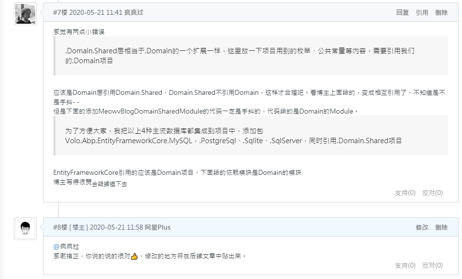
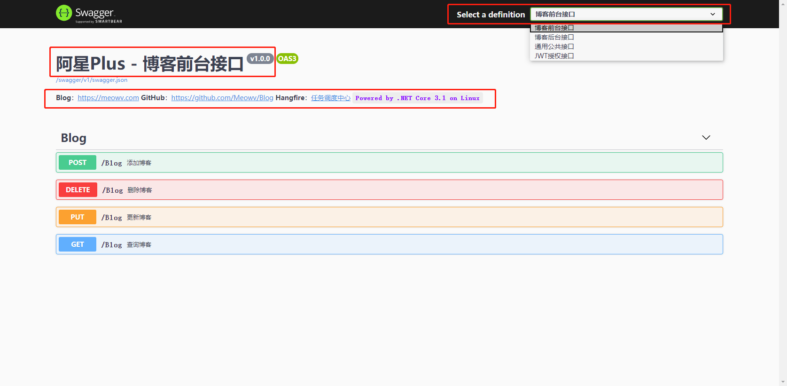
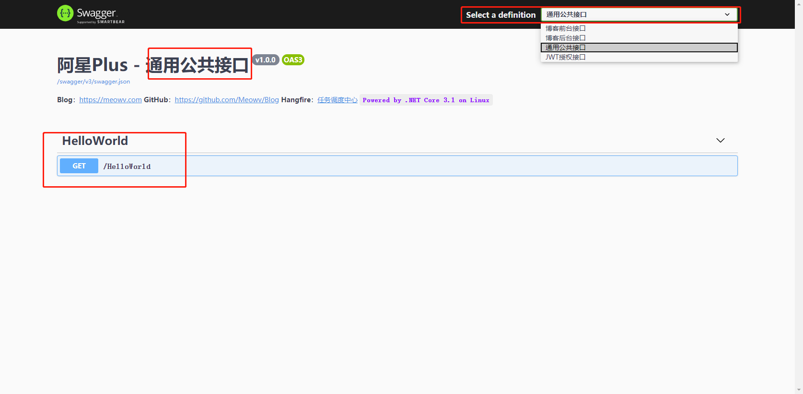
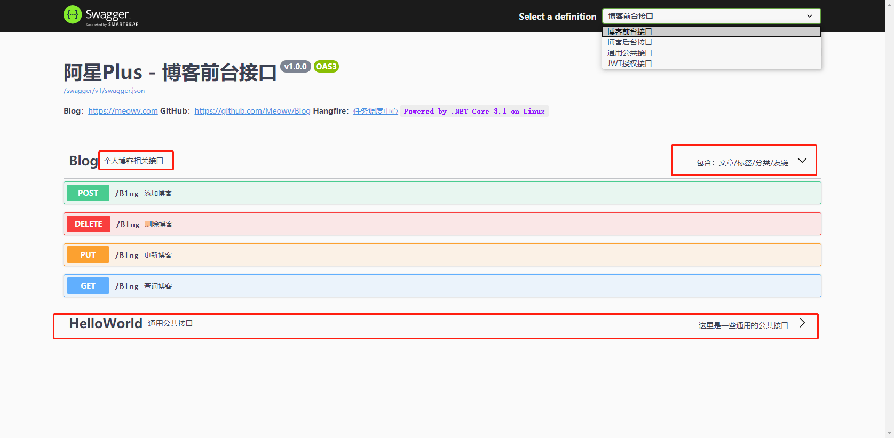

# 再说Swagger，分组、描述、小绿锁

在开始本篇正文之前，解决一个 @疯疯过 指出的错误，再次感谢指正。



步骤如下：

* 删掉`.Domain.Shared`层中的项目引用，添加nuget依赖包`Volo.Abp.Identity.Domain.Shared`，可以使用命令：`Install-Package Volo.Abp.Identity.Domain.Shared`
* 在`.Domain`层中引用项目`.Domain.Shared`，在模块类中添加依赖`typeof(MeowvBlogDomainSharedModule)`
* 将`.EntityFrameworkCore`层中的引用项目`.Domain.Shared`改成`.Domain`。


---

上一篇文章完成了对API返回模型的封装，紧接着我打算继续来折腾一下Swagger，之前的文章中已经简单用起了Swagger，本篇还是围绕它让其发挥更高的更多的价值。

当我们的项目不断壮大，API持续增多，这时如果想要快速准确定位到某个API可能不是那么容易，需要翻半天才能找对我们的API。于是对Swagger API文档分组和详细的文档描述就有必要了，就本项目而言，博客系统可以分组为：博客前台接口、博客后台接口、其它公共接口、JWT认证授权接口。

其中，博客后台组中的接口需要授权后才可以调用，需要授权那么就涉及到身份验证，在这里准备采用JWT(JSON WEB TOKEN)的方式进行。

## 分组

对Swagger进行分组很简单，在`.Swagger`层中的扩展方法`AddSwagger(this IServiceCollection services)`中多次调用`options.SwaggerDoc(...)`即可，像这样

```csharp
...
    options.SwaggerDoc("v1", new OpenApiInfo
    {
        Version = "1.0.0",
        Title = "我的接口啊1",
        Description = "接口描述1"
    });
    options.SwaggerDoc("v2", new OpenApiInfo
    {
        Version = "1.0.0",
        Title = "我的接口啊2",
        Description = "接口描述2"
    });
    ...
...
```

不过这样显得有点low，然后可以转变一下思路使用遍历的方式进行。`options.SwaggerDoc(...)`接收两个参数：`string name, OpenApiInfo info`。

`name`：可以理解为当前分组的前缀；`OpenApiInfo`：有许多可配置的参数，在这里我只用到三个，`Version`、`Title`、`Description`。

要注意，当在`AddSwagger(...)`中调用完后，还需要在我们的扩展方法`UseSwaggerUI(this IApplicationBuilder app)`中`options.SwaggerEndpoint()`使用它，同样的也用遍历的方法。它接收的的参数：`string url, string name`。

`url`：这里的`url`要与前面配置的`name`参数对应。

`name`：我们自定义显示的分组名称。

于是可以直接在扩展方法中新建一个内部类：`SwaggerApiInfo`

```csharp
        internal class SwaggerApiInfo
        {
            /// <summary>
            /// URL前缀
            /// </summary>
            public string UrlPrefix { get; set; }

            /// <summary>
            /// 名称
            /// </summary>
            public string Name { get; set; }

            /// <summary>
            /// <see cref="Microsoft.OpenApi.Models.OpenApiInfo"/>
            /// </summary>
            public OpenApiInfo OpenApiInfo { get; set; }
        }
```

然后新建一个`List<SwaggerApiInfo>`手动为其初始化一些值。

```csharp
...
       /// <summary>
        /// Swagger分组信息，将进行遍历使用
        /// </summary>
        private static readonly List<SwaggerApiInfo> ApiInfos = new List<SwaggerApiInfo>()
        {
            new SwaggerApiInfo
            {
                UrlPrefix = Grouping.GroupName_v1,
                Name = "博客前台接口",
                OpenApiInfo = new OpenApiInfo
                {
                    Version = version,
                    Title = "阿星Plus - 博客前台接口",
                    Description = description
                }
            },
            new SwaggerApiInfo
            {
                UrlPrefix = Grouping.GroupName_v2,
                Name = "博客后台接口",
                OpenApiInfo = new OpenApiInfo
                {
                    Version = version,
                    Title = "阿星Plus - 博客后台接口",
                    Description = description
                }
            },
            new SwaggerApiInfo
            {
                UrlPrefix = Grouping.GroupName_v3,
                Name = "通用公共接口",
                OpenApiInfo = new OpenApiInfo
                {
                    Version = version,
                    Title = "阿星Plus - 通用公共接口",
                    Description = description
                }
            },
            new SwaggerApiInfo
            {
                UrlPrefix = Grouping.GroupName_v4,
                Name = "JWT授权接口",
                OpenApiInfo = new OpenApiInfo
                {
                    Version = version,
                    Title = "阿星Plus - JWT授权接口",
                    Description = description
                }
            }
        };
...
```

`version`：我们将其配置在`appsettings.json`中，做到动态可以修改。

```csharp
//AppSettings.cs
...
        /// <summary>
        /// ApiVersion
        /// </summary>
        public static string ApiVersion => _config["ApiVersion"];
...

//appsettings.json
{
...
  "ApiVersion": "1.0.0"
...
}
```

`description`：因为多次使用，就定义一个变量，内容自拟主要是一些介绍性的描述，将在Swagger界面进行显示。

`UrlPrefix`：分别为，v1,v2,v3,v4。在`Domain.Shared`层中为其定义好常量

```csharp
//MeowvBlogConsts.cs
...
        /// <summary>
        /// 分组
        /// </summary>
        public static class Grouping
        {
            /// <summary>
            /// 博客前台接口组
            /// </summary>
            public const string GroupName_v1 = "v1";

            /// <summary>
            /// 博客后台接口组
            /// </summary>
            public const string GroupName_v2 = "v2";

            /// <summary>
            /// 其他通用接口组
            /// </summary>
            public const string GroupName_v3 = "v3";

            /// <summary>
            /// JWT授权接口组
            /// </summary>
            public const string GroupName_v4 = "v4";
        }
...
```

现在修改扩展方法`AddSwagger(...)`，遍历`List<SwaggerApiInfo>`。

```csharp
...
        public static IServiceCollection AddSwagger(this IServiceCollection services)
        {
            return services.AddSwaggerGen(options =>
            {
                //options.SwaggerDoc("v1", new OpenApiInfo
                //{
                //    Version = "1.0.0",
                //    Title = "我的接口啊",
                //    Description = "接口描述"
                //});

                // 遍历并应用Swagger分组信息
                ApiInfos.ForEach(x =>
                {
                    options.SwaggerDoc(x.UrlPrefix, x.OpenApiInfo);
                });
                ...
            });
        }
...
```

在扩展方法`UseSwaggerUI(...)`使用，通用也需要遍历。

```csharp
...
        // 遍历分组信息，生成Json
        ApiInfos.ForEach(x =>
        {
                options.SwaggerEndpoint($"/swagger/{x.UrlPrefix}/swagger.json", x.Name);
        });
...
```

细心的同学可以发现，我们前几篇文章打开Swagger文档的时候都是需要手动更改URL地址：`.../swagger`才能正确进入，其实Swagger是支持配置路由的。同时咱们也将页面Title也给改了吧。看下面`UseSwaggerUI(...)`完整代码：

```csharp
...
        /// <summary>
        /// UseSwaggerUI
        /// </summary>
        /// <param name="app"></param>
        public static void UseSwaggerUI(this IApplicationBuilder app)
        {
            app.UseSwaggerUI(options =>
            {
                // 遍历分组信息，生成Json
                ApiInfos.ForEach(x =>
                {
                    options.SwaggerEndpoint($"/swagger/{x.UrlPrefix}/swagger.json", x.Name);
                });

                // 模型的默认扩展深度，设置为 -1 完全隐藏模型
                options.DefaultModelsExpandDepth(-1);
                // API文档仅展开标记
                options.DocExpansion(DocExpansion.List);
                // API前缀设置为空
                options.RoutePrefix = string.Empty;
                // API页面Title
                options.DocumentTitle = "😍接口文档 - 阿星Plus⭐⭐⭐";
            });
        }
...
```

`options.DefaultModelsExpandDepth(-1);`是模型的默认扩展深度，设置为 -1 完全隐藏模型。

`options.DocExpansion(DocExpansion.List);`代表API文档仅展开标记，不默然展开所有接口，需要我们手动去点击才展开，可以自行查看`DocExpansion`。

`options.RoutePrefix = string.Empty;`代表路由设置为空，直接打开页面就可以访问了。

`options.DocumentTitle = "😍接口文档 - 阿星Plus⭐⭐⭐";`是设置文档页面的标题的。

完成以上操作，在Controller中使用 Attribute：`[ApiExplorerSettings(GroupName = ...)]`指定是哪个分组然后就可以愉快的使用了。

默认不指定的话就是全部都有，目前只有两个Controller，我们将`HelloWorldController`设置成v3，`BlogController`设置成v1。

```csharp
//HelloWorldController.cs
...
    [ApiExplorerSettings(GroupName = Grouping.GroupName_v3)]
    public class HelloWorldController : AbpController
    {
        ...
    }
...

//BlogController.cs
...
    [ApiExplorerSettings(GroupName = Grouping.GroupName_v1)]
    public class BlogController : AbpController
    {
        ...
    }
...
```

编译运行，打开我们的Swagger文档看一下。





自己试着换切换一下分组试试吧，大功告成。​

## 描述

在Swagger文档中，默认只显示我们的Controller的名称，其实他也是支持描述信息的，这是就需要我们自行扩展了。在`.Swagger`层新建一个文件夹Filters，添加`SwaggerDocumentFilter`类来实现IDocumentFilter接口。

```csharp
//SwaggerDocumentFilter.cs
using Microsoft.OpenApi.Models;
using Swashbuckle.AspNetCore.SwaggerGen;
using System.Collections.Generic;
using System.Linq;

namespace Meowv.Blog.Swagger.Filters
{
    /// <summary>
    /// 对应Controller的API文档描述信息
    /// </summary>
    public class SwaggerDocumentFilter : IDocumentFilter
    {
        public void Apply(OpenApiDocument swaggerDoc, DocumentFilterContext context)
        {
            var tags = new List<OpenApiTag>
            {
                new OpenApiTag {
                    Name = "Blog",
                    Description = "个人博客相关接口",
                    ExternalDocs = new OpenApiExternalDocs { Description = "包含：文章/标签/分类/友链" }
                }
                new OpenApiTag {
                    Name = "HelloWorld",
                    Description = "通用公共接口",
                    ExternalDocs = new OpenApiExternalDocs { Description = "这里是一些通用的公共接口" }
                }
            };

            // 按照Name升序排序
            swaggerDoc.Tags = tags.OrderBy(x => x.Name).ToList();
        }
    }
}
```

实现`Apply(...)`方法后，使用Linq语法对文档排个序，然后最重要的使用这个Filter，在扩展方法`AddSwagger(...)`中使用

```csharp
        public static IServiceCollection AddSwagger(this IServiceCollection services)
        {
            return services.AddSwaggerGen(options =>
            {
                ...
                // 应用Controller的API文档描述信息
                options.DocumentFilter<SwaggerDocumentFilter>();
            });
        }
```

再打开Swagger文档看看效果。



ok，此时描述信息也出来了。

## 小绿锁

在Swagger文档中开启小绿锁是非常简单的，只需添加一个包：`Swashbuckle.AspNetCore.Filters`，直接使用命令安装：`Install-Package Swashbuckle.AspNetCore.Filters`

然后再扩展方法`AddSwagger(this IServiceCollection services)`中调用

```csharp
public static IServiceCollection AddSwagger(this IServiceCollection services)
{
    return services.AddSwaggerGen(options =>
    {
        ...
        var security = new OpenApiSecurityScheme
        {
            Description = "JWT模式授权，请输入 Bearer {Token} 进行身份验证",
            Name = "Authorization",
            In = ParameterLocation.Header,
            Type = SecuritySchemeType.ApiKey
        };
        options.AddSecurityDefinition("oauth2", security);
        options.AddSecurityRequirement(new OpenApiSecurityRequirement { { security, new List<string>() } });
        options.OperationFilter<AddResponseHeadersFilter>();
        options.OperationFilter<AppendAuthorizeToSummaryOperationFilter>();
        options.OperationFilter<SecurityRequirementsOperationFilter>();
        ...
    });
}
```

以上便实现了在Swagger文档中显示小绿锁，我们new的`OpenApiSecurityScheme`对象，具体参数大家可以自行看一下注释就明白具体含义。分别调用`options.AddSecurityDefinition(...)`、`options.AddSecurityRequiremen(...)`、`options.OperationFilter(...)`，编译运行，打开瞅瞅。


现在只是做了小绿锁的显示，但是并没有实际意义，因为在.net core中还需要配置我们的身份认证授权代码，才能具体发挥其真正的作用，所以目前我们的api还是处于裸奔状态，谁都能调用你的api，等你发现你写的文章都被别人删了，你都不知道为什么。

实现JWT，将在下篇文章中详细说明，本篇到这里就结束了，我们完善了Swagger文档，给接口加了分组、描述，还有小绿锁。老铁，你学会了吗？😁😁😁
