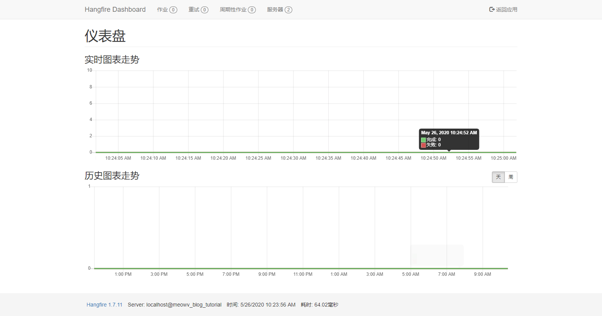
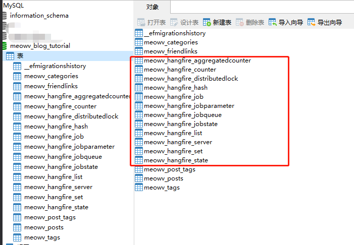
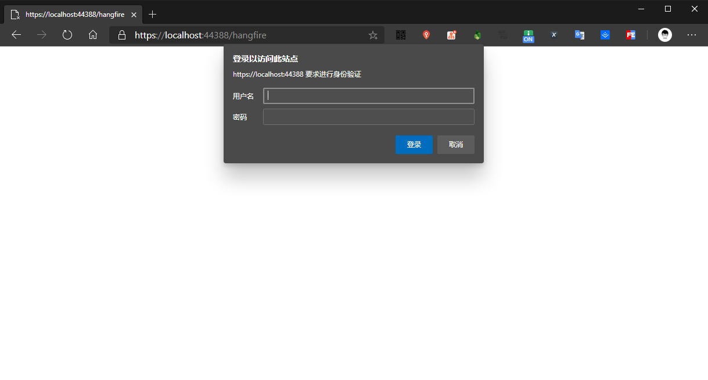
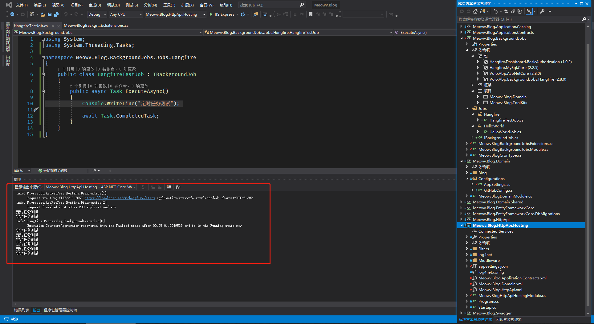

# 集成Hangfire实现定时任务处理

上一篇文章成功使用了Redis缓存数据，大大提高博客的响应性能。

接下来，将完成一个任务调度中心，关于定时任务有多种处理方式，如果你的需求比较简单，比如就是单纯的过多少时间循环执行某个操作，可以直接使用.net core中内置的实现方式，新建一个类继承`BackgroundService`，实现`ExecuteAsync()`既可。

看一个例子，我们每过一秒输出一句HelloWorld，并写入日志中。

在`.BackgroundJobs`中新建一个Jobs文件夹，添加`HelloWorldJob.cs`，并且继承自`BackgroundService`。

```csharp
//HelloWorldJob.cs
using log4net;
using Microsoft.Extensions.Hosting;
using System;
using System.Threading;
using System.Threading.Tasks;

namespace Meowv.Blog.BackgroundJobs.Jobs
{
    public class HelloWorldJob : BackgroundService
    {
        private readonly ILog _log;

        public HelloWorldJob()
        {
            _log = LogManager.GetLogger(typeof(HelloWorldJob));
        }

        protected override async Task ExecuteAsync(CancellationToken stoppingToken)
        {
            while (!stoppingToken.IsCancellationRequested)
            {
                var msg = $"CurrentTime:{ DateTime.Now}, Hello World!";

                Console.WriteLine(msg);

                _log.Info(msg);

                await Task.Delay(1000, stoppingToken);
            }
        }
    }
}
```

然后在`.HttpApi.Hosting`层模块类中的`ConfigureServices()`注入`context.Services.AddTransient<IHostedService, HelloWorldJob>();`使用，运行一下看看效果。


可以看到已经成功输出了，你可以在`ExecuteAsync()`中做你的事件处理逻辑。这应该是最简单后台定时任务处理了，比较单一。

在abp框架中，官方给我们提供了许多后台工作的集成方式，有兴趣的可以自行研究一下，文档地址：<https://docs.abp.io/zh-Hans/abp/latest/Background-Jobs>

在本项目中，我将使用 Hangfire 来完成定时任务处理，为什么选择它呢？因为简单，开箱即用。下面进入正题，可以先将 `HelloWorldJob` 停掉。

在`.BackgroundJobs`中添加nuget包：`Volo.Abp.BackgroundJobs.HangFire`、`Hangfire.MySql.Core`、`Hangfire.Dashboard.BasicAuthorization`、`Volo.Abp.AspNetCore`，然后添加项目引用：`.Domain`。

在根目录新建模块类：`MeowvBlogBackgroundJobsModule.cs`，继承`AbpModule`，依赖`AbpBackgroundJobsHangfireModule`。

```csharp
//MeowvBlogBackgroundJobsModule.cs
using Hangfire;
using Hangfire.MySql.Core;
using Meowv.Blog.Domain.Configurations;
using Meowv.Blog.Domain.Shared;
using Volo.Abp;
using Volo.Abp.BackgroundJobs.Hangfire;
using Volo.Abp.Modularity;

namespace Meowv.Blog.BackgroundJobs
{
    [DependsOn(typeof(AbpBackgroundJobsHangfireModule))]
    public class MeowvBlogBackgroundJobsModule : AbpModule
    {
        public override void ConfigureServices(ServiceConfigurationContext context)
        {
            context.Services.AddHangfire(config =>
            {
                config.UseStorage(
                    new MySqlStorage(AppSettings.ConnectionStrings,
                    new MySqlStorageOptions
                    {
                        TablePrefix = MeowvBlogConsts.DbTablePrefix + "hangfire"
                    }));
            });
        }

        public override void OnApplicationInitialization(ApplicationInitializationContext context)
        {
            var app = context.GetApplicationBuilder();

            app.UseHangfireServer();
            app.UseHangfireDashboard();
        }
    }
}
```

在`ConfigureServices()`中添加配置，因为之前选用了MySQL，所以这里引用了`Hangfire.MySql.Core`这个包，相对于的其它数据库可以在nuget上寻找。

在`new MySqlStorage()`中配置连接字符串，`new MySqlStorageOptions()`中配置表前缀，Hangfire会在第一次运行时，自动为我们创建表。

然后在`OnApplicationInitialization()中`进行使用，`app.UseHangfireServer()`必须调用，如果你不需要界面显示可以不用`app.UseHangfireDashboard();`

最后不要忘记，在`.HttpApi.Hosting`层模块类中依赖定时任务模块`MeowvBlogBackgroundJobsModule`。

现在运行一下项目，打开地址：.../hangfire 看看。



数据库默认已经为我们创建了hangfire所需的表。



有一个地方要注意，就是在连接字符串中需要开启用户变量，修改一下`appsettings.json`中的连接字符串，在末尾添加：`Allow User Variables=True`。

同时在`app.UseHangfireDashboard()`中，还支持很多配置项，现在我们这个定时任务是公开的，如果我们不想要外人访问，可以开启BasicAuth。

现在配置文件中配置Hangfire的登录账号和密码。

```json
...
"Hangfire": {
    "Login": "meowv",
    "Password": "123456"
}
...
```

```csharp
...
/// <summary>
/// Hangfire
/// </summary>
public static class Hangfire
{
    public static string Login => _config["Hangfire:Login"];

    public static string Password => _config["Hangfire:Password"];
}
...
```

开启方式也很简单，之前已经引用了`Hangfire.Dashboard.BasicAuthorization`这个包，直接看代码。

```csharp
app.UseHangfireDashboard(options: new DashboardOptions
{
    Authorization = new[]
    {
        new BasicAuthAuthorizationFilter(new BasicAuthAuthorizationFilterOptions
        {
            RequireSsl = false,
            SslRedirect = false,
            LoginCaseSensitive = true,
            Users = new []
            {
                new BasicAuthAuthorizationUser
                {
                    Login = AppSettings.Hangfire.Login,
                    PasswordClear =  AppSettings.Hangfire.Password
                }
            }
        })
    },
    DashboardTitle = "任务调度中心"
});
```

`app.UseHangfireDashboard()`中可以自定义访问路径，我们这里没有传，就是用默认值。自定义界面的标题Title等等。更多参数可以自己看`DashboardOptions`，结合情况来使用，编译运行看看效果。



现在就需要输入我们配置的账号密码才可以进入Hangfire界面了。

这样我们就集成好了Hangfire，并且还有了一个可视化的界面，接下来我们同样实现一个简单的定时任务看看效果。

在Jobs文件夹添加一个接口：`IBackgroundJob`，让他继承`ITransientDependency`，实现依赖注入，同时定义一个方法`ExecuteAsync()`。

```csharp
//IBackgroundJob.cs
using System.Threading.Tasks;
using Volo.Abp.DependencyInjection;

namespace Meowv.Blog.BackgroundJobs.Jobs
{
    public interface IBackgroundJob : ITransientDependency
    {
        /// <summary>
        /// 执行任务
        /// </summary>
        /// <returns></returns>
        Task ExecuteAsync();
    }
}
```

在Jobs文件夹新建文件夹Hangfire，添加`HangfireTestJob.cs`，继承`IBackgroundJob`实现`ExecuteAsync()`方法。

```csharp
//HangfireTestJob.cs
using System;
using System.Threading.Tasks;

namespace Meowv.Blog.BackgroundJobs.Jobs.Hangfire
{
    public class HangfireTestJob : IBackgroundJob
    {
        public async Task ExecuteAsync()
        {
            Console.WriteLine("定时任务测试");

            await Task.CompletedTask;
        }
    }
}
```

这样就完成了定时任务的逻辑，我们怎么来调用呢？新建一个扩展方法`MeowvBlogBackgroundJobsExtensions.cs`。

```csharp
//MeowvBlogBackgroundJobsExtensions.cs
using Hangfire;
using Meowv.Blog.BackgroundJobs.Jobs.Hangfire;
using Microsoft.Extensions.DependencyInjection;
using System;

namespace Meowv.Blog.BackgroundJobs
{
    public static class MeowvBlogBackgroundJobsExtensions
    {
        public static void UseHangfireTest(this IServiceProvider service)
        {
            var job = service.GetService<HangfireTestJob>();

            RecurringJob.AddOrUpdate("定时任务测试", () => job.ExecuteAsync(), CronType.Minute());
        }
    }
}
```

这里使用`IServiceProvider`解析服务，获取到我们的实列，所以我们可以在模块类中的`OnApplicationInitialization(...)`中直接调用此扩展方法。

`RecurringJob.AddOrUpdate()`是定期作业按指定的计划触发任务，同时还有`Enqueue`、`Schedule`、`ContinueJobWith`等等，可以看一下Hangfire官方文档：<https://docs.hangfire.io/en/latest/>

CronType是自定义的一个静态类，他帮我们自动生成了Cron表达式，这里表示一分钟执行一次，关于不懂Cron的同学，可以去自学一下，也许看看下面代码就懂了，也有许多Cron表达式在线生成的工具。

```csharp
# Example of job definition:
# .---------------- minute (0 - 59)
# |  .------------- hour (0 - 23)
# |  |  .---------- day of month (1 - 31)
# |  |  |  .------- month (1 - 12) OR jan,feb,mar,apr ...
# |  |  |  |  .---- day of week (0 - 6) (Sunday=0 or 7) OR sun,mon,tue,wed,thu,fri,sat
# |  |  |  |  |
*/30 * * * * /bin/python /qix/spider/spider.py #每30分钟执行一次
```

直接在根目录添加`MeowvBlogCronType.cs`。

```csharp
//MeowvBlogCronType.cs
using Hangfire;
using System;

namespace Meowv.Blog.BackgroundJobs
{
    /// <summary>
    /// Cron类型
    /// </summary>
    public static class CronType
    {
        /// <summary>
        /// 周期性为分钟的任务
        /// </summary>
        /// <param name="interval">执行周期的间隔，默认为每分钟一次</param>
        /// <returns></returns>
        public static string Minute(int interval = 1)
        {
            return "1 0/" + interval.ToString() + " * * * ? ";
        }

        /// <summary>
        /// 周期性为小时的任务
        /// </summary>
        /// <param name="minute">第几分钟开始，默认为第一分钟</param>
        /// <param name="interval">执行周期的间隔，默认为每小时一次</param>
        /// <returns></returns>
        public static string Hour(int minute = 1, int interval = 1)
        {
            return "1 " + minute + " 0/" + interval.ToString() + " * * ? ";
        }

        /// <summary>
        /// 周期性为天的任务
        /// </summary>
        /// <param name="hour">第几小时开始，默认从1点开始</param>
        /// <param name="minute">第几分钟开始，默认从第1分钟开始</param>
        /// <param name="interval">执行周期的间隔，默认为每天一次</param>
        /// <returns></returns>
        public static string Day(int hour = 1, int minute = 1, int interval = 1)
        {
            return "1 " + minute.ToString() + " " + hour.ToString() + " 1/" + interval.ToString() + " * ? ";
        }

        /// <summary>
        /// 周期性为周的任务
        /// </summary>
        /// <param name="dayOfWeek">星期几开始，默认从星期一点开始</param>
        /// <param name="hour">第几小时开始，默认从1点开始</param>
        /// <param name="minute">第几分钟开始，默认从第1分钟开始</param>
        /// <returns></returns>
        public static string Week(DayOfWeek dayOfWeek = DayOfWeek.Monday, int hour = 1, int minute = 1)
        {
            return Cron.Weekly(dayOfWeek, hour, minute);
        }

        /// <summary>
        /// 周期性为月的任务
        /// </summary>
        /// <param name="day">几号开始，默认从一号开始</param>
        /// <param name="hour">第几小时开始，默认从1点开始</param>
        /// <param name="minute">第几分钟开始，默认从第1分钟开始</param>
        /// <returns></returns>
        public static string Month(int day = 1, int hour = 1, int minute = 1)
        {
            return Cron.Monthly(day, hour, minute);
        }

        /// <summary>
        /// 周期性为年的任务
        /// </summary>
        /// <param name="month">几月开始，默认从一月开始</param>
        /// <param name="day">几号开始，默认从一号开始</param>
        /// <param name="hour">第几小时开始，默认从1点开始</param>
        /// <param name="minute">第几分钟开始，默认从第1分钟开始</param>
        /// <returns></returns>
        public static string Year(int month = 1, int day = 1, int hour = 1, int minute = 1)
        {
            return Cron.Yearly(month, day, hour, minute);
        }
    }
}
```

接着就可以调用定时任务了。

```csharp
//MeowvBlogBackgroundJobsModule.cs
...
public override void OnApplicationInitialization(ApplicationInitializationContext context)
{
    var app = context.GetApplicationBuilder();
    ...
    var service = context.ServiceProvider;

    service.UseHangfireTest();
}
...
```

通过`context.ServiceProvider`可以获取到`IServiceProvider`，然后直接调用扩展方法，是不是超级简单，现在编译运行项目看效果。


可以看到已经有一个周期性的任务躺在那，每过一分钟都将执行一次，执行完成后如下图，可以很清楚的知道我们的任务当前状态。


关于任务是否真的运行成功，我们可以从输出看出。



完美，本篇完成了Hangfire的集成，并实现了一个定时任务计划，有没有发现很简单，你学会了吗？😁😁😁
