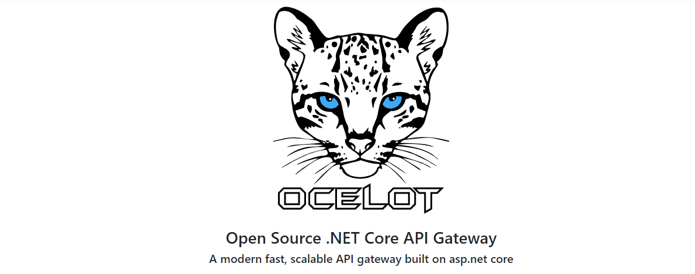

# .NET Core 下的 API 网关



## 网关介绍

网关其实就是将我们写好的API全部放在一个统一的地址暴漏在公网，提供访问的一个入口。在 .NET Core下可以使用`Ocelot`来帮助我们很方便的接入API 网关。与之类似的库还有[`ProxyKit`](https://github.com/proxykit/ProxyKit)，微软也发布了一个反向代理的库[`YARP`](https://github.com/microsoft/reverse-proxy)。

关于网关的介绍不多说了，网上文章也挺多的，这些都是不错的选择，听说后期`Ocelot`将会使用`YARP`来重写。本篇主要实践一下在.NET Core环境下使用`Ocelot`。

- Ocelot官网：<https://threemammals.com/ocelot>
- Ocelot文档：<https://ocelot.readthedocs.io>
- GitHub：<https://github.com/ThreeMammals/Ocelot>
- Ocelot资源汇总：<https://www.cnblogs.com/shanyou/p/10363360.html>

## 接入使用

先创建几个项目用于测试，创建两个默认的API项目，Api_A和Api_B，在创建一个网关项目Api_Gateway，网关项目可以选择空的模板。

在网关项目Api_Gateway中都添加`Ocelot`组件包。

```powershell
Install-Package Ocelot
```

现在分别在Api_A和Api_B中写几个api，将默认的`WeatherForecastController`中返回模型`WeatherForecast`添加一个字段Source，用于区分是哪个API返回的数据。

```csharp
using System;

namespace Api_A
{
    public class WeatherForecast
    {
        public string Source { get; set; } = "Api_A";

        public DateTime Date { get; set; }

        public int TemperatureC { get; set; }

        public int TemperatureF => 32 + (int)(TemperatureC / 0.5556);

        public string Summary { get; set; }
    }
}

using System;

namespace Api_B
{
    public class WeatherForecast
    {
        public string Source { get; set; } = "Api_B";

        public DateTime Date { get; set; }

        public int TemperatureC { get; set; }

        public int TemperatureF => 32 + (int)(TemperatureC / 0.5556);

        public string Summary { get; set; }
    }
}
```

直接使用`WeatherForecastController`默认方法，在路由中添加api前缀。

```csharp
using Microsoft.AspNetCore.Mvc;
using System;
using System.Collections.Generic;
using System.Linq;

namespace Api_A.Controllers
{
    [ApiController]
    [Route("api/[controller]")]
    public class WeatherForecastController : ControllerBase
    {
        private static readonly string[] Summaries = new[]
        {
            "Freezing", "Bracing", "Chilly", "Cool", "Mild", "Warm", "Balmy", "Hot", "Sweltering", "Scorching"
        };

        [HttpGet]
        public IEnumerable<WeatherForecast> Get()
        {
            var rng = new Random();
            return Enumerable.Range(1, 5).Select(index => new WeatherForecast
            {
                Date = DateTime.Now.AddDays(index),
                TemperatureC = rng.Next(-20, 55),
                Summary = Summaries[rng.Next(Summaries.Length)]
            }).ToArray();
        }
    }
}

using Microsoft.AspNetCore.Mvc;
using System;
using System.Collections.Generic;
using System.Linq;

namespace Api_B.Controllers
{
    [ApiController]
    [Route("api/[controller]")]
    public class WeatherForecastController : ControllerBase
    {
        private static readonly string[] Summaries = new[]
        {
            "Freezing", "Bracing", "Chilly", "Cool", "Mild", "Warm", "Balmy", "Hot", "Sweltering", "Scorching"
        };

        [HttpGet]
        public IEnumerable<WeatherForecast> Get()
        {
            var rng = new Random();
            return Enumerable.Range(1, 5).Select(index => new WeatherForecast
            {
                Date = DateTime.Now.AddDays(index),
                TemperatureC = rng.Next(-20, 55),
                Summary = Summaries[rng.Next(Summaries.Length)]
            }).ToArray();
        }
    }
}
```

再分别在Api_A和Api_B中添加两个控制器：ApiAController、ApiBController，然后加上几个简单的restful api。

```csharp
using Microsoft.AspNetCore.Mvc;
using System.Collections.Generic;

namespace Api_A.Controllers
{
    [Route("api/[controller]")]
    [ApiController]
    public class ApiAController : ControllerBase
    {
        [HttpGet]
        public IEnumerable<string> Get()
        {
            return new string[] { "value1", "value2" };
        }

        [HttpGet("{id}")]
        public string Get(int id)
        {
            return $"Get：{id}";
        }

        [HttpPost]
        public string Post([FromBody] string value)
        {
            return $"Post:{value}";
        }

        [HttpPut("{id}")]
        public string Put(int id, [FromBody] string value)
        {
            return $"Put:{id}:{value}";
        }

        [HttpDelete("{id}")]
        public string Delete(int id)
        {
            return $"Delete:{id}";
        }
    }
}
```

```csharp
using Microsoft.AspNetCore.Mvc;
using System.Collections.Generic;

namespace Api_B.Controllers
{
    [Route("api/[controller]")]
    [ApiController]
    public class ApiBController : ControllerBase
    {
        [HttpGet]
        public IEnumerable<string> Get()
        {
            return new string[] { "value1", "value2" };
        }

        [HttpGet("{id}")]
        public string Get(int id)
        {
            return $"Get：{id}";
        }

        [HttpPost]
        public string Post([FromBody] string value)
        {
            return $"Post:{value}";
        }

        [HttpPut("{id}")]
        public string Put(int id, [FromBody] string value)
        {
            return $"Put:{id}:{value}";
        }

        [HttpDelete("{id}")]
        public string Delete(int id)
        {
            return $"Delete:{id}";
        }
    }
}
```


添加`swagger`，这样我们Api_A和Api_B项目分别就有了6个接口。

接着打包docker镜像，放在docker中运行这两个api项目。这一步可以用任何你熟悉的方式，run起来即可。

```bash
docker build -t api_a:dev -f ./Api_A/Dockerfile .
docker build -t api_b:dev -f ./Api_B/Dockerfile .
```

build成功后，指定两个端口运行api项目。

```powershell
docker run -d -p 5050:80 --name api_a api_a:dev
docker run -d -p 5051:80 --name api_b api_b:dev
```

Api_A指定了5050端口，通过 <http://localhost:5050/swagger>打开可以看到swagger文档界面，Api_B指定了5051端口，通过 <http://localhost:5051/swagger>打开可以看到swagger文档界面，这样就大功告成了，接下来才是重点将两个api项目配置到Api_Gateway网关项目中。
