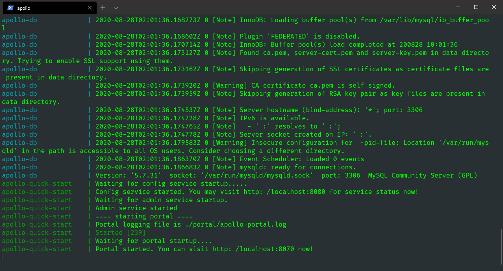
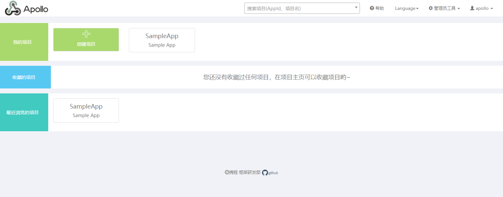
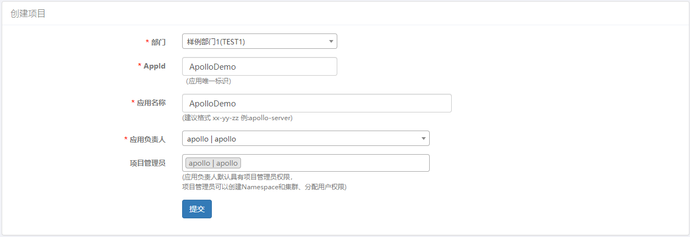

# .NET Core 下使用 Apollo 配置中心

> Apollo（阿波罗）是携程框架部门研发的分布式配置中心，能够集中化管理应用不同环境、不同集群的配置，配置修改后能够实时推送到应用端，并且具备规范的权限、流程治理等特性，适用于微服务配置管理场景。服务端基于Spring Boot和Spring Cloud开发，打包后可以直接运行，不需要额外安装Tomcat等应用容器。

`Apollo`开源地址：<https://github.com/ctripcorp/apollo>

更多产品介绍可以查看[Apollo配置中心介绍](https://github.com/ctripcorp/apollo/wiki/Apollo配置中心介绍)，本篇主要介绍在 .NET 环境下如何使用 `Apollo` 配置中心。

## Quick Start

- 本地部署：<https://github.com/ctripcorp/apollo/wiki/Quick-Start>
- Docker部署：<https://github.com/ctripcorp/apollo/wiki/Apollo-Quick-Start-Docker部署>
- 分布式部署：<https://github.com/ctripcorp/apollo/wiki/分布式部署指南>

为了方便，本次我选择使用Docker部署，快速运用。

> 另外需要说明的是，不管是Docker方式部署Quick Start还是常规方式部署的，Quick Start只是用来快速入门、了解Apollo。如果部署Apollo在公司中使用，请参考分布式部署。

请确保开发环境有docker环境，然后下载`docker-compose.yml`和所需的sql文件，然后在根目录执行`docker-compose up`，一次执行会触发下载镜像等操作，需要耐心等待一些时间。

```yml
version: '2'

services:
  apollo-quick-start:
    image: nobodyiam/apollo-quick-start
    container_name: apollo-quick-start
    depends_on:
      - apollo-db
    ports:
      - "8080:8080"
      - "8070:8070"
    links:
      - apollo-db

  apollo-db:
    image: mysql:5.7
    container_name: apollo-db
    environment:
      TZ: Asia/Shanghai
      MYSQL_ALLOW_EMPTY_PASSWORD: 'yes'
    depends_on:
      - apollo-dbdata
    ports:
      - "13306:3306"
    volumes:
      - ./sql:/docker-entrypoint-initdb.d
    volumes_from:
      - apollo-dbdata

  apollo-dbdata:
    image: alpine:latest
    container_name: apollo-dbdata
    volumes:
      - /var/lib/mysql
```

搜索所有`apollo-quick-start`开头的日志，看到以下日志说明启动成功：

```log
apollo-quick-start    | Waiting for config service startup.....
apollo-quick-start    | Config service started. You may visit http://localhost:8080 for service status now!
apollo-quick-start    | Waiting for admin service startup.
apollo-quick-start    | Admin service started
apollo-quick-start    | ==== starting portal ====
apollo-quick-start    | Portal logging file is ./portal/apollo-portal.log
apollo-quick-start    | Started [239]
apollo-quick-start    | Waiting for portal startup....
apollo-quick-start    | Portal started. You can visit http://localhost:8070 now!
```

> 数据库的端口映射为13306，所以如果希望在宿主机上访问数据库，可以通过localhost:13306，用户名是root，密码留空。如要查看更多服务的日志，可以通过docker exec -it apollo-quick-start bash登录， 然后到/apollo-quick-start/service和/apollo-quick-start/portal下查看日志信息。



访问<http://localhost:8070>，可以看到`Apollo`UI界面，默认账号密码为：apollo/admin



## .NET Core 接入

新建一个 ASP.NET Core API项目，`ApolloDemo`，添加组件`Com.Ctrip.Framework.Apollo.Configuration`。

```PowerShell
Install-Package Com.Ctrip.Framework.Apollo.Configuration
```

`Apollo`配置中心的 .NET 集成包开源地址：<https://github.com/ctripcorp/apollo.net/tree/dotnet-core>

接入也比较简单，在`appsettings.json`中配置`Apollo`服务地址。

```json
{
  "Apollo": {
    "AppId": "ApolloDemo",
    "Env": "DEV",
    "MetaServer": "http://localhost:8080",
    "ConfigServer": [ "http://localhost:8080" ]
  }
}
```

关于配置可以查看文档：<https://github.com/ctripcorp/apollo.net/tree/dotnet-core/Apollo.Configuration>

为什么地址端口是8080而不是8070？

因为在`docker-compose.yml`中我们暴露两个端口：8080个8070，8070是我们的`Apollo`配置中心管理界面，而8080端口是`Spring Eureka`服务注册中心。所以配置的应该是服务端的地址。

紧接着在`Program.cs`应用配置，代码如下：

```csharp {18-23}
using Com.Ctrip.Framework.Apollo;
using Com.Ctrip.Framework.Apollo.Logging;
using Microsoft.AspNetCore.Hosting;
using Microsoft.Extensions.Configuration;
using Microsoft.Extensions.Hosting;

namespace ApolloDemo
{
    public class Program
    {
        public static void Main(string[] args)
        {
            CreateHostBuilder(args).Build().Run();
        }

        public static IHostBuilder CreateHostBuilder(string[] args) =>
            Host.CreateDefaultBuilder(args)
                .ConfigureAppConfiguration((hostingContext, builder) =>
                {
                    LogManager.UseConsoleLogging(LogLevel.Trace);

                    builder.AddApollo(builder.Build().GetSection("Apollo")).AddDefault();
                })
                .ConfigureWebHostDefaults(webBuilder =>
                {
                    webBuilder.UseStartup<Startup>();
                });
    }
}
```

然后我们在`Apollo`管理界面新建一个与配置在`appsettings.json`中AppId同名的项目`ApolloDemo`。



`Apollo`有一个核心的概念：`Namespace`。

- `Namespace`是配置项的集合，类似于一个配置文件的概念。
- `Namespace`类型有三种：私有类型、公共类型、关联类型（继承类型）。
- `Namespace`的获取权限分为两种：private （私有的）、public （公共的），这里的获取权限是相对于Apollo客户端来说的。

配置文件有多种格式，例如：properties、xml、yml、yaml、json等。同样Namespace也具有这些格式。在Portal UI中可以看到“application”的Namespace上有一个“properties”标签，表明“application”是properties格式的。

> 非properties格式的namespace，在客户端使用时需要调用ConfigService.getConfigFile(String namespace, ConfigFileFormat configFileFormat)来获取，如果使用Http接口直接调用时，对应的namespace参数需要传入namespace的名字加上后缀名，如datasources.json。
> apollo-client 1.3.0版本开始对yaml/yml做了更好的支持，使用起来和properties格式一致：Config config = ConfigService.getConfig("application.yml");，Spring的注入方式也和properties一致。

关于Namespace`的文档：<https://github.com/ctripcorp/apollo/wiki/Apollo核心概念之“Namespace”>

接下来去新增几个配置属性，然后发布。


现在去写一个接口，来实时读取`Apollo`中的配置。

```csharp
using Microsoft.AspNetCore.Mvc;
using Microsoft.Extensions.Configuration;

namespace ApolloDemo.Controllers
{
    [Route("api/[controller]")]
    [ApiController]
    public class ValuesController : ControllerBase
    {
        [HttpGet]
        [Route("Apollo")]
        public IActionResult ApolloTest([FromServices] IConfiguration configuration, string key)
        {
            return Content(configuration.GetValue<string>(key));
        }
    }
}
```

使用起来也非常简单，这里根据传入的key值不同，获取到我们配置在`Apollo`中的value，并且是具有热更新，实时动态改变的。


然后修改name和age的值，在调用接口看看。注意在`Apollo`中修改后，需要发布才会生效。


简单介绍了 .NET Core 下使用`Apollo`配置中心，`Apollo`的功能远不止于此，根据需要可以去Github查看官网Wiki介绍，有详细的使用说明文档。
