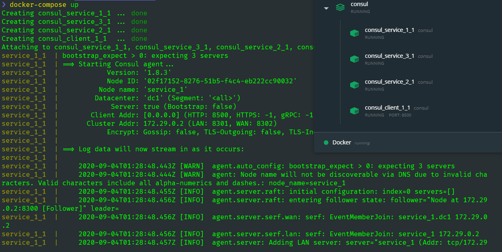
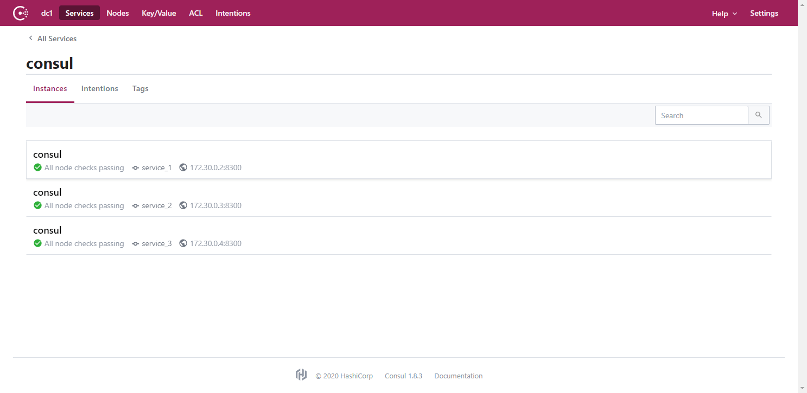

# .NET Core 使用 Consul 服务注册发现

`Consul`是一个用来实现分布式系统服务发现与配置的开源工具。它内置了服务注册与发现框架、分布一致性协议实现、健康检查、Key/Value存储、多数据中心方案，不再需要依赖其他工具，使用起来也较为简单。

- `Consul`官网：<https://www.consul.io>
- 开源地址：<https://github.com/hashicorp/consul>

## 安装

`Consul`支持各种平台的安装，安装文档：<https://www.consul.io/downloads>，为了快速使用，我这里选择用[docker方式安装](../docker/repo/consul.md)。

```yaml
version: "3"

services:
  service_1:
    image: consul
    command: agent -server -client=0.0.0.0 -bootstrap-expect=3 -node=service_1
    volumes:
      - /usr/local/docker/consul/data/service_1:/data
  service_2:
    image: consul
    command: agent -server -client=0.0.0.0 -retry-join=service_1 -node=service_2
    volumes:
      - /usr/local/docker/consul/data/service_2:/data
    depends_on:
      - service_1
  service_3:
    image: consul
    command: agent -server -client=0.0.0.0 -retry-join=service_1 -node=service_3
    volumes:
      - /usr/local/docker/consul/data/service_3:/data
    depends_on:
      - service_1
  client_1:
    image: consul
    command: agent -client=0.0.0.0 -retry-join=service_1 -ui -node=client_1
    ports:
      - 8500:8500
    volumes:
      - /usr/local/docker/consul/data/client_1:/data
    depends_on:
      - service_2
      - service_3
```

提供一个`docker-compose.yaml`，使用`docker-compose up`编排脚本启动`Consul`，如果你不熟悉，可以选择其它方式能运行`Consul`即可。



这里使用 Docker 搭建 3个 server 节点 + 1 个 client 节点，API 服务通过 client 节点进行服务注册和发现。

安装完成启动`Consul`，打开默认地址 <http://localhost:8500> 可以看到`Consul`ui界面。



## 快速使用

### 服务注册

### 服务发现
