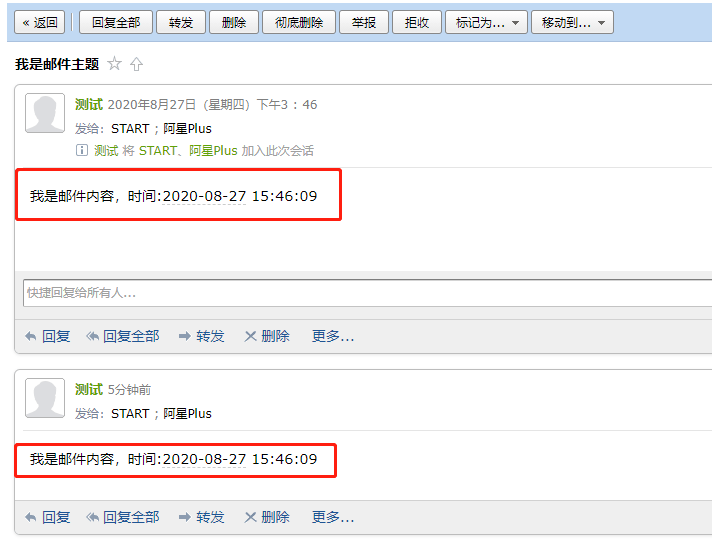

# .NET Core 下收发邮件之 MailKit

利用代码发送邮件在工作中还是比较常见的，相信大家都用过`SmtpClient`来处理发送邮件的操作，不过这个类以及被标记已过时，所以介绍一个微软推荐的库`MailKit`来处理。

`MailKit`开源地址：<https://github.com/jstedfast/MailKit>

新建一个控制台应用程序，将`MailKit`添加到项目中。

```PowerShell
Install-Package MailKit
```

新建一个`IEmail`接口。

```csharp
using MimeKit;
using System.Threading.Tasks;

namespace EmailDemo
{
    public interface IEmail
    {
        /// <summary>
        /// 发送Email
        /// </summary>
        /// <param name="message"></param>
        /// <returns></returns>
        Task SendEmailAsync(MimeMessage message);
    }
}
```

然后添加`Email.cs`实现这个接口。

```csharp
using MailKit.Net.Smtp;
using MimeKit;
using System.Collections.Generic;
using System.Threading.Tasks;

namespace EmailDemo
{
    public class Email : IEmail
    {
        public async Task SendEmailAsync(MimeMessage message)
        {
            var host = "smtp.exmail.qq.com";
            var port = 465;
            var useSsl = true;
            var from_username = "123@meowv.com";
            var from_password = "...";
            var from_name = "测试";
            var from_address = "123@meowv.com";

            var address = new List<MailboxAddress>
            {
                new MailboxAddress("111","111@meowv.com"),
                new MailboxAddress("222","222@meowv.com")
            };

            message.From.Add(new MailboxAddress(from_name, from_address));
            message.To.AddRange(address);

            using var client = new SmtpClient
            {
                ServerCertificateValidationCallback = (s, c, h, e) => true
            };
            client.AuthenticationMechanisms.Remove("XOAUTH2");

            await client.ConnectAsync(host, port, useSsl);
            await client.AuthenticateAsync(from_username, from_password);
            await client.SendAsync(message);
            await client.DisconnectAsync(true);
        }
    }
}
```

上面关于邮箱的账号密码服务器可以放在配置文件中，这里为了方便直接写了，演示了发送邮件到两个Email地址。

然后在`Program.cs`中使用依赖注入的方式调用。

```csharp
using Microsoft.Extensions.DependencyInjection;
using MimeKit;
using System;
using System.Threading.Tasks;

namespace EmailDemo
{
    class Program
    {
        static async Task Main(string[] args)
        {
            IServiceCollection service = new ServiceCollection();

            service.AddSingleton<IEmail, Email>();

            var provider = service.BuildServiceProvider().GetRequiredService<IEmail>();

            var message = new MimeMessage
            {
                Subject = "我是邮件主题",
                Body = new BodyBuilder
                {
                    HtmlBody = $"我是邮件内容，时间:{DateTime.Now:yyyy-MM-dd HH:mm:ss}"
                }.ToMessageBody()
            };

            await provider.SendEmailAsync(message);
        }
    }
}
```



以上演示了在 .NET Core 中发送邮件的示例，同时利用`MailKit`也可以接收邮件，这里使用场景不多，如有需要可以参考`MailKit`GitHub代码示例。

通常发送邮件可以提前写好HTML模板，然后将关键内容做字符串替换，这样发出去的就是一个比较美观的邮件了。

`MailKit`还支持将图片作为数据内容发送出去。

```csharp
using Microsoft.Extensions.DependencyInjection;
using MimeKit;
using MimeKit.Utils;
using System;
using System.Threading.Tasks;

namespace EmailDemo
{
    class Program
    {
        static async Task Main(string[] args)
        {
            IServiceCollection service = new ServiceCollection();

            service.AddSingleton<IEmail, Email>();

            var provider = service.BuildServiceProvider().GetRequiredService<IEmail>();

            var path = "D:\\bg.jpg";

            var builder = new BodyBuilder();

            var image = builder.LinkedResources.Add(path);
            image.ContentId = MimeUtils.GenerateMessageId();

            builder.HtmlBody = $"当前时间:{DateTime.Now:yyyy-MM-dd HH:mm:ss} ";

            var message = new MimeMessage
            {
                Subject = "带图片的邮件推送",
                Body = builder.ToMessageBody()
            };

            await provider.SendEmailAsync(message);
        }
    }
}
```

在本地准备先一张图片，利用ContentId的方式迁入在img标签中，成功将其发送出去。


